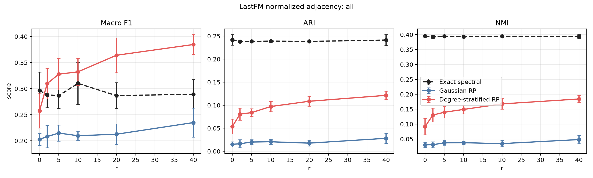
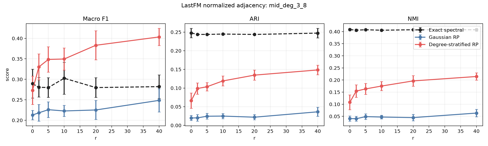

# Cora 의사코드 정합 실험 결과보고서

## 0A. Non-random baseline 추가 후 최신 결과

본 섹션은 `Exact spectral` non-random baseline을 추가한 뒤 동일 설정으로 재실행한 최신 결과다. 아래 기존 본문은 randomized-only 실험 설명을 보존한 것이며, 수치 해석은 이 섹션을 우선한다.

전체 node 기준 Macro F1:

| r | Exact spectral | Gaussian RP | DS-RP | DS-RP - Gaussian | DS-RP - Exact |
|---:|---:|---:|---:|---:|---:|
| 0 | 0.2964 | 0.2027 | 0.2575 | +0.0548 | -0.0389 |
| 2 | 0.2880 | 0.2081 | 0.3098 | +0.1017 | +0.0218 |
| 5 | 0.2866 | 0.2148 | 0.3277 | +0.1129 | +0.0411 |
| 10 | 0.3101 | 0.2097 | 0.3323 | +0.1226 | +0.0222 |
| 20 | 0.2866 | 0.2126 | 0.3640 | +0.1514 | +0.0774 |
| 40 | 0.2893 | 0.2349 | 0.3846 | +0.1497 | +0.0953 |

`r=40`의 전체 지표:

| Method | Macro F1 | ARI | NMI |
|---|---:|---:|---:|
| Exact spectral | 0.2893 | 0.2414 | 0.3939 |
| Gaussian RP | 0.2349 | 0.0282 | 0.0482 |
| DS-RP | 0.3846 | 0.1214 | 0.1842 |

해석:

- DS-RP는 Macro F1 기준으로 Gaussian RP와 exact spectral보다 높다.
- 반면 ARI/NMI는 exact spectral이 DS-RP보다 높다. 즉 Cora에서는 어떤 평가 지표를 보느냐에 따라 결론이 달라진다.
- 논문에서는 "DS-RP improves macro label balance over Gaussian RP"라고 쓰는 것은 가능하지만, "DS-RP dominates exact spectral"이라고 쓰면 안 된다.
- Exact spectral의 ARI/NMI가 높은 점은 Cora label이 일부 spectral structure와 맞지만 class-wise macro recovery는 여전히 어렵다는 해석을 뒷받침한다.

## 0. 요약

본 보고서는 Cora citation network에 대해 LastFM Asia, Deezer Europe과 동일한 focused experiment 구성을 적용한 결과를 정리한다.

실험 조건은 다음과 같다.

| 항목 | 값 |
|---|---:|
| Graph operator | `S = D^{-1/2} A D^{-1/2}` |
| `alpha` | 0.5 |
| `tau` | 0 |
| `q` | 1 |
| 반복 수 | 10 |
| `r` | 0, 2, 5, 10, 20, 40 |
| Test matrix scaling | by dimension |
| Rayleigh-Ritz symmetrization | 사용하지 않음 |

핵심 결과는 다음과 같다.

> Cora에서는 Degree-Stratified RP가 모든 `r`에서 Gaussian RP보다 높은 label 기반 clustering 성능을 보였다. 특히 `r=40`에서 전체 node 기준 Macro F1은 Gaussian RP 0.2274, DS-RP 0.3705로 개선폭이 +0.1431이었다.

전체 node 기준 결과:

| r | Gaussian F1 | DS-RP F1 | F1 개선폭 | Gaussian ARI | DS-RP ARI | ARI 개선폭 | Gaussian NMI | DS-RP NMI | NMI 개선폭 |
|---:|---:|---:|---:|---:|---:|---:|---:|---:|---:|
| 0 | 0.2091 | 0.2246 | +0.0156 | 0.0137 | 0.0281 | +0.0143 | 0.0289 | 0.0510 | +0.0221 |
| 2 | 0.2022 | 0.3205 | +0.1183 | 0.0141 | 0.0842 | +0.0701 | 0.0277 | 0.1416 | +0.1138 |
| 5 | 0.2172 | 0.3174 | +0.1002 | 0.0180 | 0.0880 | +0.0700 | 0.0339 | 0.1420 | +0.1081 |
| 10 | 0.2168 | 0.3354 | +0.1185 | 0.0195 | 0.0917 | +0.0723 | 0.0360 | 0.1490 | +0.1130 |
| 20 | 0.2164 | 0.3547 | +0.1384 | 0.0217 | 0.1076 | +0.0859 | 0.0399 | 0.1656 | +0.1257 |
| 40 | 0.2274 | 0.3705 | +0.1431 | 0.0235 | 0.1242 | +0.1007 | 0.0460 | 0.1743 | +0.1284 |

## 1. 데이터셋

Cora는 machine learning paper citation network이다. `cora.content`에는 paper id, binary word features, class label이 있고, `cora.cites`에는 citation pair가 있다. 본 실험에서는 citation 방향을 무시하고 undirected graph로 symmetrize했다.

데이터 출처: [LINQS Cora dataset archive](https://linqs-data.soe.ucsc.edu/public/lbc/cora.tgz)

전체 Cora archive 기준:

| 항목 | 값 |
|---|---:|
| 전체 paper 수 | 2,708 |
| Symmetrized undirected edge 수 | 5,278 |
| Feature 수 | 1,433 |
| Class 수 | 7 |

기존 실험 루틴과 동일하게 largest connected component만 사용했다.

| 항목 | 값 |
|---|---:|
| 실험 node 수 | 2,485 |
| 실험 edge 수 | 5,069 |
| Class 수 | 7 |
| Degree min | 1 |
| Degree median | 3 |
| Degree mean | 4.080 |
| Degree q75 | 5 |
| Degree q90 | 7 |
| Degree q99 | 19 |
| Degree max | 168 |
| Degree Gini | 0.397 |
| Tail alpha rough | 4.002 |
| Tail log-log CCDF R2 | 0.983 |

Largest connected component의 label count는 다음과 같다.

| Label | Count |
|---|---:|
| Case_Based | 285 |
| Genetic_Algorithms | 406 |
| Neural_Networks | 726 |
| Probabilistic_Methods | 379 |
| Reinforcement_Learning | 214 |
| Rule_Learning | 131 |
| Theory | 344 |

## 2. 실험 구성

LastFM과 동일하게 normalized adjacency를 사용했다.

```text
S = D^{-1/2} A D^{-1/2}
```

비교 방법은 다음 두 가지이다.

| 방법 | 설명 |
|---|---|
| Gaussian RP | `Omega_ij ~ N(0, 1/ell)`인 global Gaussian sketch |
| Degree-Stratified RP | degree bucket별 `G_j ~ N(0, 1/ell_j)`를 사용하고, `ell_j`를 `sqrt(M_j)` 비율로 배분 |

Cora는 7-class label이므로 `k=7`로 설정되었다.

| r | ell = k+r |
|---:|---:|
| 0 | 7 |
| 2 | 9 |
| 5 | 12 |
| 10 | 17 |
| 20 | 27 |
| 40 | 47 |

평가는 전체 node와 degree group별로 수행했다.

| Group | 조건 |
|---|---|
| `all` | 전체 LCC node |
| `low_deg_1_2` | degree 1-2 |
| `mid_deg_3_8` | degree 3-8 |
| `high_deg_9_plus` | degree 9 이상 |

## 3. 전체 Node 결과

전체 node 기준으로 DS-RP는 모든 `r`에서 Gaussian RP보다 높았다.

| r | Gaussian F1 | DS-RP F1 | F1 개선폭 | Gaussian ARI | DS-RP ARI | ARI 개선폭 | Gaussian NMI | DS-RP NMI | NMI 개선폭 |
|---:|---:|---:|---:|---:|---:|---:|---:|---:|---:|
| 0 | 0.2091 | 0.2246 | +0.0156 | 0.0137 | 0.0281 | +0.0143 | 0.0289 | 0.0510 | +0.0221 |
| 2 | 0.2022 | 0.3205 | +0.1183 | 0.0141 | 0.0842 | +0.0701 | 0.0277 | 0.1416 | +0.1138 |
| 5 | 0.2172 | 0.3174 | +0.1002 | 0.0180 | 0.0880 | +0.0700 | 0.0339 | 0.1420 | +0.1081 |
| 10 | 0.2168 | 0.3354 | +0.1185 | 0.0195 | 0.0917 | +0.0723 | 0.0360 | 0.1490 | +0.1130 |
| 20 | 0.2164 | 0.3547 | +0.1384 | 0.0217 | 0.1076 | +0.0859 | 0.0399 | 0.1656 | +0.1257 |
| 40 | 0.2274 | 0.3705 | +0.1431 | 0.0235 | 0.1242 | +0.1007 | 0.0460 | 0.1743 | +0.1284 |



해석:

- Gaussian RP는 `r`이 증가해도 Macro F1이 0.20-0.23 수준에 머문다.
- DS-RP는 `r=2`부터 성능이 크게 올라가고, `r=40`까지 점진적으로 개선된다.
- `r=40`에서 DS-RP는 Gaussian RP 대비 Macro F1 +0.1431, ARI +0.1007, NMI +0.1284의 개선을 보였다.

## 4. Degree Group별 결과

### 4.1 Low-degree group: degree 1-2

| r | Gaussian F1 | DS-RP F1 | F1 개선폭 | Gaussian ARI | DS-RP ARI | ARI 개선폭 | Gaussian NMI | DS-RP NMI | NMI 개선폭 |
|---:|---:|---:|---:|---:|---:|---:|---:|---:|---:|
| 0 | 0.1969 | 0.2057 | +0.0088 | 0.0091 | 0.0192 | +0.0101 | 0.0263 | 0.0399 | +0.0136 |
| 2 | 0.1948 | 0.2802 | +0.0854 | 0.0101 | 0.0482 | +0.0381 | 0.0268 | 0.1064 | +0.0796 |
| 5 | 0.2014 | 0.2728 | +0.0714 | 0.0131 | 0.0545 | +0.0414 | 0.0301 | 0.1072 | +0.0772 |
| 10 | 0.2049 | 0.2816 | +0.0767 | 0.0140 | 0.0503 | +0.0363 | 0.0318 | 0.1052 | +0.0733 |
| 20 | 0.2077 | 0.3135 | +0.1058 | 0.0168 | 0.0657 | +0.0489 | 0.0357 | 0.1220 | +0.0863 |
| 40 | 0.2117 | 0.3218 | +0.1101 | 0.0144 | 0.0772 | +0.0628 | 0.0364 | 0.1249 | +0.0885 |

Low-degree group에서도 DS-RP가 안정적으로 우세하다. 이는 bucket별 sketch가 low-degree 영역에도 최소 representation을 보장하는 효과와 일관된다.

### 4.2 Mid-degree group: degree 3-8

| r | Gaussian F1 | DS-RP F1 | F1 개선폭 | Gaussian ARI | DS-RP ARI | ARI 개선폭 | Gaussian NMI | DS-RP NMI | NMI 개선폭 |
|---:|---:|---:|---:|---:|---:|---:|---:|---:|---:|
| 0 | 0.2177 | 0.2373 | +0.0197 | 0.0174 | 0.0334 | +0.0160 | 0.0380 | 0.0633 | +0.0254 |
| 2 | 0.2132 | 0.3384 | +0.1252 | 0.0177 | 0.1055 | +0.0878 | 0.0363 | 0.1657 | +0.1294 |
| 5 | 0.2296 | 0.3356 | +0.1060 | 0.0228 | 0.1075 | +0.0848 | 0.0452 | 0.1649 | +0.1197 |
| 10 | 0.2255 | 0.3564 | +0.1309 | 0.0231 | 0.1155 | +0.0924 | 0.0450 | 0.1766 | +0.1316 |
| 20 | 0.2248 | 0.3790 | +0.1542 | 0.0264 | 0.1316 | +0.1052 | 0.0516 | 0.1933 | +0.1416 |
| 40 | 0.2395 | 0.3911 | +0.1516 | 0.0299 | 0.1521 | +0.1223 | 0.0583 | 0.2068 | +0.1485 |

Mid-degree group에서도 LastFM과 비슷하게 DS-RP의 개선폭이 크다. `r=40`에서 Macro F1 개선폭은 +0.1516이다.



### 4.3 High-degree group: degree 9 이상

| r | Gaussian F1 | DS-RP F1 | F1 개선폭 | Gaussian ARI | DS-RP ARI | ARI 개선폭 | Gaussian NMI | DS-RP NMI | NMI 개선폭 |
|---:|---:|---:|---:|---:|---:|---:|---:|---:|---:|
| 0 | 0.2827 | 0.3140 | +0.0313 | 0.0363 | 0.0820 | +0.0457 | 0.1352 | 0.1810 | +0.0458 |
| 2 | 0.2858 | 0.3981 | +0.1123 | 0.0441 | 0.1817 | +0.1376 | 0.1383 | 0.2936 | +0.1554 |
| 5 | 0.2894 | 0.4098 | +0.1204 | 0.0437 | 0.1882 | +0.1444 | 0.1389 | 0.3054 | +0.1666 |
| 10 | 0.3027 | 0.4321 | +0.1293 | 0.0600 | 0.2188 | +0.1587 | 0.1608 | 0.3403 | +0.1795 |
| 20 | 0.3013 | 0.4553 | +0.1539 | 0.0526 | 0.2337 | +0.1811 | 0.1429 | 0.3473 | +0.2043 |
| 40 | 0.2970 | 0.4635 | +0.1665 | 0.0541 | 0.2495 | +0.1954 | 0.1602 | 0.3720 | +0.2117 |

High-degree group은 절대 성능이 가장 높고, DS-RP의 개선폭도 크다. `r=40`에서 Macro F1 개선폭은 +0.1665, ARI 개선폭은 +0.1954이다.

## 5. Runtime 결과

Embedding 계산만 보면 DS-RP가 Gaussian RP보다 느리다. 이는 bucket별 sketch를 구성하고 concatenate하는 추가 비용 때문이다. 다만 Cora는 그래프가 작아 전체 runtime은 모두 짧다.

| r | 방법 | Embedding sec | Clustering sec | Total sec |
|---:|---|---:|---:|---:|
| 0 | Gaussian RP | 0.0009 | 0.1322 | 0.1330 |
| 0 | DS-RP | 0.0024 | 0.0604 | 0.0628 |
| 2 | Gaussian RP | 0.0011 | 0.1102 | 0.1113 |
| 2 | DS-RP | 0.0026 | 0.0700 | 0.0727 |
| 5 | Gaussian RP | 0.0014 | 0.1026 | 0.1040 |
| 5 | DS-RP | 0.0028 | 0.0716 | 0.0744 |
| 10 | Gaussian RP | 0.0019 | 0.0956 | 0.0975 |
| 10 | DS-RP | 0.0037 | 0.0779 | 0.0816 |
| 20 | Gaussian RP | 0.0036 | 0.0972 | 0.1008 |
| 20 | DS-RP | 0.0060 | 0.0780 | 0.0841 |
| 40 | Gaussian RP | 0.0072 | 0.0969 | 0.1041 |
| 40 | DS-RP | 0.0119 | 0.0805 | 0.0924 |

## 6. Bucket Allocation 예시

`r=40`일 때 `ell = k+r = 47`이다. 첫 번째 반복의 DS-RP bucket allocation은 다음과 같다.

| Bucket | Degree range | Node 수 | Mass | sqrt(Mass) | Sketch dim | Entry std |
|---:|---|---:|---:|---:|---:|---:|
| 1 | [1, 2) | 354 | 354 | 18.815 | 4 | 0.500 |
| 2 | [2, 4) | 1,070 | 2,665 | 51.624 | 9 | 0.333 |
| 3 | [4, 8) | 859 | 4,210 | 64.885 | 11 | 0.302 |
| 4 | [8, 16) | 155 | 1,534 | 39.166 | 7 | 0.378 |
| 5 | [16, 32) | 35 | 697 | 26.401 | 5 | 0.447 |
| 6 | [32, 64) | 8 | 293 | 17.117 | 4 | 0.500 |
| 7 | [64, 128) | 3 | 217 | 14.731 | 4 | 0.500 |
| 8 | [128, 256) | 1 | 168 | 12.961 | 3 | 0.577 |

이 배분은 low/mid/high degree 영역을 모두 sketch에 반영한다. 특히 Cora에서는 `[2,4)`, `[4,8)` bucket에 많은 node와 mass가 있어, 이 영역에 상당한 sketch budget이 배정된다.

## 7. 해석

Cora 결과는 DS-RP의 positive result로 볼 수 있다.

1. Cora는 citation graph이고 class label은 paper topic이다.
2. Topic label은 citation structure와 비교적 잘 정렬되어 있다.
3. Global Gaussian sketch는 normalized adjacency의 community-relevant subspace를 충분히 안정적으로 잡지 못했다.
4. DS-RP는 degree bucket별 representation을 보장하면서 topic-related spectral information을 더 잘 보존했다.
5. LastFM에서 관찰된 mid-degree 개선 양상이 Cora에서도 재현되며, high-degree group에서도 강한 개선이 나타났다.

Deezer와 비교하면 차이가 더 명확하다. Deezer의 gender-derived binary label은 graph community와 약하게 정렬된 것으로 보였고, Cora의 topic label은 citation structure와 더 잘 정렬되어 DS-RP 개선이 드러났다.

## 8. 결론

Cora focused experiment에서는 Degree-Stratified RP가 Gaussian RP보다 명확히 좋은 결과를 보였다.

논문 관점에서 중요한 수치는 다음과 같다.

| 기준 | Gaussian RP | DS-RP | 개선폭 |
|---|---:|---:|---:|
| 전체 Macro F1, r=40 | 0.2274 | 0.3705 | +0.1431 |
| 전체 ARI, r=40 | 0.0235 | 0.1242 | +0.1007 |
| 전체 NMI, r=40 | 0.0460 | 0.1743 | +0.1284 |
| Mid-degree Macro F1, r=40 | 0.2395 | 0.3911 | +0.1516 |
| High-degree Macro F1, r=40 | 0.2970 | 0.4635 | +0.1665 |

따라서 Cora는 LastFM과 함께 DS-RP의 positive evidence로 사용할 수 있다.

> On Cora, degree-stratified randomized sketching substantially improves label-aligned spectral clustering over a global Gaussian sketch across all oversampling regimes.

## 9. 결과 파일

이번 Cora 실험 결과는 다음 위치에 저장되어 있다.

| 파일 | 내용 |
|---|---|
| `results/cora_degree_stratum_alpha05_tau0/cora_degree_stratum_raw.csv` | 반복별 원자료 |
| `results/cora_degree_stratum_alpha05_tau0/cora_degree_stratum_summary.csv` | group, r, method별 평균/표준편차 |
| `results/cora_degree_stratum_alpha05_tau0/cora_degree_stratum_paired_ds_minus_gaussian.csv` | 같은 반복 번호 기준 DS-RP minus Gaussian paired difference |
| `results/cora_degree_stratum_alpha05_tau0/cora_degree_stratum_bucket_allocations.csv` | DS-RP bucket별 sketch dimension 배분 |
| `results/cora_degree_stratum_alpha05_tau0/cora_degree_stratum_meta.json` | 실행 설정, 그래프 진단, operator 정보 |
| `results/cora_degree_stratum_alpha05_tau0/viz/*.png` | 성능 및 paired difference 시각화 |
