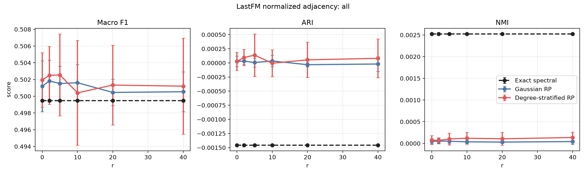
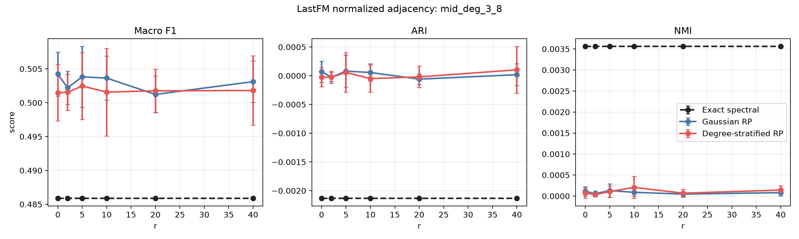

# Deezer Europe 의사코드 정합 실험 결과보고서

## 0A. Non-random baseline 추가 후 최신 결과

본 섹션은 `Exact spectral` non-random baseline을 추가한 뒤 동일 설정으로 재실행한 최신 결과다. 아래 기존 본문은 randomized-only 실험 설명을 보존한 것이며, 수치 해석은 이 섹션을 우선한다.

전체 node 기준 Macro F1:

| r | Exact spectral | Gaussian RP | DS-RP | DS-RP - Gaussian | DS-RP - Exact |
|---:|---:|---:|---:|---:|---:|
| 0 | 0.4995 | 0.5012 | 0.5020 | +0.0008 | +0.0025 |
| 2 | 0.4995 | 0.5018 | 0.5025 | +0.0007 | +0.0030 |
| 5 | 0.4995 | 0.5015 | 0.5026 | +0.0011 | +0.0031 |
| 10 | 0.4995 | 0.5016 | 0.5004 | -0.0012 | +0.0009 |
| 20 | 0.4995 | 0.5005 | 0.5013 | +0.0008 | +0.0018 |
| 40 | 0.4995 | 0.5005 | 0.5012 | +0.0007 | +0.0017 |

`r=40`의 전체 지표:

| Method | Macro F1 | ARI | NMI |
|---|---:|---:|---:|
| Exact spectral | 0.4995 | -0.0015 | 0.0025 |
| Gaussian RP | 0.5005 | -0.0000 | 0.0000 |
| DS-RP | 0.5012 | 0.0001 | 0.0001 |

해석:

- Exact spectral도 chance 수준이므로, Deezer Europe의 낮은 성능은 randomized approximation 문제가 아니라 label과 graph spectral community가 거의 맞지 않는 문제로 보는 것이 타당하다.
- DS-RP와 Gaussian RP의 차이는 실질적으로 의미 있는 수준이 아니다.
- 논문에서는 Deezer를 positive result로 쓰기보다 label-graph mismatch failure case 또는 appendix 결과로 두는 것이 안전하다.

## 0. 요약

본 보고서는 Deezer Europe Social Network에 대해 LastFM Asia focused experiment와 동일한 구성으로 Degree-Stratified RP와 Gaussian RP를 비교한 결과를 정리한다.

실험은 다음 조건을 고정했다.

| 항목 | 값 |
|---|---:|
| Graph operator | `S = D^{-1/2} A D^{-1/2}` |
| `alpha` | 0.5 |
| `tau` | 0 |
| `q` | 1 |
| 반복 수 | 10 |
| `r` | 0, 2, 5, 10, 20, 40 |
| Test matrix scaling | by dimension |
| Rayleigh-Ritz symmetrization | 사용하지 않음 |

핵심 결론은 다음과 같다.

> Deezer Europe에서는 Gaussian RP와 Degree-Stratified RP 모두 label 기반 clustering 성능이 거의 chance 수준에 머물렀다. LastFM Asia에서 관찰된 DS-RP의 뚜렷한 개선은 Deezer Europe에서는 재현되지 않았다.

전체 node 기준 결과는 다음과 같다.

| r | Gaussian F1 | DS-RP F1 | F1 차이 | Gaussian ARI | DS-RP ARI | ARI 차이 | Gaussian NMI | DS-RP NMI | NMI 차이 |
|---:|---:|---:|---:|---:|---:|---:|---:|---:|---:|
| 0 | 0.5019 | 0.5002 | -0.0018 | 0.0001 | -0.0000 | -0.0001 | 0.0001 | 0.0000 | -0.0000 |
| 2 | 0.5022 | 0.5016 | -0.0006 | 0.0000 | 0.0000 | +0.0000 | 0.0001 | 0.0001 | -0.0000 |
| 5 | 0.5005 | 0.5020 | +0.0015 | 0.0000 | 0.0001 | +0.0001 | 0.0000 | 0.0001 | +0.0001 |
| 10 | 0.5000 | 0.4997 | -0.0003 | -0.0000 | -0.0000 | -0.0000 | 0.0000 | 0.0001 | +0.0001 |
| 20 | 0.5001 | 0.4987 | -0.0014 | -0.0000 | 0.0001 | +0.0001 | 0.0000 | 0.0001 | +0.0001 |
| 40 | 0.5013 | 0.4935 | -0.0078 | 0.0000 | -0.0002 | -0.0002 | 0.0000 | 0.0001 | +0.0000 |

Macro F1이 0.50 근처이고 ARI/NMI가 거의 0이므로, 이 실험에서는 spectral clustering embedding이 Deezer의 binary label을 거의 회복하지 못한 것으로 해석하는 것이 맞다.

## 1. 데이터셋

Deezer Europe Social Network는 SNAP에서 제공하는 undirected social network이다. 공식 설명에 따르면 node는 Deezer의 유럽 사용자이고 edge는 mutual follower 관계이다. Node label은 binary class이며, 사용자의 name field에서 derived된 gender label이다. 따라서 이 label은 사용자가 명시적으로 제공한 ground-truth community라기보다, 이름 기반으로 추정된 binary attribute에 가깝다.

출처: [SNAP Deezer Europe Social Network](https://snap.stanford.edu/data/feather-deezer-social.html)

| 항목 | 값 |
|---|---:|
| Node 수 | 28,281 |
| Edge 수 | 92,752 |
| Label class 수 | 2 |
| Label 0 | 15,743 |
| Label 1 | 12,538 |
| Degree min | 1 |
| Degree median | 4 |
| Degree mean | 6.559 |
| Degree q75 | 8 |
| Degree q90 | 15 |
| Degree q99 | 38 |
| Degree max | 172 |
| Degree Gini | 0.523 |
| Tail alpha rough | 2.866 |
| Tail log-log CCDF R2 | 0.976 |

Degree Gini와 tail log-log CCDF R2를 보면 Deezer Europe도 heavy-tailed degree structure를 가진 그래프로 볼 수 있다. 다만 label은 community label이라기보다 gender-derived binary attribute이므로, spectral clustering과 직접 맞지 않을 수 있다.

## 2. 실험 구성

LastFM Asia 실험과 동일하게 normalized adjacency를 사용했다.

```text
S = D^{-1/2} A D^{-1/2}
```

비교 방법은 다음 두 가지이다.

| 방법 | 설명 |
|---|---|
| Gaussian RP | `Omega_ij ~ N(0, 1/ell)`인 global Gaussian sketch |
| Degree-Stratified RP | degree bucket별 `G_j ~ N(0, 1/ell_j)`를 사용하고, `ell_j`를 `sqrt(M_j)` 비율로 배분 |

Deezer는 binary label이므로 `k=2`로 설정되었다. 따라서 각 `r`에 대한 sketch dimension은 다음과 같다.

| r | ell = k+r |
|---:|---:|
| 0 | 2 |
| 2 | 4 |
| 5 | 7 |
| 10 | 12 |
| 20 | 22 |
| 40 | 42 |

평가는 전체 node와 degree group별로 수행했다.

| Group | 조건 | Node 수 |
|---|---|---:|
| `all` | 전체 node | 28,281 |
| `low_deg_1_2` | degree 1-2 | 10,028 |
| `mid_deg_3_8` | degree 3-8 | 11,333 |
| `high_deg_9_plus` | degree 9 이상 | 6,920 |

## 3. 전체 Node 결과

전체 node 기준으로는 두 방법 모두 label 성능이 거의 chance 수준이다.

| r | Gaussian F1 | DS-RP F1 | F1 차이 | Gaussian ARI | DS-RP ARI | ARI 차이 | Gaussian NMI | DS-RP NMI | NMI 차이 |
|---:|---:|---:|---:|---:|---:|---:|---:|---:|---:|
| 0 | 0.5019 | 0.5002 | -0.0018 | 0.0001 | -0.0000 | -0.0001 | 0.0001 | 0.0000 | -0.0000 |
| 2 | 0.5022 | 0.5016 | -0.0006 | 0.0000 | 0.0000 | +0.0000 | 0.0001 | 0.0001 | -0.0000 |
| 5 | 0.5005 | 0.5020 | +0.0015 | 0.0000 | 0.0001 | +0.0001 | 0.0000 | 0.0001 | +0.0001 |
| 10 | 0.5000 | 0.4997 | -0.0003 | -0.0000 | -0.0000 | -0.0000 | 0.0000 | 0.0001 | +0.0001 |
| 20 | 0.5001 | 0.4987 | -0.0014 | -0.0000 | 0.0001 | +0.0001 | 0.0000 | 0.0001 | +0.0001 |
| 40 | 0.5013 | 0.4935 | -0.0078 | 0.0000 | -0.0002 | -0.0002 | 0.0000 | 0.0001 | +0.0000 |



해석:

- Macro F1은 거의 0.50 근처에 머문다.
- ARI와 NMI는 거의 0이다.
- DS-RP가 `r=5`에서 F1을 약간 높였지만, 개선폭은 +0.0015로 의미 있는 수준이 아니다.
- `r=40`에서는 오히려 DS-RP의 Macro F1이 Gaussian RP보다 낮다.

## 4. Degree Group별 결과

### 4.1 Low-degree group: degree 1-2

| r | Gaussian F1 | DS-RP F1 | F1 차이 | Gaussian ARI | DS-RP ARI | ARI 차이 | Gaussian NMI | DS-RP NMI | NMI 차이 |
|---:|---:|---:|---:|---:|---:|---:|---:|---:|---:|
| 0 | 0.5027 | 0.5015 | -0.0012 | 0.0000 | -0.0000 | -0.0001 | 0.0001 | 0.0001 | -0.0001 |
| 2 | 0.5028 | 0.5037 | +0.0009 | 0.0000 | 0.0000 | -0.0000 | 0.0001 | 0.0001 | +0.0000 |
| 5 | 0.5017 | 0.5018 | +0.0001 | 0.0000 | -0.0000 | -0.0001 | 0.0001 | 0.0001 | -0.0000 |
| 10 | 0.5010 | 0.4999 | -0.0011 | -0.0001 | -0.0001 | -0.0001 | 0.0000 | 0.0000 | +0.0000 |
| 20 | 0.5021 | 0.5009 | -0.0012 | 0.0000 | -0.0000 | -0.0000 | 0.0001 | 0.0001 | -0.0000 |
| 40 | 0.5038 | 0.5003 | -0.0035 | 0.0000 | -0.0001 | -0.0002 | 0.0001 | 0.0001 | -0.0001 |

Low-degree group에서도 두 방법 모두 label recovery signal이 거의 없다.

### 4.2 Mid-degree group: degree 3-8

| r | Gaussian F1 | DS-RP F1 | F1 차이 | Gaussian ARI | DS-RP ARI | ARI 차이 | Gaussian NMI | DS-RP NMI | NMI 차이 |
|---:|---:|---:|---:|---:|---:|---:|---:|---:|---:|
| 0 | 0.5046 | 0.5019 | -0.0028 | 0.0001 | 0.0000 | -0.0001 | 0.0001 | 0.0001 | -0.0000 |
| 2 | 0.5035 | 0.5038 | +0.0004 | 0.0000 | 0.0001 | +0.0001 | 0.0001 | 0.0001 | -0.0000 |
| 5 | 0.5018 | 0.5061 | +0.0043 | -0.0000 | 0.0002 | +0.0002 | 0.0000 | 0.0002 | +0.0002 |
| 10 | 0.5029 | 0.5013 | -0.0016 | -0.0000 | 0.0000 | +0.0000 | 0.0001 | 0.0002 | +0.0001 |
| 20 | 0.5023 | 0.5004 | -0.0019 | -0.0000 | 0.0001 | +0.0001 | 0.0001 | 0.0002 | +0.0001 |
| 40 | 0.5024 | 0.4981 | -0.0043 | -0.0000 | -0.0002 | -0.0002 | 0.0001 | 0.0002 | +0.0002 |

LastFM에서는 mid-degree group에서 DS-RP의 개선폭이 가장 컸지만, Deezer에서는 같은 현상이 나타나지 않았다.



### 4.3 High-degree group: degree 9 이상

| r | Gaussian F1 | DS-RP F1 | F1 차이 | Gaussian ARI | DS-RP ARI | ARI 차이 | Gaussian NMI | DS-RP NMI | NMI 차이 |
|---:|---:|---:|---:|---:|---:|---:|---:|---:|---:|
| 0 | 0.5046 | 0.5030 | -0.0015 | 0.0002 | 0.0001 | -0.0001 | 0.0002 | 0.0002 | +0.0000 |
| 2 | 0.5042 | 0.5048 | +0.0007 | 0.0000 | 0.0001 | +0.0001 | 0.0003 | 0.0003 | -0.0000 |
| 5 | 0.5015 | 0.5041 | +0.0026 | -0.0000 | 0.0003 | +0.0003 | 0.0002 | 0.0003 | +0.0001 |
| 10 | 0.5028 | 0.4982 | -0.0046 | 0.0000 | 0.0001 | +0.0001 | 0.0001 | 0.0003 | +0.0002 |
| 20 | 0.5027 | 0.4936 | -0.0091 | 0.0000 | 0.0003 | +0.0003 | 0.0001 | 0.0001 | +0.0000 |
| 40 | 0.5036 | 0.4847 | -0.0188 | 0.0001 | -0.0003 | -0.0003 | 0.0001 | 0.0003 | +0.0001 |

High-degree group에서도 DS-RP의 안정적인 우위는 관찰되지 않았다. 특히 `r=40`에서는 DS-RP의 Macro F1이 Gaussian RP보다 낮았다.

## 5. Runtime 결과

Embedding 계산 시간은 DS-RP가 Gaussian RP보다 일관되게 크다. 이는 bucket별 sketch를 구성하고 concatenate하는 비용 때문이다.

| r | 방법 | Embedding sec | Clustering sec | Total sec |
|---:|---|---:|---:|---:|
| 0 | Gaussian RP | 0.0045 | 0.3522 | 0.3567 |
| 0 | DS-RP | 0.0091 | 0.1160 | 0.1251 |
| 2 | Gaussian RP | 0.0068 | 0.1156 | 0.1224 |
| 2 | DS-RP | 0.0124 | 0.0756 | 0.0880 |
| 5 | Gaussian RP | 0.0130 | 0.1243 | 0.1373 |
| 5 | DS-RP | 0.0194 | 0.0689 | 0.0883 |
| 10 | Gaussian RP | 0.0209 | 0.1108 | 0.1317 |
| 10 | DS-RP | 0.0286 | 0.0644 | 0.0931 |
| 20 | Gaussian RP | 0.0343 | 0.0938 | 0.1281 |
| 20 | DS-RP | 0.0462 | 0.0754 | 0.1216 |
| 40 | Gaussian RP | 0.0722 | 0.0957 | 0.1679 |
| 40 | DS-RP | 0.0959 | 0.0865 | 0.1824 |

Total time은 k-means 시간의 변동까지 포함하므로, 알고리즘 자체의 sketch/eigenspace 비용은 embedding time을 중심으로 보는 것이 적절하다.

## 6. Bucket Allocation 예시

Deezer는 binary label이므로 `k=2`이고, `r=40`일 때 `ell=42`이다. 첫 번째 반복의 DS-RP bucket allocation은 다음과 같다.

| Bucket | Degree range | Node 수 | Mass | sqrt(Mass) | Sketch dim | Entry std |
|---:|---|---:|---:|---:|---:|---:|
| 1 | [1, 2) | 5,879 | 5,879 | 76.675 | 3 | 0.577 |
| 2 | [2, 4) | 7,198 | 17,445 | 132.080 | 5 | 0.447 |
| 3 | [4, 8) | 7,214 | 38,034 | 195.023 | 7 | 0.378 |
| 4 | [8, 16) | 5,339 | 56,979 | 238.703 | 9 | 0.333 |
| 5 | [16, 32) | 2,164 | 45,105 | 212.379 | 8 | 0.354 |
| 6 | [32, 64) | 440 | 18,101 | 134.540 | 5 | 0.447 |
| 7 | [64, 128) | 44 | 3,492 | 59.093 | 3 | 0.577 |
| 8 | [128, 256) | 3 | 469 | 21.656 | 2 | 0.707 |

이 배분 자체는 의도대로 동작한다. 즉 high-degree bucket에 더 많은 dimension을 주되, hub 영역이 전체 budget을 독점하지 않도록 `sqrt(mass)` 배분이 적용된다.

## 7. 해석

Deezer Europe 결과는 LastFM Asia와 다르게 해석해야 한다.

1. 그래프는 heavy-tailed degree structure를 갖고 있으므로 DS-RP를 적용할 조건은 충족한다.
2. 그러나 label이 gender-derived binary attribute이기 때문에, graph community structure와 직접 일치하지 않을 가능성이 크다.
3. 실제로 Gaussian RP와 DS-RP 모두 ARI/NMI가 거의 0이다.
4. 따라서 이 결과는 DS-RP의 실패라기보다, normalized spectral clustering embedding이 Deezer gender-derived label을 잘 설명하지 못한다는 evidence로 보는 것이 적절하다.

논문에서는 Deezer를 메인 positive result로 쓰기보다, 다음과 같은 robustness 또는 limitation 사례로 사용하는 것이 좋다.

> On Deezer Europe, both Gaussian RP and Degree-Stratified RP yield near-chance agreement with the gender-derived binary labels, suggesting that the label is weakly aligned with the spectral community structure of the graph.

## 8. 결론

Deezer Europe에서 LastFM과 동일한 실험 구성을 수행한 결과:

- DS-RP의 LastFM식 개선은 재현되지 않았다.
- 전체 Macro F1은 모든 `r`에서 0.49-0.50대에 머물렀다.
- ARI와 NMI는 거의 0이었다.
- Degree group별로 봐도 의미 있는 우위는 나타나지 않았다.
- Deezer의 gender-derived binary label은 graph spectral clustering으로 회복하기 어려운 label로 보인다.

따라서 Deezer Europe은 논문에서 다음 역할로 쓰는 것이 적절하다.

| 사용 방식 | 판단 |
|---|---|
| DS-RP가 뚜렷하게 이기는 positive result | 부적합 |
| heavy-tailed graph에서 label alignment가 약한 limitation case | 적합 |
| LastFM 결과와 대조되는 dataset-dependent behavior 설명 | 적합 |

## 9. 결과 파일

이번 Deezer Europe 재실험 결과는 다음 위치에 저장되어 있다.

| 파일 | 내용 |
|---|---|
| `results/deezer_degree_stratum_alpha05_tau0/deezer_degree_stratum_raw.csv` | 반복별 원자료 |
| `results/deezer_degree_stratum_alpha05_tau0/deezer_degree_stratum_summary.csv` | group, r, method별 평균/표준편차 |
| `results/deezer_degree_stratum_alpha05_tau0/deezer_degree_stratum_paired_ds_minus_gaussian.csv` | 같은 반복 번호 기준 DS-RP minus Gaussian paired difference |
| `results/deezer_degree_stratum_alpha05_tau0/deezer_degree_stratum_bucket_allocations.csv` | DS-RP bucket별 sketch dimension 배분 |
| `results/deezer_degree_stratum_alpha05_tau0/deezer_degree_stratum_meta.json` | 실행 설정, 그래프 진단, operator 정보 |
| `results/deezer_degree_stratum_alpha05_tau0/viz/*.png` | 성능 및 paired difference 시각화 |
