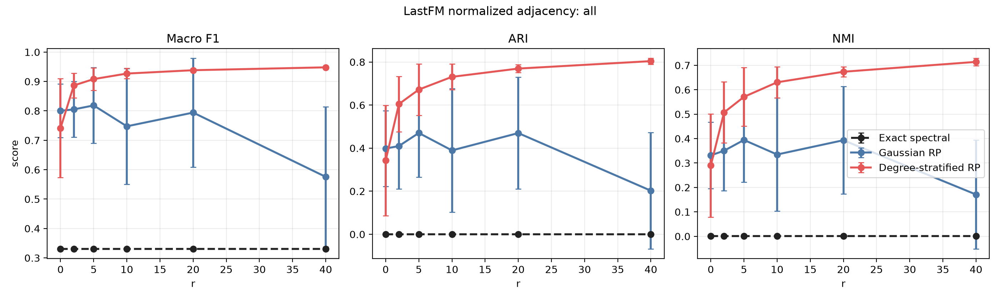
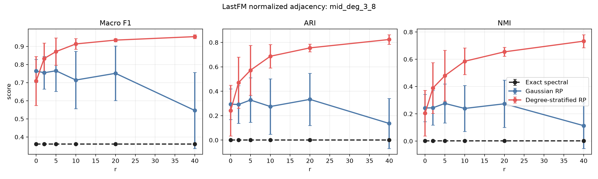
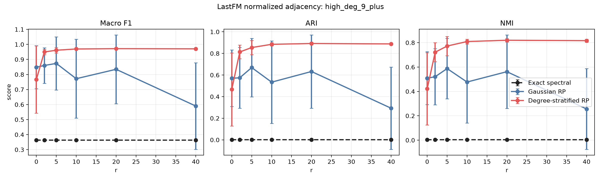

# Political Blogs 의사코드 정합 실험 결과보고서

## 0A. Non-random baseline 추가 후 최신 결과

본 섹션은 `Exact spectral` non-random baseline을 추가한 뒤 동일 설정으로 재실행한 최신 결과다. 아래 기존 본문은 randomized-only 실험 설명을 보존한 것이며, 수치 해석은 이 섹션을 우선한다.

전체 node 기준 Macro F1:

| r | Exact spectral | Gaussian RP | DS-RP | DS-RP - Gaussian | DS-RP - Exact |
|---:|---:|---:|---:|---:|---:|
| 0 | 0.3303 | 0.8003 | 0.7414 | -0.0589 | +0.4111 |
| 2 | 0.3303 | 0.8051 | 0.8865 | +0.0814 | +0.5562 |
| 5 | 0.3303 | 0.8186 | 0.9081 | +0.0895 | +0.5778 |
| 10 | 0.3303 | 0.7476 | 0.9270 | +0.1794 | +0.5967 |
| 20 | 0.3303 | 0.7942 | 0.9384 | +0.1442 | +0.6081 |
| 40 | 0.3303 | 0.5756 | 0.9481 | +0.3725 | +0.6178 |

`r=40`의 전체 지표:

| Method | Macro F1 | ARI | NMI |
|---|---:|---:|---:|
| Exact spectral | 0.3303 | -0.0002 | 0.0006 |
| Gaussian RP | 0.5756 | 0.2023 | 0.1711 |
| DS-RP | 0.9481 | 0.8040 | 0.7140 |

해석:

- PolBlogs에서는 DS-RP가 매우 강한 positive result를 보인다.
- 다만 exact top-`k` spectral baseline이 낮다는 점이 중요하다. 이는 DS-RP가 단순히 exact top-`k` eigenspace를 더 잘 근사해서 좋아진 것이 아니라, label-aligned direction을 포함하는 implicit filtering 효과를 보였다는 해석과 맞다.
- 따라서 논문에서는 PolBlogs를 "top-k eigenspace approximation"의 성공 사례가 아니라 "degree-stratified sketching이 community-relevant direction을 포착한 사례"로 조심스럽게 써야 한다.

## 0. 요약

본 보고서는 Political blog network에 대해 LastFM, Deezer Europe, Cora와 동일한 focused experiment 구성을 적용한 결과를 정리한다. 현재 코드는 의사코드와 맞춘 버전이다. 즉, Gaussian/degree-stratified test matrix는 dimension scaling을 사용하고, Rayleigh-Ritz 단계의 추가 symmetrization은 사용하지 않는다.

실험 조건은 다음과 같다.

| 항목 | 값 |
|---|---:|
| Graph operator | `S = D^{-1/2} A D^{-1/2}` |
| `alpha` | 0.5 |
| `tau` | 0 |
| `q` | 1 |
| 반복 수 | 10 |
| `r` | 0, 2, 5, 10, 20, 40 |
| Test matrix scaling | by dimension |
| Rayleigh-Ritz symmetrization | 사용하지 않음 |

핵심 결론은 다음과 같다.

> Political Blogs에서는 Degree-Stratified RP가 Gaussian RP보다 모든 `r`에서 더 높은 label-based clustering 성능을 보였다. 특히 `r=40`에서 전체 node 기준 Macro F1은 Gaussian RP 0.7174, DS-RP 0.9491로 +0.2318 개선되었고, ARI는 +0.4702, NMI는 +0.4382 개선되었다.

전체 node 기준 결과:

| r | Gaussian F1 | DS-RP F1 | F1 diff | Gaussian ARI | DS-RP ARI | ARI diff | Gaussian NMI | DS-RP NMI | NMI diff |
|---:|---:|---:|---:|---:|---:|---:|---:|---:|---:|
| 0 | 0.7379 | 0.7910 | +0.0531 | 0.2888 | 0.3839 | +0.0951 | 0.2395 | 0.3174 | +0.0779 |
| 2 | 0.7937 | 0.8769 | +0.0832 | 0.3927 | 0.5852 | +0.1925 | 0.3182 | 0.4922 | +0.1740 |
| 5 | 0.8171 | 0.8711 | +0.0540 | 0.4575 | 0.5771 | +0.1196 | 0.3785 | 0.4936 | +0.1151 |
| 10 | 0.6985 | 0.9219 | +0.2234 | 0.2811 | 0.7144 | +0.4333 | 0.2346 | 0.6137 | +0.3791 |
| 20 | 0.7380 | 0.9435 | +0.2055 | 0.3836 | 0.7874 | +0.4038 | 0.3216 | 0.6931 | +0.3715 |
| 40 | 0.7174 | 0.9491 | +0.2318 | 0.3374 | 0.8075 | +0.4702 | 0.2789 | 0.7171 | +0.4382 |

## 1. 데이터셋

Political blog network는 Adamic and Glance가 2005년에 수집한 미국 정치 블로그 hyperlink network이다. 원본은 directed graph이며, node label은 정치 성향을 나타낸다.

데이터 출처: [Mark Newman Network Data - Political blogs](https://websites.umich.edu/~mejn/netdata/)

본 실험에서는 기존 실험들과 동일하게 spectral clustering용 undirected operator를 만들기 위해 원본 directed edge를 symmetrize했다.

| 항목 | 값 |
|---|---:|
| 원본 node 수 | 1,490 |
| 원본 directed edge 수 | 19,090 |
| Symmetrized undirected edge 수 | 16,715 |
| 실험 node 수 | 1,222 |
| 실험 edge 수 | 16,714 |
| Class 수 | 2 |
| 사용한 `k` | 2 |
| Subgraph | largest connected component |

원본 라벨 의미는 다음과 같다.

| Label | 의미 | 원본 count | LCC count |
|---:|---|---:|---:|
| 0 | left / liberal | 758 | 586 |
| 1 | right / conservative | 732 | 636 |

Degree heterogeneity는 상당히 강하다.

| 항목 | 값 |
|---|---:|
| Degree min | 1 |
| Degree q25 | 3 |
| Degree median | 13 |
| Degree mean | 27.462 |
| Degree q75 | 36 |
| Degree q90 | 74.900 |
| Degree q99 | 178.110 |
| Degree max | 352 |
| Degree Gini | 0.623 |
| Tail alpha rough | 2.564 |
| Tail log-log CCDF R2 | 0.963 |

해석상 중요한 점은 이 데이터셋이 heavy-tailed degree structure를 가지면서도 정치 성향 label이 link structure와 강하게 align되어 있다는 것이다. 따라서 Deezer Europe처럼 label signal이 약한 case가 아니라, spectral embedding이 회복해야 할 community-relevant signal이 비교적 뚜렷한 case로 볼 수 있다.

## 2. 실험 구성

LastFM, Deezer Europe, Cora 실험과 동일하게 normalized adjacency를 사용했다.

```text
S = D^{-1/2} A D^{-1/2}
```

비교 방법은 다음 두 가지다.

| 방법 | 설명 |
|---|---|
| Gaussian RP | `Omega_ij ~ N(0, 1/ell)`인 global Gaussian sketch |
| Degree-Stratified RP | degree bucket별 `G_j ~ N(0, 1/ell_j)`를 사용하고, `ell_j`를 `sqrt(M_j)` 비율로 배분 |

Political Blogs는 binary label이므로 `k=2`로 설정했다.

| r | ell = k+r |
|---:|---:|
| 0 | 2 |
| 2 | 4 |
| 5 | 7 |
| 10 | 12 |
| 20 | 22 |
| 40 | 42 |

평가는 전체 node와 degree group별로 수행했다.

| Group | 조건 | Node 수 |
|---|---|---:|
| `all` | 전체 LCC node | 1,222 |
| `low_deg_1_2` | degree 1-2 | 242 |
| `mid_deg_3_8` | degree 3-8 | 271 |
| `high_deg_9_plus` | degree 9 이상 | 709 |

## 3. 전체 Node 결과

전체 node 기준으로 DS-RP는 모든 `r`에서 Gaussian RP보다 높다. 특히 `r=10` 이후부터 차이가 크게 벌어진다.

| r | Gaussian F1 | DS-RP F1 | F1 diff | Gaussian ARI | DS-RP ARI | ARI diff | Gaussian NMI | DS-RP NMI | NMI diff |
|---:|---:|---:|---:|---:|---:|---:|---:|---:|---:|
| 0 | 0.7379 | 0.7910 | +0.0531 | 0.2888 | 0.3839 | +0.0951 | 0.2395 | 0.3174 | +0.0779 |
| 2 | 0.7937 | 0.8769 | +0.0832 | 0.3927 | 0.5852 | +0.1925 | 0.3182 | 0.4922 | +0.1740 |
| 5 | 0.8171 | 0.8711 | +0.0540 | 0.4575 | 0.5771 | +0.1196 | 0.3785 | 0.4936 | +0.1151 |
| 10 | 0.6985 | 0.9219 | +0.2234 | 0.2811 | 0.7144 | +0.4333 | 0.2346 | 0.6137 | +0.3791 |
| 20 | 0.7380 | 0.9435 | +0.2055 | 0.3836 | 0.7874 | +0.4038 | 0.3216 | 0.6931 | +0.3715 |
| 40 | 0.7174 | 0.9491 | +0.2318 | 0.3374 | 0.8075 | +0.4702 | 0.2789 | 0.7171 | +0.4382 |



해석:

- Gaussian RP도 `r=2`, `r=5`에서는 비교적 괜찮은 성능을 보이지만, `r=10` 이후에는 평균 성능이 불안정하게 움직인다.
- DS-RP는 `r`이 커질수록 성능이 안정적으로 상승해 `r=40`에서 Macro F1 0.9491에 도달한다.
- Political Blogs는 degree heterogeneity와 community-label alignment가 모두 강한 데이터셋이므로, degree bucket별 sketch budget 배분의 장점이 뚜렷하게 드러난다.

## 4. Degree Group별 결과

### 4.1 Low-degree group: degree 1-2

| r | Gaussian F1 | DS-RP F1 | F1 diff | Gaussian ARI | DS-RP ARI | ARI diff | Gaussian NMI | DS-RP NMI | NMI diff |
|---:|---:|---:|---:|---:|---:|---:|---:|---:|---:|
| 0 | 0.6403 | 0.6794 | +0.0391 | 0.1248 | 0.1929 | +0.0681 | 0.1014 | 0.1542 | +0.0529 |
| 2 | 0.6892 | 0.7539 | +0.0647 | 0.1774 | 0.2854 | +0.1079 | 0.1461 | 0.2396 | +0.0935 |
| 5 | 0.6743 | 0.7227 | +0.0484 | 0.1651 | 0.2705 | +0.1054 | 0.1370 | 0.2289 | +0.0919 |
| 10 | 0.6301 | 0.8223 | +0.1922 | 0.1195 | 0.4240 | +0.3045 | 0.1017 | 0.3478 | +0.2461 |
| 20 | 0.6607 | 0.8676 | +0.2069 | 0.1681 | 0.5402 | +0.3721 | 0.1494 | 0.4574 | +0.3080 |
| 40 | 0.6443 | 0.8850 | +0.2408 | 0.1244 | 0.5923 | +0.4679 | 0.1190 | 0.5094 | +0.3904 |

Low-degree group에서도 DS-RP의 개선이 크다. 이는 low-degree node가 global sketch에서 상대적으로 약하게 반영되는 문제를 degree-stratified sketch가 완화한다는 주장과 잘 맞는다.

### 4.2 Mid-degree group: degree 3-8

| r | Gaussian F1 | DS-RP F1 | F1 diff | Gaussian ARI | DS-RP ARI | ARI diff | Gaussian NMI | DS-RP NMI | NMI diff |
|---:|---:|---:|---:|---:|---:|---:|---:|---:|---:|
| 0 | 0.6776 | 0.6903 | +0.0127 | 0.1949 | 0.2173 | +0.0224 | 0.1570 | 0.1792 | +0.0223 |
| 2 | 0.7235 | 0.8256 | +0.1021 | 0.2498 | 0.4581 | +0.2083 | 0.2029 | 0.3850 | +0.1821 |
| 5 | 0.7764 | 0.8218 | +0.0454 | 0.3568 | 0.4748 | +0.1180 | 0.2896 | 0.4077 | +0.1181 |
| 10 | 0.6425 | 0.8897 | +0.2473 | 0.1773 | 0.6177 | +0.4403 | 0.1490 | 0.5220 | +0.3730 |
| 20 | 0.7068 | 0.9415 | +0.2347 | 0.2849 | 0.7802 | +0.4954 | 0.2344 | 0.6834 | +0.4489 |
| 40 | 0.6633 | 0.9508 | +0.2874 | 0.2132 | 0.8130 | +0.5997 | 0.1734 | 0.7191 | +0.5457 |

Mid-degree group에서 차이가 가장 크게 나타났다. `r=40` 기준 Macro F1 개선은 +0.2874, ARI 개선은 +0.5997이다.



### 4.3 High-degree group: degree 9 이상

| r | Gaussian F1 | DS-RP F1 | F1 diff | Gaussian ARI | DS-RP ARI | ARI diff | Gaussian NMI | DS-RP NMI | NMI diff |
|---:|---:|---:|---:|---:|---:|---:|---:|---:|---:|
| 0 | 0.7872 | 0.8723 | +0.0851 | 0.4270 | 0.5894 | +0.1624 | 0.3815 | 0.5117 | +0.1303 |
| 2 | 0.8521 | 0.9381 | +0.0861 | 0.5831 | 0.7800 | +0.1969 | 0.5051 | 0.6920 | +0.1869 |
| 5 | 0.8839 | 0.9414 | +0.0576 | 0.6490 | 0.7953 | +0.1463 | 0.5732 | 0.7203 | +0.1471 |
| 10 | 0.7363 | 0.9674 | +0.2311 | 0.4172 | 0.8760 | +0.4588 | 0.3696 | 0.7976 | +0.4280 |
| 20 | 0.7674 | 0.9698 | +0.2024 | 0.5299 | 0.8849 | +0.3550 | 0.4666 | 0.8104 | +0.3438 |
| 40 | 0.7541 | 0.9701 | +0.2160 | 0.4954 | 0.8859 | +0.3905 | 0.4295 | 0.8131 | +0.3837 |

High-degree group은 원래도 link signal이 강한 편이지만, DS-RP가 더 높은 성능과 더 안정적인 결과를 보인다.



## 5. Runtime 결과

이 데이터셋은 작아서 두 방법 모두 매우 빠르다. 전체 method time 기준으로는 DS-RP가 Gaussian RP보다 오히려 약간 빠르게 측정되었다. 이는 embedding 자체는 DS-RP가 더 오래 걸리지만, 이후 clustering이 더 안정적으로 끝난 영향으로 보인다.

| r | Method | Embedding sec | Clustering sec | Total sec |
|---:|---|---:|---:|---:|
| 0 | Gaussian RP | 0.00075 | 0.02552 | 0.02628 |
| 0 | Degree-stratified RP | 0.00158 | 0.01421 | 0.01578 |
| 2 | Gaussian RP | 0.00100 | 0.01854 | 0.01955 |
| 2 | Degree-stratified RP | 0.00202 | 0.01385 | 0.01587 |
| 5 | Gaussian RP | 0.00098 | 0.01802 | 0.01900 |
| 5 | Degree-stratified RP | 0.00291 | 0.01433 | 0.01724 |
| 10 | Gaussian RP | 0.00160 | 0.01810 | 0.01971 |
| 10 | Degree-stratified RP | 0.00380 | 0.01267 | 0.01648 |
| 20 | Gaussian RP | 0.00308 | 0.02007 | 0.02315 |
| 20 | Degree-stratified RP | 0.00593 | 0.01231 | 0.01824 |
| 40 | Gaussian RP | 0.00619 | 0.02024 | 0.02643 |
| 40 | Degree-stratified RP | 0.00947 | 0.01182 | 0.02129 |

## 6. Bucket Allocation 예시

`r=40`이면 `ell = k+r = 42`이다. 첫 번째 반복에서 DS-RP bucket allocation은 다음과 같다.

| Bucket | Degree range | Nodes | Mass | sqrt(Mass) | Sketch dim | Entry std |
|---:|---|---:|---:|---:|---:|---:|
| 1 | [1, 2) | 135 | 135 | 11.619 | 2 | 0.707 |
| 2 | [2, 4) | 182 | 439 | 20.952 | 2 | 0.707 |
| 3 | [4, 8) | 169 | 897 | 29.950 | 3 | 0.577 |
| 4 | [8, 16) | 189 | 2,182 | 46.712 | 4 | 0.500 |
| 5 | [16, 32) | 196 | 4,332 | 65.818 | 6 | 0.408 |
| 6 | [32, 64) | 184 | 8,071 | 89.839 | 7 | 0.378 |
| 7 | [64, 128) | 134 | 11,486 | 107.173 | 8 | 0.354 |
| 8 | [128, 256) | 28 | 4,502 | 67.097 | 6 | 0.408 |
| 9 | [256, 512) | 5 | 1,514 | 38.910 | 4 | 0.500 |

이 배분은 hub 쪽 bucket에 더 많은 sketch dimension을 주면서도 low/mid degree 영역을 완전히 잃지 않는다. Political Blogs처럼 degree range가 넓고 정치 성향 community가 edge structure에 강하게 반영된 graph에서는 이 구조가 성능 개선으로 이어진다.

## 7. 논문용 해석

Political Blogs는 논문 실험에 넣기 좋은 positive case다.

1. Degree distribution이 heavy-tailed이다.
2. Label이 link community와 강하게 맞물려 있다.
3. Gaussian RP는 sketch dimension을 늘려도 성능이 불안정한 반면, DS-RP는 `r` 증가에 따라 안정적으로 개선된다.
4. Low/mid/high degree group 모두에서 개선이 나타나므로, 특정 degree 영역에만 유리한 결과가 아니다.

논문에서는 다음 식으로 해석할 수 있다.

> The Political Blogs experiment illustrates that degree-stratified sketching is particularly effective when degree heterogeneity coexists with community-aligned labels. Compared with a global Gaussian sketch, the proposed method consistently improves clustering quality across all degree strata, with the largest gains appearing in the low- and mid-degree groups.

주의할 점도 있다.

- 원본 graph는 directed network이며, 본 실험에서는 기존 실험 구성과 맞추기 위해 undirected graph로 symmetrize했다.
- label은 blog directory 및 일부 manual labeling에서 온 정치 성향 label이므로 완전한 ground truth community라기보다 political leaning attribute로 보는 것이 정확하다.
- 최종 논문 표에는 현재 10회 반복 결과를 그대로 쓸 수 있지만, 심사용 안정성을 더 높이려면 30회 반복 또는 여러 seed 결과를 추가하는 것이 좋다.

## 8. Sanity Check

결과가 매우 높게 나왔기 때문에 추가 검산을 수행했다.

| Check | 결과 | 해석 |
|---|---:|---|
| Same-label edge rate | 0.9058 | edge의 약 90.6%가 같은 정치 성향 node 사이에 존재한다. |
| Random-label same-edge baseline | 0.5008 | label이 무작위라면 약 50.1%가 기대된다. |
| Degree-only KMeans F1 | 0.5456 | degree만으로는 DS-RP의 F1 0.9491을 설명하지 못한다. |
| Label permutation F1 | 0.5099 ± 0.0086 | label을 섞으면 성능이 chance 수준으로 떨어진다. |

`r=40` DS-RP 단일 재현 run의 confusion matrix는 다음과 같다.

| True label | Predicted 0 | Predicted 1 |
|---:|---:|---:|
| 0: left/liberal | 542 | 44 |
| 1: right/conservative | 17 | 619 |

Exact spectral baseline도 함께 확인했다. `S = D^{-1/2} A D^{-1/2}`의 largest algebraic eigenvalues는 다음과 같다.

```text
1.000000, 0.918560, 0.890997, 0.792250, 0.715788, 0.711329
```

여기서 label과 강하게 맞는 방향은 eigenvalue 0.890997에 해당하는 세 번째 eigenvector다. 따라서 naive exact top-2 spectral clustering은 이 label-aligned direction을 포함하지 못해 성능이 낮다.

| Embedding | ARI | NMI | Macro F1 |
|---|---:|---:|---:|
| Exact `v0, v1` | -0.0002 | 0.0006 | 0.3303 |
| Exact `v0, v2` | 0.8220 | 0.7298 | 0.9532 |
| Exact `v2` only | 0.8013 | 0.7121 | 0.9474 |
| DS-RP `r=40`, one run | 0.8101 | 0.7202 | 0.9499 |

이 검산은 두 가지를 말해준다.

1. DS-RP의 높은 성능은 label leakage 때문이라기보다, PolBlogs graph 자체의 강한 political homophily와 관련이 있다.
2. 그러나 이 결과를 “top-k eigenspace 근사 정확도”로만 해석하면 안 된다. DS-RP는 이 case에서 nuisance eigenvector를 약화시키고 label-aligned direction을 포함하는 implicit filtering 효과를 보인다.

따라서 논문에서는 PolBlogs 결과를 단순한 eigensolver accuracy가 아니라, degree heterogeneity가 있는 graph에서 community-relevant subspace를 더 안정적으로 포착한 사례로 해석하는 것이 적절하다.

## 9. 산출물 위치

| 산출물 | 경로 |
|---|---|
| Raw results | `results/polblogs_degree_stratum_alpha05_tau0/polblogs_degree_stratum_raw.csv` |
| Summary results | `results/polblogs_degree_stratum_alpha05_tau0/polblogs_degree_stratum_summary.csv` |
| Paired differences | `results/polblogs_degree_stratum_alpha05_tau0/polblogs_degree_stratum_paired_ds_minus_gaussian.csv` |
| Bucket allocations | `results/polblogs_degree_stratum_alpha05_tau0/polblogs_degree_stratum_bucket_allocations.csv` |
| Metadata | `results/polblogs_degree_stratum_alpha05_tau0/polblogs_degree_stratum_meta.json` |
| Figures | `results/polblogs_degree_stratum_alpha05_tau0/viz/` |
