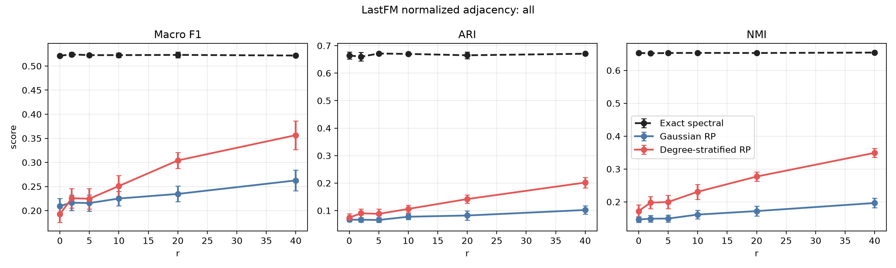
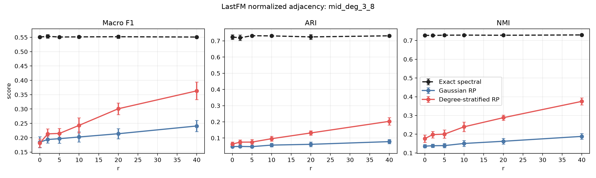

# LastFM Asia 의사코드 정합 실험 결과보고서

## 0A. Non-random baseline 추가 후 최신 결과

본 섹션은 `Exact spectral` non-random baseline을 추가한 뒤 동일 설정으로 재실행한 최신 결과다. 아래 기존 본문은 randomized-only 실험 설명을 보존한 것이며, 수치 해석은 이 섹션을 우선한다.

`Exact spectral`은 `S = D^{-1/2} A D^{-1/2}`에 대해 exact top-`k` eigenvector를 계산한 뒤 같은 row-normalization과 KMeans 평가를 적용한 기준선이다.

전체 node 기준 Macro F1:

| r | Exact spectral | Gaussian RP | DS-RP | DS-RP - Gaussian | DS-RP - Exact |
|---:|---:|---:|---:|---:|---:|
| 0 | 0.5213 | 0.2096 | 0.1926 | -0.0170 | -0.3287 |
| 2 | 0.5241 | 0.2164 | 0.2257 | +0.0093 | -0.2984 |
| 5 | 0.5226 | 0.2157 | 0.2246 | +0.0089 | -0.2980 |
| 10 | 0.5226 | 0.2250 | 0.2510 | +0.0260 | -0.2716 |
| 20 | 0.5231 | 0.2346 | 0.3041 | +0.0695 | -0.2190 |
| 40 | 0.5218 | 0.2626 | 0.3565 | +0.0939 | -0.1653 |

`r=40`의 전체 지표:

| Method | Macro F1 | ARI | NMI |
|---|---:|---:|---:|
| Exact spectral | 0.5218 | 0.6706 | 0.6542 |
| Gaussian RP | 0.2626 | 0.1022 | 0.1965 |
| DS-RP | 0.3565 | 0.2020 | 0.3492 |

해석:

- DS-RP는 Gaussian RP보다 확실히 높지만, exact spectral baseline에는 아직 미치지 못한다.
- 따라서 LastFM 결과는 "DS-RP가 standard Gaussian sketch보다 community signal을 더 잘 보존한다"는 근거로는 쓸 수 있지만, "exact spectral 수준의 성능을 달성한다"고 주장하면 안 된다.
- 논문에서는 randomized approximation gap이 남아 있는 hard real-world case로 해석하는 것이 적절하다.

## 0. 요약

본 보고서는 교수님 피드백을 반영해 구현을 의사코드와 정합시킨 뒤, 기존 LastFM Asia focused experiment와 동일한 실험 구성을 다시 실행한 결과를 정리한다.

이번 코드 정합 기준은 다음과 같다.

| 항목 | 반영 내용 |
|---|---|
| Gaussian test matrix scaling | Gaussian RP는 `Omega_ij ~ N(0, 1/ell)`를 사용 |
| Degree-stratified block scaling | DS-RP는 bucket별 `G_j ~ N(0, 1/ell_j)`를 사용 |
| Rayleigh-Ritz projection | `B = Q^T S Q`를 그대로 사용 |
| Symmetrization line | 의사코드 31번에 해당하는 `B <- (B+B^T)/2`를 코드에서도 제거 |

핵심 결과는 기존 관찰과 일관된다.

> LastFM Asia normalized adjacency 조건에서 Degree-Stratified RP는 `r=10` 이후 Gaussian RP보다 높은 label 기반 clustering 성능을 보였다. 개선폭은 특히 degree 3-8의 mid-degree node group에서 가장 크게 나타났다.

전체 node 기준 주요 결과는 다음과 같다.

| r | Gaussian F1 | DS-RP F1 | F1 개선폭 | Gaussian ARI | DS-RP ARI | ARI 개선폭 | Gaussian NMI | DS-RP NMI | NMI 개선폭 |
|---:|---:|---:|---:|---:|---:|---:|---:|---:|---:|
| 0 | 0.2133 | 0.2050 | -0.0083 | 0.0644 | 0.0807 | +0.0164 | 0.1475 | 0.1795 | +0.0320 |
| 2 | 0.2229 | 0.2144 | -0.0085 | 0.0703 | 0.0873 | +0.0170 | 0.1535 | 0.1987 | +0.0452 |
| 5 | 0.2175 | 0.2256 | +0.0081 | 0.0665 | 0.0870 | +0.0205 | 0.1492 | 0.1996 | +0.0504 |
| 10 | 0.2239 | 0.2757 | +0.0518 | 0.0726 | 0.1164 | +0.0438 | 0.1592 | 0.2427 | +0.0836 |
| 20 | 0.2326 | 0.2965 | +0.0639 | 0.0808 | 0.1377 | +0.0569 | 0.1689 | 0.2713 | +0.1024 |
| 40 | 0.2654 | 0.3500 | +0.0846 | 0.1019 | 0.1995 | +0.0976 | 0.1967 | 0.3431 | +0.1463 |

## 1. 코드 정합성 변경

이번 재실험에서는 의사코드와 구현의 불일치 가능성을 줄이기 위해 다음 코드를 수정했다.

1. `degree_stratified_random_projection`의 Gaussian block을 기본적으로 `1/sqrt(ell_j)`로 scale한다.
2. `gaussian_random_projection`도 기본적으로 `1/sqrt(ell)`로 scale한다.
3. LastFM degree-stratum experiment의 기본 설정을 `scale_test_matrix_by_dim=True`로 변경했다.
4. Rayleigh-Ritz 단계에서 작은 projected matrix를 강제로 symmetrize하던 구현 디테일을 제거했다.

수학적으로 `B = Q^T S Q`는 `S`가 symmetric이면 이미 symmetric이다. 따라서 `B <- (B+B^T)/2`는 알고리즘의 본질적 단계가 아니라 roundoff 보정용 구현 디테일이다. 본 실험에서는 논문 의사코드와 구현을 맞추기 위해 이 줄을 제거했다.

## 2. 실험 설정

### 2.1 데이터셋

| 항목 | 값 |
|---|---:|
| 데이터셋 | SNAP LastFM Asia |
| Node 수 | 7,624 |
| Edge 수 | 27,806 |
| Label class 수 | 18 |
| Degree min | 1 |
| Degree median | 4 |
| Degree mean | 7.294 |
| Degree q75 | 8 |
| Degree q90 | 16 |
| Degree q99 | 55.77 |
| Degree max | 216 |
| Degree Gini | 0.583 |
| Tail log-log CCDF R2 | 0.973 |

LastFM Asia는 degree Gini가 높고 tail log-log CCDF fit도 높으므로, heavy-tailed degree structure를 가진 social graph로 볼 수 있다.

### 2.2 Operator와 파라미터

이번 실험은 normalized adjacency를 사용했다.

```text
S = D^{-1/2} A D^{-1/2}
```

더 일반적으로는 다음 operator의 특수한 경우이다.

```text
S_{alpha,tau} = D_tau^{-alpha} A D_tau^{-alpha}
D_tau = D + tau I
```

| 파라미터 | 값 |
|---|---:|
| `alpha` | 0.5 |
| `tau` | 0 |
| `k` | 18 |
| `r` | 0, 2, 5, 10, 20, 40 |
| `q` | 1 |
| `reps` | 10 |
| `ell_min` | 1 |
| k-means `n_init` | 20 |
| Row normalization | True |
| Test matrix scaling | by dimension |

실행 명령은 다음과 같다.

```powershell
cd C:\Users\WWindows10\Documents\github_project\python-rand-nla-research\degree_stratified_rp_powerlaw

python .\lastfm_degree_stratum_experiment.py `
  --dataset-path ..\data\lastfm_asia\lastfm_asia.zip `
  --dataset-name lastfm-asia `
  --r-values 0,2,5,10,20,40 `
  --alpha 0.5 `
  --tau 0 `
  --q 1 `
  --reps 10 `
  --outdir results\lastfm_degree_stratum_alpha05_tau0
```

## 3. 전체 Node 결과

전체 node 기준으로는 `r=5`부터 DS-RP가 Macro F1에서 Gaussian RP를 앞서기 시작했고, `r=10` 이후에는 Macro F1, ARI, NMI 모두에서 DS-RP가 더 높았다.

| r | Gaussian F1 | DS-RP F1 | DS - Gaussian | Gaussian ARI | DS-RP ARI | DS - Gaussian | Gaussian NMI | DS-RP NMI | DS - Gaussian |
|---:|---:|---:|---:|---:|---:|---:|---:|---:|---:|
| 0 | 0.2133 | 0.2050 | -0.0083 | 0.0644 | 0.0807 | +0.0164 | 0.1475 | 0.1795 | +0.0320 |
| 2 | 0.2229 | 0.2144 | -0.0085 | 0.0703 | 0.0873 | +0.0170 | 0.1535 | 0.1987 | +0.0452 |
| 5 | 0.2175 | 0.2256 | +0.0081 | 0.0665 | 0.0870 | +0.0205 | 0.1492 | 0.1996 | +0.0504 |
| 10 | 0.2239 | 0.2757 | +0.0518 | 0.0726 | 0.1164 | +0.0438 | 0.1592 | 0.2427 | +0.0836 |
| 20 | 0.2326 | 0.2965 | +0.0639 | 0.0808 | 0.1377 | +0.0569 | 0.1689 | 0.2713 | +0.1024 |
| 40 | 0.2654 | 0.3500 | +0.0846 | 0.1019 | 0.1995 | +0.0976 | 0.1967 | 0.3431 | +0.1463 |

핵심 관찰:

- `r=0,2`에서는 Macro F1 기준으로 Gaussian RP가 약간 높다.
- `r=5`부터 DS-RP가 Macro F1에서 앞서기 시작한다.
- `r=10,20,40`에서는 DS-RP의 개선폭이 커진다.
- `r=40`에서 전체 Macro F1은 Gaussian RP 0.2654, DS-RP 0.3500으로 개선폭은 +0.0846이다.



## 4. Degree Group별 결과

### 4.1 Low-degree group: degree 1-2

Low-degree group은 구조 정보가 제한적이므로 절대 성능은 낮다. 그러나 `r=10` 이후에는 DS-RP가 모든 지표에서 Gaussian RP보다 높았다.

| r | Gaussian F1 | DS-RP F1 | F1 개선폭 | Gaussian ARI | DS-RP ARI | ARI 개선폭 | Gaussian NMI | DS-RP NMI | NMI 개선폭 |
|---:|---:|---:|---:|---:|---:|---:|---:|---:|---:|
| 0 | 0.1451 | 0.1362 | -0.0089 | 0.0243 | 0.0203 | -0.0040 | 0.0817 | 0.0934 | +0.0117 |
| 2 | 0.1506 | 0.1504 | -0.0003 | 0.0248 | 0.0245 | -0.0003 | 0.0821 | 0.1063 | +0.0242 |
| 5 | 0.1487 | 0.1584 | +0.0097 | 0.0249 | 0.0247 | -0.0002 | 0.0812 | 0.1055 | +0.0243 |
| 10 | 0.1460 | 0.1869 | +0.0409 | 0.0255 | 0.0350 | +0.0095 | 0.0838 | 0.1275 | +0.0436 |
| 20 | 0.1575 | 0.2000 | +0.0425 | 0.0296 | 0.0435 | +0.0139 | 0.0903 | 0.1443 | +0.0541 |
| 40 | 0.1767 | 0.2486 | +0.0719 | 0.0367 | 0.0742 | +0.0375 | 0.1049 | 0.1952 | +0.0903 |

### 4.2 Mid-degree group: degree 3-8

Mid-degree group에서 개선폭이 가장 크게 나타났다. 이 그룹은 node 수가 많고 모든 label class가 포함되어 있어, degree-stratified sketch가 community-relevant information을 보존한다는 주장을 뒷받침하는 핵심 결과로 볼 수 있다.

| r | Gaussian F1 | DS-RP F1 | F1 개선폭 | Gaussian ARI | DS-RP ARI | ARI 개선폭 | Gaussian NMI | DS-RP NMI | NMI 개선폭 |
|---:|---:|---:|---:|---:|---:|---:|---:|---:|---:|
| 0 | 0.1878 | 0.1931 | +0.0053 | 0.0454 | 0.0679 | +0.0224 | 0.1363 | 0.1831 | +0.0468 |
| 2 | 0.1978 | 0.2086 | +0.0108 | 0.0502 | 0.0747 | +0.0245 | 0.1435 | 0.2016 | +0.0581 |
| 5 | 0.1976 | 0.2179 | +0.0202 | 0.0476 | 0.0751 | +0.0275 | 0.1407 | 0.2048 | +0.0641 |
| 10 | 0.2003 | 0.2685 | +0.0682 | 0.0539 | 0.1041 | +0.0502 | 0.1514 | 0.2499 | +0.0985 |
| 20 | 0.2123 | 0.2904 | +0.0781 | 0.0610 | 0.1271 | +0.0661 | 0.1617 | 0.2810 | +0.1193 |
| 40 | 0.2402 | 0.3507 | +0.1105 | 0.0783 | 0.1973 | +0.1191 | 0.1870 | 0.3656 | +0.1786 |

`r=40`에서 mid-degree group의 개선폭은 Macro F1 +0.1105, ARI +0.1191, NMI +0.1786이다.



### 4.3 High-degree group: degree 9 이상

High-degree group에서는 작은 `r`에서 Gaussian RP의 Macro F1이 더 높았지만, ARI와 NMI는 처음부터 DS-RP가 높았다. `r=10` 이후에는 Macro F1도 DS-RP가 더 높았다.

| r | Gaussian F1 | DS-RP F1 | F1 개선폭 | Gaussian ARI | DS-RP ARI | ARI 개선폭 | Gaussian NMI | DS-RP NMI | NMI 개선폭 |
|---:|---:|---:|---:|---:|---:|---:|---:|---:|---:|
| 0 | 0.3373 | 0.3042 | -0.0331 | 0.2421 | 0.3082 | +0.0661 | 0.3919 | 0.4318 | +0.0400 |
| 2 | 0.3509 | 0.3141 | -0.0368 | 0.2686 | 0.3132 | +0.0446 | 0.4047 | 0.4565 | +0.0519 |
| 5 | 0.3559 | 0.3331 | -0.0227 | 0.2508 | 0.3092 | +0.0584 | 0.3981 | 0.4554 | +0.0573 |
| 10 | 0.3627 | 0.4042 | +0.0415 | 0.2744 | 0.3953 | +0.1209 | 0.4200 | 0.5327 | +0.1127 |
| 20 | 0.3743 | 0.4321 | +0.0578 | 0.2930 | 0.4389 | +0.1460 | 0.4315 | 0.5736 | +0.1421 |
| 40 | 0.4242 | 0.4819 | +0.0576 | 0.3542 | 0.5334 | +0.1792 | 0.4877 | 0.6548 | +0.1672 |

## 5. Runtime 결과

Embedding 계산만 보면 DS-RP가 Gaussian RP보다 느리다. 이는 bucket별 sketch를 구성하고 concatenate하는 비용이 있기 때문이다. 다만 total time은 k-means 시간의 변동도 포함하므로, 알고리즘의 sketch/eigenspace 계산 비용은 embedding time을 중심으로 해석하는 것이 더 적절하다.

| r | 방법 | Embedding sec | Clustering sec | Total sec |
|---:|---|---:|---:|---:|
| 0 | Gaussian RP | 0.0099 | 0.5534 | 0.5633 |
| 0 | DS-RP | 0.0151 | 0.3400 | 0.3551 |
| 2 | Gaussian RP | 0.0110 | 0.4182 | 0.4292 |
| 2 | DS-RP | 0.0158 | 0.3411 | 0.3569 |
| 5 | Gaussian RP | 0.0130 | 0.4283 | 0.4412 |
| 5 | DS-RP | 0.0187 | 0.3370 | 0.3557 |
| 10 | Gaussian RP | 0.0164 | 0.4105 | 0.4269 |
| 10 | DS-RP | 0.0220 | 0.3697 | 0.3917 |
| 20 | Gaussian RP | 0.0210 | 0.4149 | 0.4358 |
| 20 | DS-RP | 0.0295 | 0.3498 | 0.3793 |
| 40 | Gaussian RP | 0.0327 | 0.3706 | 0.4033 |
| 40 | DS-RP | 0.0451 | 0.3363 | 0.3815 |

## 6. Bucket Allocation 예시

`r=40`일 때 `ell = k+r = 58`이다. 첫 번째 반복에서 DS-RP의 bucket allocation은 다음과 같다.

| Bucket | Degree range | Node 수 | Mass | sqrt(Mass) | Sketch dim | Entry std |
|---:|---|---:|---:|---:|---:|---:|
| 1 | [1, 2) | 1,754 | 1,754 | 41.881 | 4 | 0.500 |
| 2 | [2, 4) | 1,979 | 4,749 | 68.913 | 6 | 0.408 |
| 3 | [4, 8) | 1,786 | 9,332 | 96.602 | 9 | 0.333 |
| 4 | [8, 16) | 1,265 | 13,563 | 116.460 | 10 | 0.316 |
| 5 | [16, 32) | 576 | 12,304 | 110.923 | 10 | 0.316 |
| 6 | [32, 64) | 212 | 8,953 | 94.620 | 9 | 0.333 |
| 7 | [64, 128) | 46 | 3,921 | 62.618 | 6 | 0.408 |
| 8 | [128, 256) | 6 | 1,036 | 32.187 | 4 | 0.500 |

이 배분은 high-degree 영역에 더 많은 sketch dimension을 주되, mass에 정비례시키지는 않는다. 따라서 hub bucket이 전체 budget을 독점하지 않고, low/mid-degree 영역에도 representation이 보장된다.

## 7. 해석

이번 결과는 다음 메시지를 지지한다.

1. Normalized adjacency 조건에서 Gaussian RP는 degree scale별 community signal을 충분히 안정적으로 보존하지 못하는 구간이 있다.
2. Degree-Stratified RP는 degree bucket별 sketch를 통해 low/mid/high degree 영역을 명시적으로 반영한다.
3. LastFM Asia에서는 특히 mid-degree node group에서 DS-RP의 개선폭이 가장 크게 나타났다.
4. Test matrix scaling을 의사코드와 맞추고 Rayleigh-Ritz symmetrization을 제거해도 핵심 실험 결과는 유지된다.

## 8. 결론

의사코드와 구현을 정합시킨 뒤 동일한 LastFM Asia 실험을 다시 수행한 결과, 기존 핵심 결론은 유지되었다.

> LastFM Asia normalized adjacency 실험에서 Degree-Stratified RP는 `r=10` 이후 Gaussian RP보다 높은 label 기반 clustering 지표를 보였으며, 개선폭은 degree 3-8의 mid-degree group에서 가장 컸다.

논문 관점에서 가장 중요한 수치는 다음과 같다.

| 기준 | Gaussian RP | DS-RP | 개선폭 |
|---|---:|---:|---:|
| 전체 Macro F1, r=40 | 0.2654 | 0.3500 | +0.0846 |
| 전체 ARI, r=40 | 0.1019 | 0.1995 | +0.0976 |
| 전체 NMI, r=40 | 0.1967 | 0.3431 | +0.1463 |
| Mid-degree Macro F1, r=40 | 0.2402 | 0.3507 | +0.1105 |
| Mid-degree ARI, r=40 | 0.0783 | 0.1973 | +0.1191 |
| Mid-degree NMI, r=40 | 0.1870 | 0.3656 | +0.1786 |

따라서 본 실험은 다음 주장을 뒷받침한다.

> In heavy-tailed graphs, degree-stratified randomized sketching can better preserve community-relevant spectral information across degree scales than a global Gaussian sketch, especially for mid-degree nodes under normalized adjacency.

## 9. 결과 파일

이번 재실험 결과는 다음 위치에 저장되어 있다.

| 파일 | 내용 |
|---|---|
| `results/lastfm_degree_stratum_alpha05_tau0/lastfm_degree_stratum_raw.csv` | 반복별 원자료 |
| `results/lastfm_degree_stratum_alpha05_tau0/lastfm_degree_stratum_summary.csv` | group, r, method별 평균/표준편차 |
| `results/lastfm_degree_stratum_alpha05_tau0/lastfm_degree_stratum_paired_ds_minus_gaussian.csv` | 같은 반복 번호 기준 DS-RP minus Gaussian paired difference |
| `results/lastfm_degree_stratum_alpha05_tau0/lastfm_degree_stratum_bucket_allocations.csv` | DS-RP bucket별 sketch dimension 배분 |
| `results/lastfm_degree_stratum_alpha05_tau0/lastfm_degree_stratum_meta.json` | 실행 설정, 그래프 진단, operator 정보 |
| `results/lastfm_degree_stratum_alpha05_tau0/viz/*.png` | 성능 및 paired difference 시각화 |
