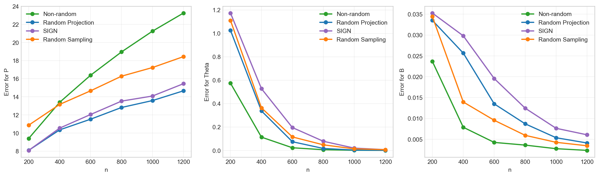
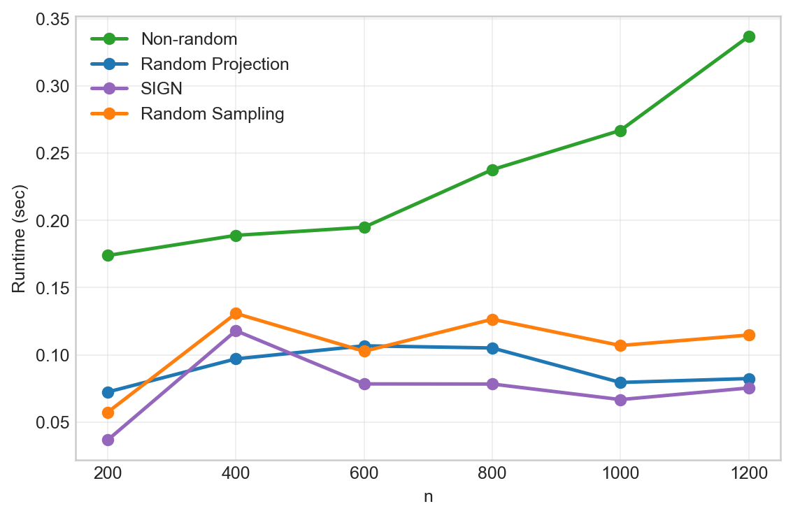
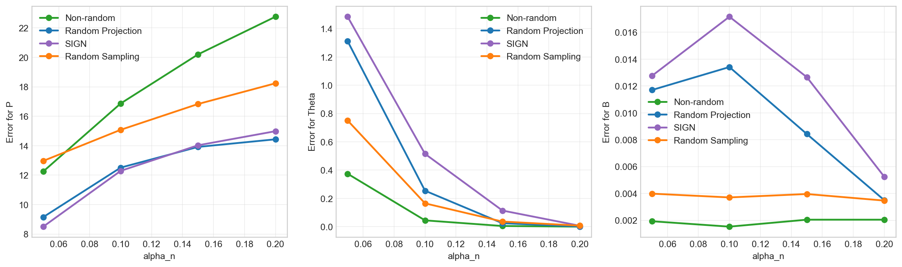
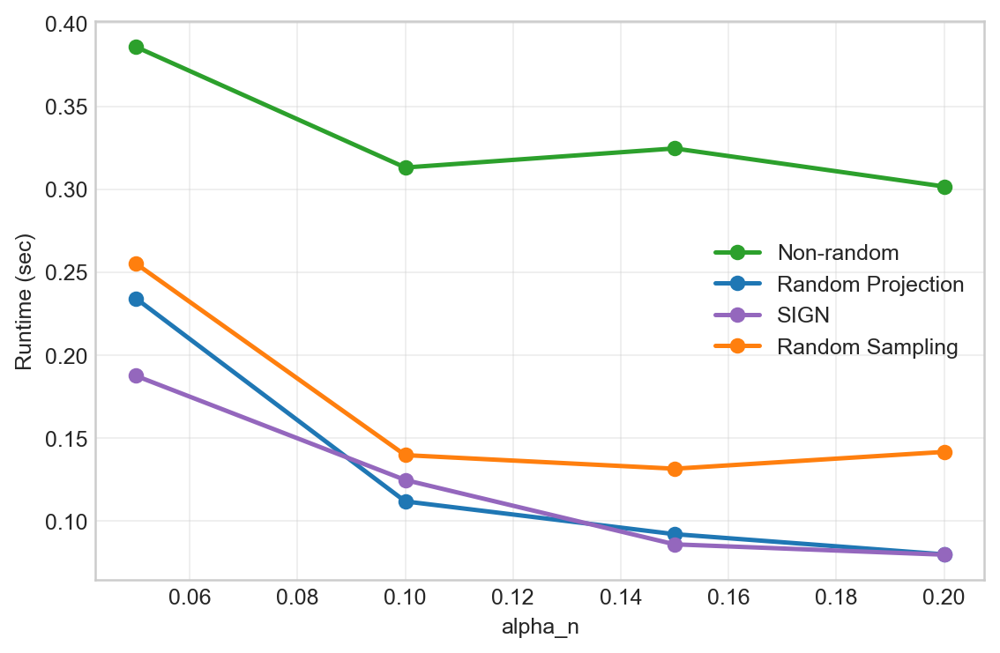
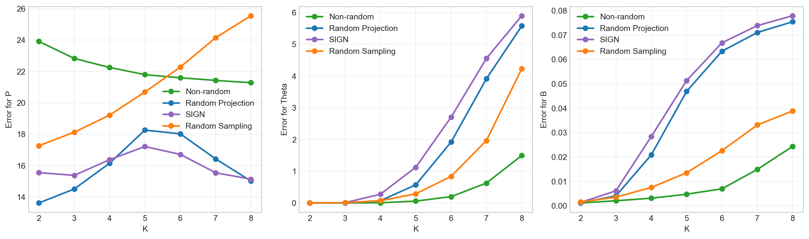
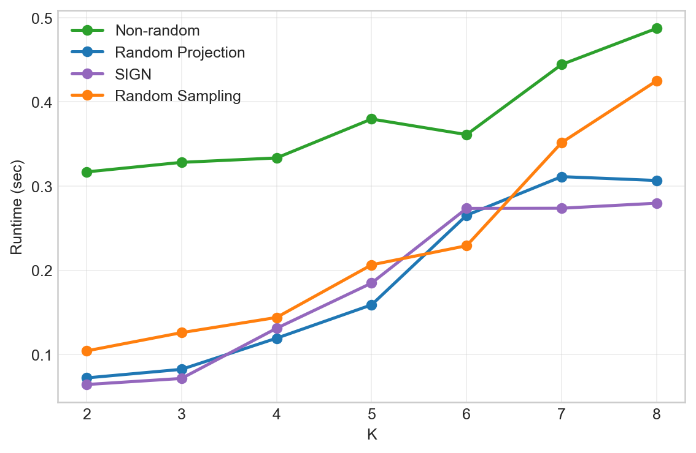
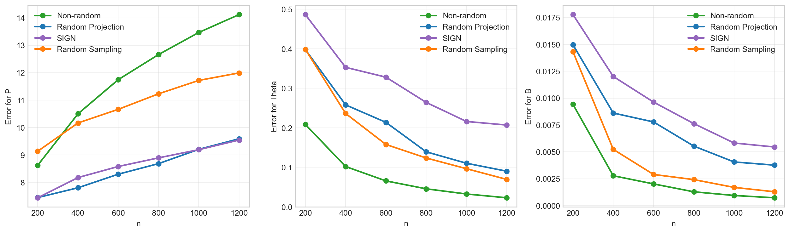
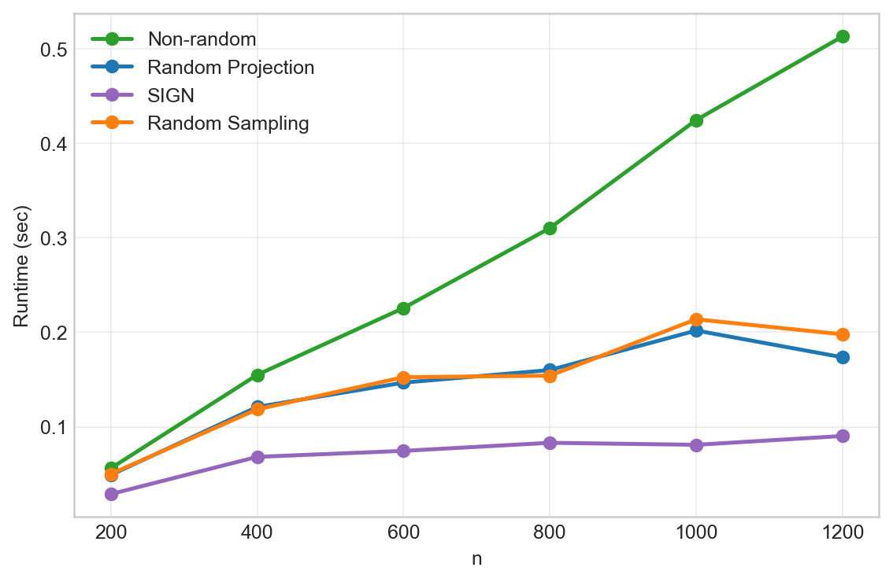

# Wang 2025 SIGN 방법론의 Section 7.1 적용 보고서

## 목적

사용자가 제공한 Wang et al. (2025)의 SIGN(generalized Nystrom method with subspace iteration)을 Reference 1 Section 7.1 SBM 실험에 추가 적용했다. 기존 7.1 실험의 `Random Projection`, `Random Sampling`, `Non-random` 결과는 그대로 두고, 같은 난수 seed 흐름으로 생성되는 SBM 인스턴스에 `SIGN`을 추가 실행한 뒤 비교했다.

## 구현 메모

- 구현 함수: `src.common.run_sign_subspace_iteration`
- 실행 스크립트: `experiments/reference_1_section7_1/run_sign_section7_1.py`
- 결과 폴더: `/Users/eomjeonghyeon/Documents/github_project/python-rand-nla-research/experiments/reference_1_section7_1/results/sign_section7_1_wang2025`
- SIGN 설정: 기존 Section 7.1의 `q=2`, `r=10`을 각각 SIGN power parameter `k=2`, oversampling `r=10`으로 사용했다.
- Section 7.1의 행렬은 대칭 SBM adjacency이므로, 논문의 비대칭 행렬용 SIGN은 여기서 `A.T`와 `A`를 번갈아 곱하는 symmetric subspace iteration으로 작동한다.
- 저랭크 근사 `A_hat`은 논문의 SIGN form으로 만든 뒤 Section 7.1 metric 계산에 맞춰 대칭화했다.
- clustering embedding은 최종 SIGN left basis `Q` 위의 작은 Rayleigh-Ritz 행렬 `Q.T @ A @ Q`에서 얻었다.

## 실험 설정

```json
{
  "exp1": {
    "n_values": [
      200,
      400,
      600,
      800,
      1000,
      1200
    ],
    "K": 3,
    "K_prime": 3,
    "alpha_n": 0.2,
    "lam": 0.5,
    "q": 2,
    "r": 10,
    "p": 0.7,
    "reps": 20,
    "seed": 2026
  },
  "exp2": {
    "alpha_values": [
      0.05,
      0.1,
      0.15,
      0.2
    ],
    "n": 1152,
    "K": 3,
    "K_prime": 3,
    "lam": 0.5,
    "q": 2,
    "r": 10,
    "p": 0.7,
    "reps": 20,
    "seed": 2026
  },
  "exp3": {
    "K_values": [
      2,
      3,
      4,
      5,
      6,
      7,
      8
    ],
    "n": 1152,
    "alpha_n": 0.2,
    "lam": 0.5,
    "q": 2,
    "r": 10,
    "p": 0.7,
    "reps": 20,
    "seed": 2026
  },
  "exp4": {
    "n_values": [
      200,
      400,
      600,
      800,
      1000,
      1200
    ],
    "K": 2,
    "K_prime": 2,
    "lam": 0.5,
    "q": 2,
    "r": 10,
    "p": 0.7,
    "reps": 20,
    "seed": 2026
  }
}
```

## 전체 평균 요약

아래 표는 각 experiment의 모든 grid point와 반복을 평균낸 값이다.

| experiment | method | error_P_mean | error_Theta_mean | error_B_mean | time_mean |
| --- | --- | --- | --- | --- | --- |
| exp1 | Non-random | 17.11 | 0.1199 | 0.007415 | 0.2331 |
| exp1 | Random Projection | 11.84 | 0.2431 | 0.01514 | 0.09046 |
| exp1 | SIGN | 12.29 | 0.3336 | 0.01847 | 0.07553 |
| exp1 | Random Sampling | 15.11 | 0.2763 | 0.01193 | 0.1064 |
| exp2 | Non-random | 18.02 | 0.106 | 0.001889 | 0.3313 |
| exp2 | Random Projection | 12.5 | 0.3979 | 0.009259 | 0.1296 |
| exp2 | SIGN | 12.45 | 0.5299 | 0.01195 | 0.1195 |
| exp2 | Random Sampling | 15.78 | 0.2398 | 0.003779 | 0.1671 |
| exp3 | Non-random | 22.16 | 0.3412 | 0.008199 | 0.3787 |
| exp3 | Random Projection | 16 | 1.723 | 0.04043 | 0.1881 |
| exp3 | SIGN | 15.99 | 2.082 | 0.0437 | 0.1828 |
| exp3 | Random Sampling | 21.04 | 1.058 | 0.01726 | 0.2267 |
| exp4 | Non-random | 11.85 | 0.07953 | 0.002859 | 0.2808 |
| exp4 | Random Projection | 8.501 | 0.2016 | 0.007453 | 0.142 |
| exp4 | SIGN | 8.635 | 0.3092 | 0.00972 | 0.07091 |
| exp4 | Random Sampling | 10.82 | 0.1804 | 0.004639 | 0.1478 |

## 마지막 grid point 요약

각 experiment에서 가장 큰 x값, 즉 Exp1/Exp4는 최대 `n`, Exp2는 최대 `alpha_n`, Exp3는 최대 `K`에서의 summary다.

| experiment | endpoint | method | error_P_mean | error_Theta_mean | error_B_mean | time_mean |
| --- | --- | --- | --- | --- | --- | --- |
| exp1 | 1200 | Non-random | 23.25 | 0.00075 | 0.002338 | 0.3367 |
| exp1 | 1200 | Random Projection | 14.66 | 0.00125 | 0.004109 | 0.08232 |
| exp1 | 1200 | SIGN | 15.45 | 0.006875 | 0.006071 | 0.07532 |
| exp1 | 1200 | Random Sampling | 18.44 | 0.006625 | 0.003443 | 0.1147 |
| exp2 | 0.2 | Non-random | 22.76 | 0.0002604 | 0.002047 | 0.3017 |
| exp2 | 0.2 | Random Projection | 14.43 | 0.001302 | 0.003504 | 0.07996 |
| exp2 | 0.2 | SIGN | 14.98 | 0.00638 | 0.005248 | 0.07977 |
| exp2 | 0.2 | Random Sampling | 18.24 | 0.007292 | 0.003469 | 0.1417 |
| exp3 | 8 | Non-random | 21.28 | 1.497 | 0.02437 | 0.4872 |
| exp3 | 8 | Random Projection | 15.01 | 5.579 | 0.07546 | 0.3067 |
| exp3 | 8 | SIGN | 15.13 | 5.901 | 0.07794 | 0.2797 |
| exp3 | 8 | Random Sampling | 25.55 | 4.234 | 0.0389 | 0.425 |
| exp4 | 1200 | Non-random | 14.12 | 0.02292 | 0.0007247 | 0.5131 |
| exp4 | 1200 | Random Projection | 9.588 | 0.09017 | 0.003764 | 0.1735 |
| exp4 | 1200 | SIGN | 9.543 | 0.207 | 0.005452 | 0.0902 |
| exp4 | 1200 | Random Sampling | 11.99 | 0.06942 | 0.001286 | 0.1978 |

## SIGN과 Random Projection의 평균 차이

음수는 SIGN이 Random Projection보다 해당 metric 또는 runtime이 작다는 뜻이다.

| experiment | metric | mean_SIGN_minus_RP |
| --- | --- | --- |
| exp1 | error_P | 0.4499 |
| exp1 | error_Theta | 0.09044 |
| exp1 | error_B | 0.003321 |
| exp1 | time | -0.01493 |
| exp2 | error_P | -0.05173 |
| exp2 | error_Theta | 0.1319 |
| exp2 | error_B | 0.002695 |
| exp2 | time | -0.01003 |
| exp3 | error_P | -0.01357 |
| exp3 | error_Theta | 0.3593 |
| exp3 | error_B | 0.003272 |
| exp3 | time | -0.005331 |
| exp4 | error_P | 0.1332 |
| exp4 | error_Theta | 0.1076 |
| exp4 | error_B | 0.002267 |
| exp4 | time | -0.0711 |

## 그림

### exp1





### exp2





### exp3





### exp4






## 해석

Section 7.1은 원래 대칭 그래프 adjacency에 대한 spectral clustering 실험이다. 따라서 SIGN의 주된 장점인 비대칭 행렬에서 row/column space를 동시에 개선하는 효과는 완전히 드러나지 않는다. 이 실험에서 SIGN은 기존 random projection보다 한 번 더 구조화된 양방향 subspace iteration으로 볼 수 있다.

결과 해석에서는 `error_Theta`를 가장 우선해서 보면 된다. `error_P`와 `error_B`는 저랭크 reconstruction 품질의 영향을 많이 받는다. 특히 대칭 SBM에서는 spectral embedding만 충분히 좋으면 clustering은 안정적일 수 있지만, `A_hat`의 operator-norm 근사 품질은 방법별 reconstruction 방식에 더 민감하게 움직인다.
