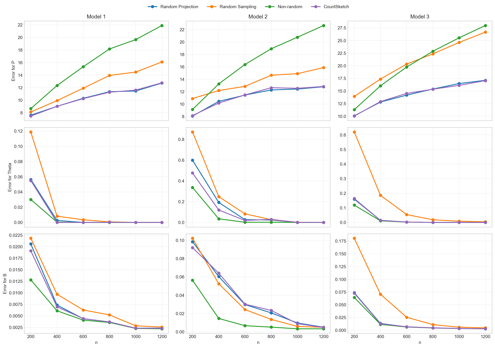
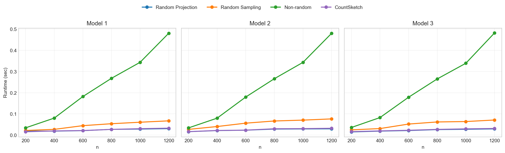
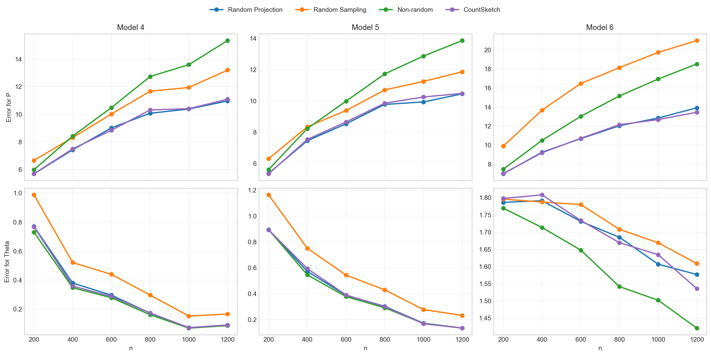
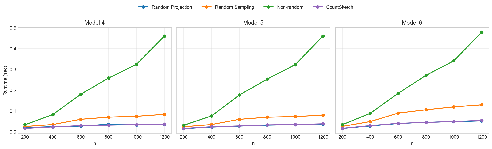

# Reference 1 Section 7.2 Python 실험 보고서

이 보고서는 Reference 1 논문 Section 7.2의 Model 1-6 실험을 Python 코드로 실행한 결과를 정리한다. 기존 Python 실험의 세 방법에 CountSketch random projection을 추가했고, 같은 CSV/PNG 형식으로 결과를 다시 산출했다.

## 1. 실행 요약

| 항목 | 값 |
|---|---|
| 구현 위치 | `experiments/reference_1_section7_2/` |
| 공통 함수 위치 | `src/common.py` |
| Python 버전 | Python 3.8.19 |
| 반복 횟수 | 20 |
| seed | 2026 |
| n 값 | 200, 400, 600, 800, 1000, 1200 |
| Model 1-3 출력 row 수 | raw 1440개, summary 72개 |
| Model 4-6 출력 row 수 | raw 1440개, summary 72개 |

실행 명령은 다음과 같다.

```bash
python experiments/reference_1_section7_2/sec72_models123_live.py \
  --reps 20 \
  --seed 2026 \
  --no-progress

python experiments/reference_1_section7_2/sec72_models456_live.py \
  --reps 20 \
  --seed 2026 \
  --no-progress
```

## 2. 실험 방법

비교한 방법은 네 가지다.

| 방법 | 설명 |
|---|---|
| Non-random | 원래 adjacency matrix에서 leading eigenvectors를 직접 구한 뒤 k-means를 수행하는 기준 방법 |
| Random Projection | Gaussian random projection과 power iteration으로 spectral subspace를 근사한 뒤 k-means를 수행 |
| Random Sampling | edge를 확률 `p=0.7`로 샘플링하고 `1/p`로 rescale한 matrix에서 spectral clustering 수행 |
| CountSketch | Gaussian test matrix 대신 CountSketch sparse test matrix를 사용해 random projection을 수행 |

공통 파라미터는 `K=3`, `q=2`, `r=10`, `p=0.7`이다. Model 3과 Model 6은 rank-deficient 설정이므로 `K_prime=2`를 사용했고, 나머지는 `K_prime=3`을 사용했다. CountSketch의 sketch dimension은 Gaussian RP와 같이 `ell = K_prime + r`로 두었다.

CountSketch 구현은 `src/common.py`의 `run_countsketch_projection`에 들어 있다. CountSketch 행렬 `S`는 각 column에 하나의 nonzero sign만 갖는 sparse matrix이고, 초기 곱셈은 대칭성을 이용해 `A @ S.T = (S @ A.T).T`로 계산했다. 이후 과정은 Gaussian RP와 동일하게 power iteration, QR, core matrix 구성, 작은 고유값 문제, lift, k-means 순서로 진행한다.

평가 지표는 기존 Section 7.2 실험과 같은 형식이다.

| 지표 | 의미 |
|---|---|
| `error_P` | 추정 행렬과 true probability matrix의 spectral norm error |
| `error_Theta` | true community membership과 추정 membership 사이의 normalized label error |
| `error_B` | block probability matrix 추정의 max absolute error |
| `time_sec` | 방법별 알고리즘 실행 시간 |

## 3. 산출물

Model 1-3 결과:

| 파일 | 설명 |
|---|---|
| `results/exp72_models123_paper_aligned_live/sec72_models123_raw_per_rep.csv` | 반복별 raw 결과 |
| `results/exp72_models123_paper_aligned_live/sec72_models123_summary_mean_std.csv` | 평균/표준편차 summary |
| `results/exp72_models123_paper_aligned_live/sec72_models123_metrics_figure5_like.png` | Figure 5 형식의 metric plot |
| `results/exp72_models123_paper_aligned_live/sec72_models123_runtime.png` | runtime plot |

Model 4-6 결과:

| 파일 | 설명 |
|---|---|
| `results/exp72_models456_paper_aligned_live/sec72_models456_raw_per_rep.csv` | 반복별 raw 결과 |
| `results/exp72_models456_paper_aligned_live/sec72_models456_summary_mean_std.csv` | 평균/표준편차 summary |
| `results/exp72_models456_paper_aligned_live/sec72_models456_metrics_figure6_like.png` | Figure 6 형식의 metric plot |
| `results/exp72_models456_paper_aligned_live/sec72_models456_runtime.png` | runtime plot |

## 4. 전체 그림

### 4.1 Model 1-3 metric



### 4.2 Model 1-3 runtime



### 4.3 Model 4-6 metric



### 4.4 Model 4-6 runtime



## 5. 대표 수치: n = 1200

아래 표는 가장 큰 크기인 `n=1200`에서의 평균 결과다. 표준편차는 CSV 파일에 함께 저장되어 있으며, 여기서는 가독성을 위해 평균만 표시한다.

### 5.1 Model 1-3

| Model | Method | error_P | error_Theta | error_B | time_sec |
|---:|---|---:|---:|---:|---:|
| 1 | Non-random | 21.897 | 0.0000 | 0.0022 | 0.4805 |
| 1 | Random Projection | 12.729 | 0.0001 | 0.0024 | 0.0306 |
| 1 | Random Sampling | 16.094 | 0.0001 | 0.0026 | 0.0672 |
| 1 | CountSketch | 12.778 | 0.0000 | 0.0023 | 0.0327 |
| 2 | Non-random | 22.648 | 0.0003 | 0.0034 | 0.4801 |
| 2 | Random Projection | 12.795 | 0.0003 | 0.0051 | 0.0296 |
| 2 | Random Sampling | 15.880 | 0.0003 | 0.0049 | 0.0764 |
| 2 | CountSketch | 12.841 | 0.0003 | 0.0048 | 0.0321 |
| 3 | Non-random | 27.966 | 0.0000 | 0.0028 | 0.4817 |
| 3 | Random Projection | 17.120 | 0.0000 | 0.0029 | 0.0293 |
| 3 | Random Sampling | 26.653 | 0.0046 | 0.0047 | 0.0712 |
| 3 | CountSketch | 17.053 | 0.0000 | 0.0029 | 0.0312 |

Model 1-3에서는 Random Projection과 CountSketch가 `error_P` 기준으로 가장 낮은 그룹을 이룬다. 18개 `(model, n)` 지점 중 CountSketch가 Gaussian Random Projection보다 낮은 `error_P`를 기록한 지점은 8개, 더 높은 지점은 10개였다. `n=1200`에서는 Model 3에서 CountSketch가 Random Projection보다 근소하게 낮았고, Model 1과 Model 2에서는 Random Projection이 근소하게 낮았다.

`error_Theta`는 큰 `n`에서 거의 0으로 수렴한다. `n=1200`에서는 CountSketch가 Model 1과 Model 3에서 0을 기록했고, Model 2에서도 0.00025로 Random Projection 및 Non-random과 같은 수준이었다.

실행 시간은 Random Projection이 가장 짧고 CountSketch가 아주 가까운 두 번째 그룹이다. Non-random은 dense eigen decomposition 비용 때문에 `n=1200`에서 약 0.48초로 훨씬 길게 측정되었다.

### 5.2 Model 4-6

| Model | Method | error_P | error_Theta | error_B | time_sec |
|---:|---|---:|---:|---:|---:|
| 4 | Non-random | 15.348 | 0.0866 | 0.4777 | 0.4601 |
| 4 | Random Projection | 10.968 | 0.0899 | 0.4782 | 0.0355 |
| 4 | Random Sampling | 13.206 | 0.1665 | 0.4784 | 0.0835 |
| 4 | CountSketch | 11.090 | 0.0910 | 0.4784 | 0.0364 |
| 5 | Non-random | 13.869 | 0.1345 | 0.4834 | 0.4605 |
| 5 | Random Projection | 10.455 | 0.1341 | 0.4839 | 0.0351 |
| 5 | Random Sampling | 11.869 | 0.2316 | 0.4837 | 0.0795 |
| 5 | CountSketch | 10.481 | 0.1335 | 0.4838 | 0.0380 |
| 6 | Non-random | 18.527 | 1.4206 | 0.9185 | 0.4792 |
| 6 | Random Projection | 13.920 | 1.5766 | 0.9263 | 0.0521 |
| 6 | Random Sampling | 20.985 | 1.6085 | 0.9271 | 0.1295 |
| 6 | CountSketch | 13.455 | 1.5354 | 0.9292 | 0.0546 |

Model 4-6에서도 Random Projection과 CountSketch가 `error_P` 기준의 가장 좋은 그룹이다. 18개 `(model, n)` 지점 중 CountSketch가 Gaussian Random Projection보다 낮은 `error_P`를 기록한 지점은 5개, 더 높은 지점은 13개였다. `n=1200`에서는 Model 6에서 CountSketch가 Random Projection보다 낮았고, Model 4와 Model 5에서는 Random Projection이 더 낮았다.

degree-corrected 구조가 들어간 Model 4-6에서는 Model 1-3보다 `error_Theta`가 높게 남아 있다. 특히 Model 6은 rank-deficient 구조와 degree correction이 동시에 들어가 네 방법 모두 membership recovery가 어렵다. 그래도 `error_P` 기준으로는 CountSketch와 Random Projection이 Random Sampling 및 Non-random보다 낮다.

실행 시간은 Model 4-6에서도 Random Projection이 가장 짧고 CountSketch가 그 뒤를 따른다. CountSketch의 평균 실행 시간은 Gaussian RP 대비 약 1.012배로, 거의 같은 수준이지만 약간 더 길었다.

## 6. 핵심 관찰

1. CountSketch는 Gaussian RP와 거의 같은 정확도 그룹에 있다.

   전체 36개 `(model, n)` 지점 중 CountSketch가 Gaussian RP보다 낮은 `error_P`를 보인 지점은 13개, 더 높은 지점은 23개였다. 평균적으로는 Gaussian RP가 조금 더 안정적이지만, CountSketch도 Random Sampling 및 Non-random보다 낮은 `error_P`를 내는 구간이 많다.

2. `error_Theta`는 모델 구조에 따라 난이도가 크게 달라졌다.

   Model 1-3에서는 큰 `n`에서 membership error가 거의 사라진다. 반면 Model 4-6에서는 degree correction 때문에 `Theta` 복원이 더 어렵고, Model 6에서는 rank-deficient 구조까지 겹쳐 error가 크게 유지된다. CountSketch도 이 패턴을 그대로 따른다.

3. `error_B`는 Non-random이 약간 더 안정적이다.

   `B` 추정은 label alignment와 block 평균에 민감하다. Random Projection과 CountSketch가 `P`의 spectral norm error는 낮췄지만, `B` 추정에서는 Non-random과 비슷하거나 약간 큰 error를 보였다.

4. 실행 시간은 randomized projection 계열이 유리하다.

   Python 구현에서 Non-random은 full dense eigen decomposition을 사용하므로 `n=1200`에서 약 0.46-0.48초가 걸렸다. Random Projection과 CountSketch는 훨씬 짧았고, CountSketch의 평균 실행 시간은 Model 1-3에서 Gaussian RP 대비 약 1.035배, Model 4-6에서 약 1.012배였다.

5. CountSketch의 장점은 sparse test matrix다.

   CountSketch는 test matrix를 명시적 dense Gaussian matrix로 만들지 않고, 각 node를 하나의 bucket과 sign에 매핑한다. 다만 이번 `n <= 1200`, `ell <= 13` 설정에서는 이후 power iteration, QR, k-means 비용의 비중도 커서 Gaussian RP보다 명확히 빠르지는 않았다.

## 7. MATLAB 결과와의 관계

이 Python 보고서는 같은 Section 7.2 실험을 Python 구현으로 실행한 결과다. 별도 MATLAB 폴더의 보고서와 같은 형식으로 작성했지만, 수치가 완전히 같지는 않다.

차이가 나는 주된 이유는 다음과 같다.

- Python/NumPy와 MATLAB의 random number generator 차이
- eigen solver 구현 차이
- k-means 초기화와 반복 세부 구현 차이
- CountSketch hash/sign 생성 방식 차이
- 부동소수점 연산 순서 차이

따라서 Python 보고서는 Python 구현 자체의 CountSketch 추가 결과로 읽어야 하며, MATLAB 결과와는 같은 형식의 독립 재현 결과로 비교하는 것이 적절하다.

## 8. 결론

Python Section 7.2 실험에 CountSketch를 추가한 결과, CountSketch는 Gaussian Random Projection과 거의 같은 정확도 그룹에 들어갔다. `error_P` 기준으로는 Gaussian RP가 전체적으로 조금 더 안정적이지만, CountSketch도 여러 구간에서 Gaussian RP보다 낮은 값을 보였고, Random Sampling 및 Non-random보다 좋은 경우가 많았다.

결론적으로, Python 구현에서도 randomized projection 계열이 Section 7.2 synthetic model들에서 정확도와 속도 사이의 좋은 균형을 제공한다. CountSketch는 Gaussian RP의 sparse test matrix 대체안으로 사용할 수 있지만, 이번 문제 크기에서는 runtime 이점이 크지는 않았다.
