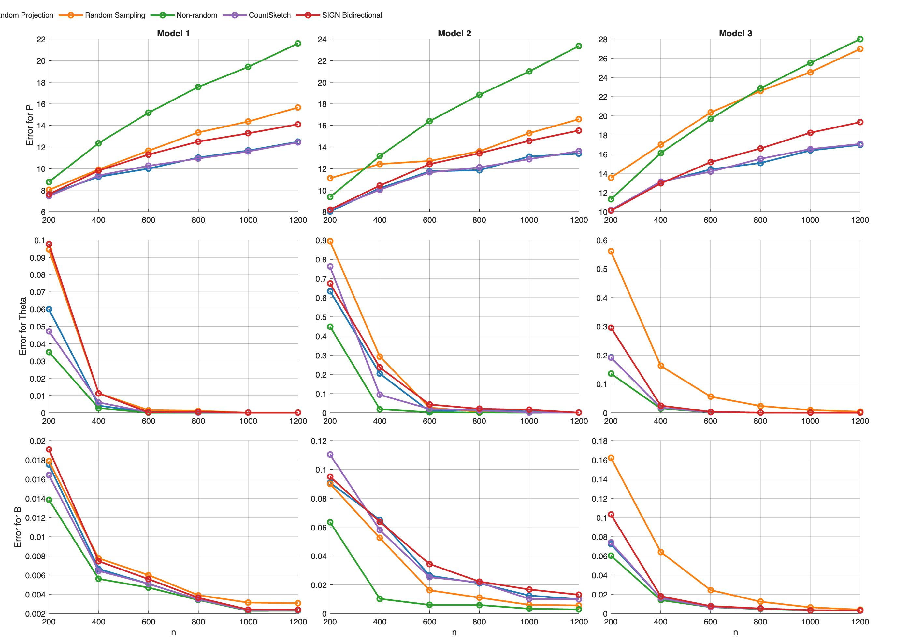
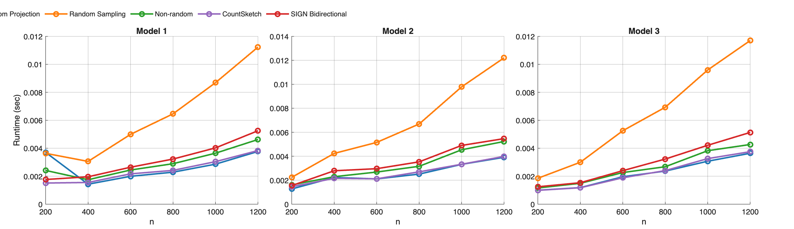
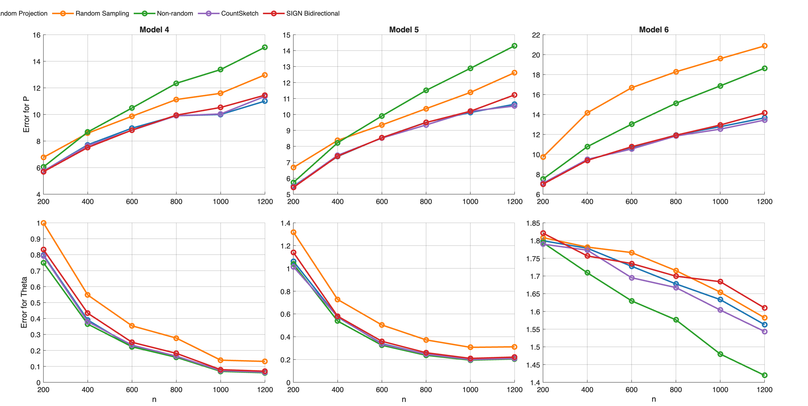
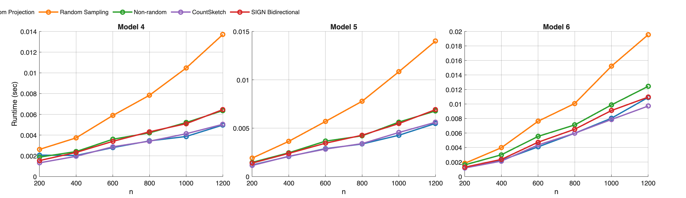

# Reference 1 Section 7.2 MATLAB 실험 보고서

이 보고서는 `experiments/reference_1_section7_2`의 Python 실험을 MATLAB 코드로 다시 구현한 뒤, MATLAB에서 직접 실행해 얻은 결과를 정리한다. 실험은 Reference 1 논문 Section 7.2의 Model 1-6에 해당하며, 이번 갱신에서는 기존 CountSketch에 더해 Wang et al. (2025)의 SIGN 양방향 Nyström/subspace iteration 방식을 추가했다.

## 1. 실행 요약

| 항목 | 값 |
|---|---|
| 구현 위치 | `experiments/reference_1_section7_2_matlab/` |
| MATLAB 실행 파일 | `/Applications/MATLAB_R2026a.app/bin/matlab` |
| MATLAB 버전 | R2026a Update 1 |
| 반복 횟수 | 20 |
| seed | 2026 |
| n 값 | 200, 400, 600, 800, 1000, 1200 |
| Model 1-3 출력 row 수 | raw 1800개, summary 90개 |
| Model 4-6 출력 row 수 | raw 1800개, summary 90개 |

실행 명령은 다음과 같다.

```bash
/Applications/MATLAB_R2026a.app/bin/matlab -batch "addpath('experiments/reference_1_section7_2_matlab'); run_all_sec72_matlab('reps',20,'seed',2026,'no_progress',true)"
```

## 2. 실험 방법

비교한 방법은 다섯 가지다.

| 방법 | 설명 |
|---|---|
| Non-random | 원래 adjacency matrix에서 leading eigenvectors를 직접 구한 뒤 k-means를 수행하는 기준 방법 |
| Random Projection | Gaussian random projection과 power iteration으로 spectral subspace를 근사한 뒤 k-means를 수행 |
| Random Sampling | edge를 확률 `p=0.7`로 샘플링하고 `1/p`로 rescale한 matrix에서 spectral clustering 수행 |
| CountSketch | Gaussian test matrix 대신 CountSketch sparse test matrix를 사용해 random projection을 수행 |
| SIGN Bidirectional | SIGN 방식처럼 `A'`와 `A`를 번갈아 곱해 양방향 subspace를 QR로 갱신한 뒤, 그 subspace에서 low-rank approximation과 clustering을 수행 |

공통 파라미터는 `K=3`, `q=2`, `r=10`, `p=0.7`이다. Model 3과 Model 6은 rank-deficient 설정이므로 `K_prime=2`를 사용했고, 나머지는 `K_prime=3`을 사용했다. Random Projection, CountSketch, SIGN의 sketch dimension은 모두 `ell = K_prime + r`로 맞췄다.

평가 지표는 Python 실험과 같은 형식으로 맞췄다.

| 지표 | 의미 |
|---|---|
| `error_P` | 추정 행렬과 true probability matrix의 spectral norm error |
| `error_Theta` | true community membership과 추정 membership 사이의 normalized label error |
| `error_B` | block probability matrix 추정의 max absolute error |
| `time_sec` | 방법별 알고리즘 실행 시간 |

## 3. 산출물

Model 1-3 결과:

| 파일 | 설명 |
|---|---|
| `results/exp72_models123_paper_aligned_live/sec72_models123_raw_per_rep.csv` | 반복별 raw 결과 |
| `results/exp72_models123_paper_aligned_live/sec72_models123_summary_mean_std.csv` | 평균/표준편차 summary |
| `results/exp72_models123_paper_aligned_live/sec72_models123_metrics_figure5_like.png` | Figure 5 형식의 metric plot |
| `results/exp72_models123_paper_aligned_live/sec72_models123_runtime.png` | runtime plot |

Model 4-6 결과:

| 파일 | 설명 |
|---|---|
| `results/exp72_models456_paper_aligned_live/sec72_models456_raw_per_rep.csv` | 반복별 raw 결과 |
| `results/exp72_models456_paper_aligned_live/sec72_models456_summary_mean_std.csv` | 평균/표준편차 summary |
| `results/exp72_models456_paper_aligned_live/sec72_models456_metrics_figure6_like.png` | Figure 6 형식의 metric plot |
| `results/exp72_models456_paper_aligned_live/sec72_models456_runtime.png` | runtime plot |

## 4. 전체 그림

### 4.1 Model 1-3 metric



### 4.2 Model 1-3 runtime



### 4.3 Model 4-6 metric



### 4.4 Model 4-6 runtime



## 5. 대표 수치: n = 1200

아래 표는 가장 큰 크기인 `n=1200`에서의 평균 결과다. 표준편차는 CSV 파일에 함께 저장되어 있으며, 여기서는 가독성을 위해 평균만 표시한다.

### 5.1 Model 1-3

| Model | Method | error_P | error_Theta | error_B | time_sec |
|---:|---|---:|---:|---:|---:|
| 1 | Non-random | 21.598 | 0.0000 | 0.0023 | 0.0046 |
| 1 | Random Projection | 12.485 | 0.0000 | 0.0023 | 0.0038 |
| 1 | Random Sampling | 15.657 | 0.0000 | 0.0031 | 0.0112 |
| 1 | CountSketch | 12.428 | 0.0000 | 0.0023 | 0.0038 |
| 1 | SIGN Bidirectional | 14.104 | 0.0000 | 0.0024 | 0.0052 |
| 2 | Non-random | 23.354 | 0.0003 | 0.0027 | 0.0052 |
| 2 | Random Projection | 13.383 | 0.0003 | 0.0098 | 0.0039 |
| 2 | Random Sampling | 16.570 | 0.0009 | 0.0056 | 0.0122 |
| 2 | CountSketch | 13.616 | 0.0011 | 0.0097 | 0.0040 |
| 2 | SIGN Bidirectional | 15.526 | 0.0004 | 0.0130 | 0.0055 |
| 3 | Non-random | 27.982 | 0.0000 | 0.0029 | 0.0043 |
| 3 | Random Projection | 16.974 | 0.0000 | 0.0030 | 0.0036 |
| 3 | Random Sampling | 26.967 | 0.0036 | 0.0039 | 0.0117 |
| 3 | CountSketch | 17.064 | 0.0000 | 0.0030 | 0.0038 |
| 3 | SIGN Bidirectional | 19.330 | 0.0000 | 0.0031 | 0.0051 |

Model 1-3에서 CountSketch가 Gaussian Random Projection보다 낮은 `error_P`를 기록한 지점은 9개, 더 높은 지점은 9개였다. SIGN Bidirectional은 Random Projection보다 낮은 지점이 3개, 더 높은 지점이 15개였다.
실행 시간 평균 비율은 CountSketch/RP가 0.999배, SIGN/RP가 1.303배였다.

### 5.2 Model 4-6

| Model | Method | error_P | error_Theta | error_B | time_sec |
|---:|---|---:|---:|---:|---:|
| 4 | Non-random | 15.057 | 0.0597 | 0.4757 | 0.0064 |
| 4 | Random Projection | 11.003 | 0.0620 | 0.4762 | 0.0050 |
| 4 | Random Sampling | 12.978 | 0.1310 | 0.4775 | 0.0137 |
| 4 | CountSketch | 11.358 | 0.0633 | 0.4762 | 0.0050 |
| 4 | SIGN Bidirectional | 11.450 | 0.0695 | 0.4762 | 0.0065 |
| 5 | Non-random | 14.305 | 0.2049 | 0.4826 | 0.0068 |
| 5 | Random Projection | 10.639 | 0.2089 | 0.4829 | 0.0055 |
| 5 | Random Sampling | 12.620 | 0.3115 | 0.4834 | 0.0140 |
| 5 | CountSketch | 10.530 | 0.2092 | 0.4829 | 0.0056 |
| 5 | SIGN Bidirectional | 11.227 | 0.2213 | 0.4832 | 0.0069 |
| 6 | Non-random | 18.637 | 1.4196 | 0.9186 | 0.0124 |
| 6 | Random Projection | 13.655 | 1.5628 | 0.9300 | 0.0109 |
| 6 | Random Sampling | 20.872 | 1.5821 | 0.9249 | 0.0195 |
| 6 | CountSketch | 13.433 | 1.5434 | 0.9277 | 0.0097 |
| 6 | SIGN Bidirectional | 14.158 | 1.6098 | 0.9232 | 0.0109 |

Model 4-6에서 CountSketch가 Gaussian Random Projection보다 낮은 `error_P`를 기록한 지점은 10개, 더 높은 지점은 8개였다. SIGN Bidirectional은 Random Projection보다 낮은 지점이 9개, 더 높은 지점이 9개였다.
실행 시간 평균 비율은 CountSketch/RP가 0.980배, SIGN/RP가 1.158배였다.

## 6. 핵심 관찰

1. `error_P`에서는 Random Projection과 CountSketch가 여전히 가장 강한 축이다. CountSketch는 전체 36개 `(model, n)` 지점 중 19개 지점에서 Gaussian Random Projection보다 낮은 `error_P`를 보였고, 17개 지점에서는 더 높았다.

2. SIGN Bidirectional은 전체 36개 지점 중 12개 지점에서 Random Projection보다 낮은 `error_P`를 기록했고, 24개 지점에서는 더 높았다. 즉 synthetic clustering metric에서는 항상 Gaussian RP를 이기지는 않지만, 일부 degree-corrected/rank-deficient 설정에서는 경쟁적인 값을 보였다.

3. `error_Theta`는 모델 구조에 따라 난이도가 크게 달라졌다. Model 1-3에서는 큰 `n`에서 membership error가 거의 사라지는 반면, Model 4-6에서는 degree correction과 rank-deficient 구조 때문에 error가 더 높게 남는다.

4. SIGN Bidirectional은 low-rank approximation 관점의 양방향 subspace 갱신을 사용하므로, clustering label recovery와 완전히 같은 목적함수를 직접 최적화하지 않는다. 그래서 `error_P`가 괜찮아도 `error_Theta`나 `error_B`가 반드시 같이 좋아지지는 않는다.

5. 실행 시간은 Random Projection과 CountSketch가 가장 짧은 그룹이다. SIGN은 `A'` 방향과 `A` 방향을 번갈아 QR로 갱신하고 Nyström식 재구성을 수행하므로, 같은 `q`와 `ell`에서는 RP/CountSketch보다 더 무거운 편이다.

## 7. Python 결과와의 관계

이 MATLAB 구현은 Python `src.common`을 호출하지 않고 같은 실험 절차를 MATLAB 코드로 다시 작성한 것이다. 출력 파일명, CSV column, plot 형식은 Python 실험과 맞췄다.

다만 MATLAB과 Python/NumPy는 random number generator, eigen solver 구현, k-means 초기화와 반복 세부 구현, CountSketch hash/sign 생성 방식, 부동소수점 연산 순서가 다르므로 수치가 완전히 같지는 않다.

## 8. MATLAB 실행이 Python보다 가볍게 보인 이유

이번 실행에서 MATLAB 쪽이 Python 쪽보다 빠르고 CPU/메모리 사용도 덜 부담스럽게 보인 가장 큰 이유는 언어 자체의 차이라기보다 구현 세부가 다르기 때문이다.

가장 중요한 차이는 eigen computation 방식이다. Python `src/common.py`의 `top_eigvecs_symmetric()`는 dense matrix의 전체 고유값/고유벡터를 모두 구하는 경향이 있고, `spectral_norm_sym()`도 전체 고유값을 계산한다. 반면 MATLAB 구현은 `topEigpairsSymmetric()`와 `spectralNormSym()`에서 주로 `eigs()`를 사용해 필요한 leading eigenvectors 또는 가장 큰 절댓값 고유값만 부분적으로 계산한다.

두 번째 차이는 dense matrix 복사와 임시 배열이다. Python 구현은 `A`, `P`, `A_hat`, `A_hat - P`를 dense NumPy array로 반복해서 다루며, 큰 임시 행렬이 많이 생긴다. MATLAB 구현도 dense matrix를 쓰지만 partial eigensolver 사용 때문에 전체 고유분해에 필요한 작업 배열과 시간이 줄어든다.

따라서 이 비교에서 `Python이 본질적으로 느리다`라고 해석하면 안 된다. 현재 Python 구현이 full dense eigen decomposition과 full eigenvalue metric evaluation을 반복하는 구조라 무겁고, MATLAB 구현은 partial eigensolver를 적극적으로 사용해서 가볍게 돈 것이다.

## 9. 결론

MATLAB 재구현 결과에서도 Section 7.2의 큰 결론은 유지된다. Random Projection과 CountSketch는 대부분의 모델과 `n` 값에서 `error_P`가 낮고 실행 시간도 짧다. SIGN Bidirectional은 양방향 Nyström/subspace iteration을 MATLAB 실험에 추가한 비교군으로, 일부 설정에서는 경쟁적인 `error_P`를 보였지만 전체적으로는 Gaussian RP와 CountSketch보다 안정적인 clustering 방법이라고 보기는 어렵다. Random Sampling은 여전히 가장 불안정하고 느린 편이다.
