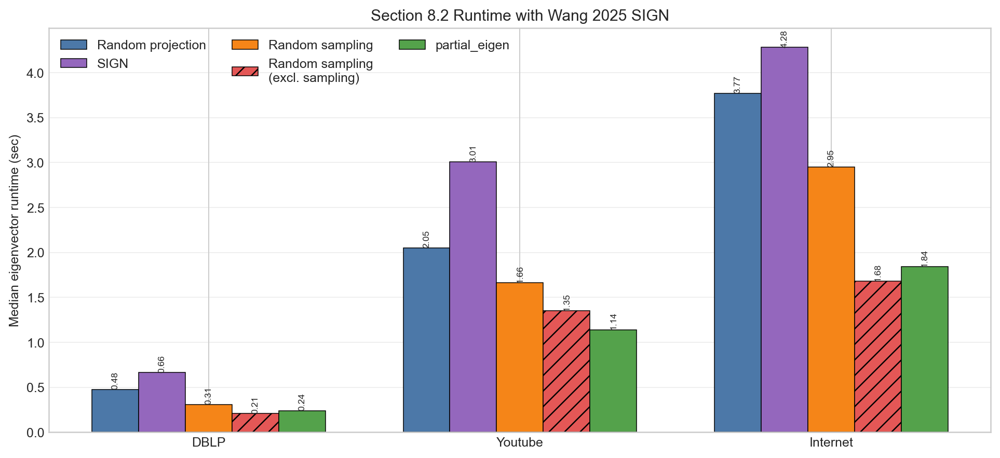
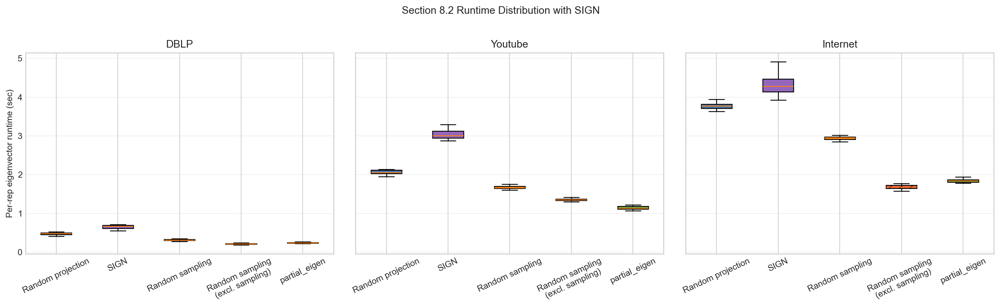

# Wang 2025 SIGN 방법론의 Section 8.2 적용 보고서

## 목적

Reference 1 Section 8.2는 대규모 sparse real network에서 eigenvector computation time을 비교하는 Table 4 스타일 benchmark다. 여기에 사용자가 제공한 Wang et al. (2025)의 SIGN subspace iteration 방법을 추가해 기존 `Random Projection`, `Random Sampling`, `partial_eigen` 결과와 같은 단위로 비교했다.

## 구현 메모

- sparse SIGN 구현: `src.common.eigvecs_sign_sparse`
- 실행 스크립트: `experiments/reference_1_section8_2/run_sign_section8_2.py`
- 출력 폴더: `experiments/reference_1_section8_2/results/sign_section8_2_wang2025`
- 기존 baseline: `experiments/reference_1_section8_2/results/exp8_2_table4_paper_aligned/table4_time_raw.csv`
- SIGN 설정: 기존 8.2와 맞춰 oversampling `r=10`, power parameter `k=q=2`를 사용했다.
- Section 8.2의 graph는 undirected adjacency로 읽기 때문에 `A.T`와 `A`가 같은 대칭 문제다. 따라서 여기서 SIGN은 비대칭 행렬용 장점보다는 양방향 subspace iteration의 runtime 특성을 보는 실험이다.
- timing은 Table 4와 맞춰 KMeans나 accuracy 계산 없이 eigenvector approximation pipeline만 잰다.

## 설정

```json
{
  "baseline_raw_csv": "experiments/reference_1_section8_2/results/exp8_2_table4_paper_aligned/table4_time_raw.csv",
  "dblp_edgelist": "data/dblp/com-dblp.ungraph.txt",
  "youtube_edgelist": "/private/tmp/sign82_data/com-youtube.ungraph.txt.gz",
  "internet_edgelist": "/private/tmp/sign82_data/as-skitter.txt.gz",
  "reps": 20,
  "seed": 2026,
  "r": 10,
  "q": 2,
  "delimiter": null,
  "comment_prefix": "#",
  "outdir": "experiments/reference_1_section8_2/results/sign_section8_2_wang2025",
  "no_progress": true
}
```

## 데이터셋

| dataset | edgelist | target_rank | n_nodes | n_edges | status |
| --- | --- | --- | --- | --- | --- |
| DBLP | data/dblp/com-dblp.ungraph.txt | 3 | 317080 | 1049866 | ok |
| Youtube | /private/tmp/sign82_data/com-youtube.ungraph.txt.gz | 7 | 1134890 | 2987624 | ok |
| Internet | /private/tmp/sign82_data/as-skitter.txt.gz | 4 | 1696415 | 11095298 | ok |

## Median Runtime 표

Table 4-like median time (seconds) over replications, with Wang 2025 SIGN added.

| Networks | Random projection | SIGN | Random sampling | partial_eigen | SIGN / RP | SIGN / partial_eigen |
|---|---:|---:|---:|---:|---:|---:|
| DBLP | 0.476 | 0.664 | 0.310(0.209) | 0.239 | 1.39x | 2.78x |
| Youtube | 2.053 | 3.007 | 1.661(1.349) | 1.140 | 1.47x | 2.64x |
| Internet | 3.771 | 4.281 | 2.952(1.680) | 1.840 | 1.14x | 2.33x |

Note: Random Sampling values outside parentheses include sampling time; values inside parentheses exclude sampling time.

## SIGN 내부 단계별 Median

| dataset | sign_draw_omega_sec_median | sign_subspace_iter_sec_median | sign_build_core_sec_median | sign_small_eig_sec_median | sign_lift_sec_median | time_sec_median |
| --- | --- | --- | --- | --- | --- | --- |
| DBLP | 0.02133 | 0.5843 | 0.05392 | 6.74e-05 | 0.002453 | 0.6639 |
| Internet | 0.137 | 3.696 | 0.4085 | 8.158e-05 | 0.01582 | 4.281 |
| Youtube | 0.104 | 2.67 | 0.2164 | 8.117e-05 | 0.01539 | 3.007 |

## 그림





## 해석

SIGN은 Random Projection과 같은 randomized subspace family에 속하지만, 한 iteration마다 `A.T`와 `A`를 번갈아 곱고 QR을 수행한다. 대칭 sparse graph에서는 이것이 기존 Random Projection의 `A^(2q+1) Omega`와 비슷한 방향의 근사지만, QR 횟수와 matrix multiplication 횟수 구성이 다르다.

따라서 이 결과는 Wang 2025의 비대칭 행렬 low-rank approximation 장점을 직접 검증한다기보다는, 현재 8.2의 대칭 graph runtime benchmark에서 SIGN 변형이 어느 정도 비용을 갖는지 확인하는 의미가 크다. `SIGN / RP`가 1보다 작으면 SIGN이 Random Projection보다 빠르고, 1보다 크면 느리다.
