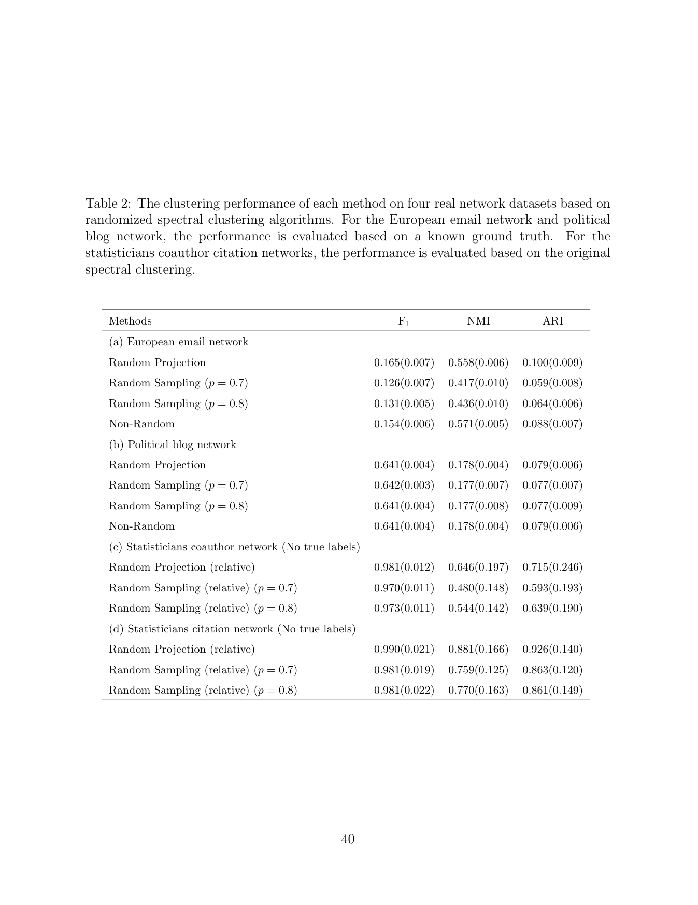
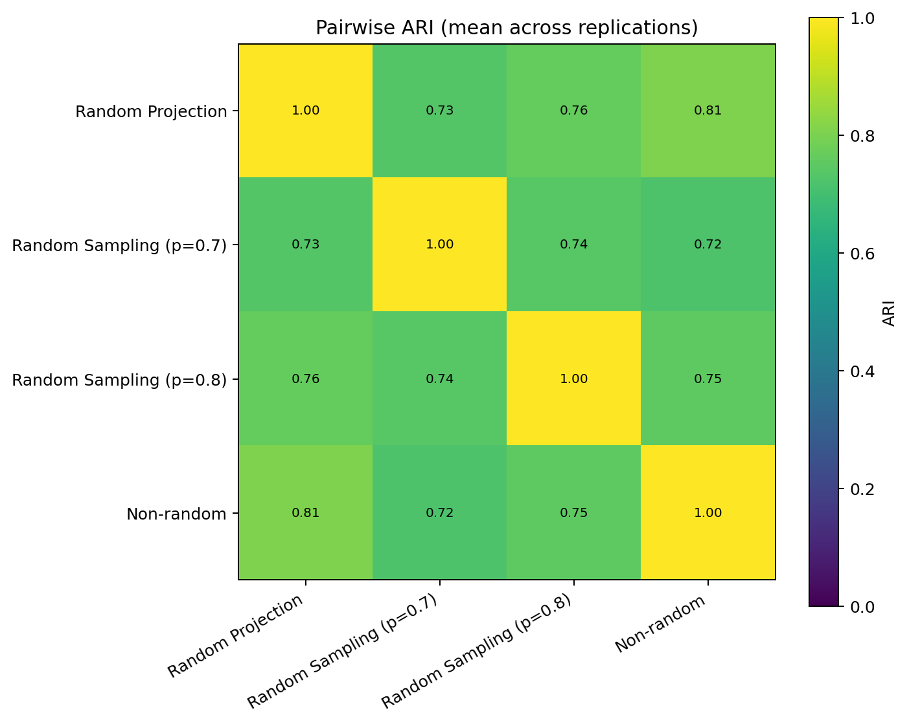
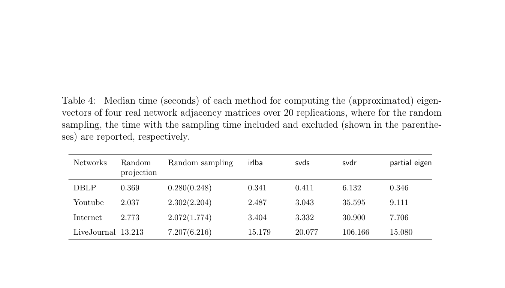
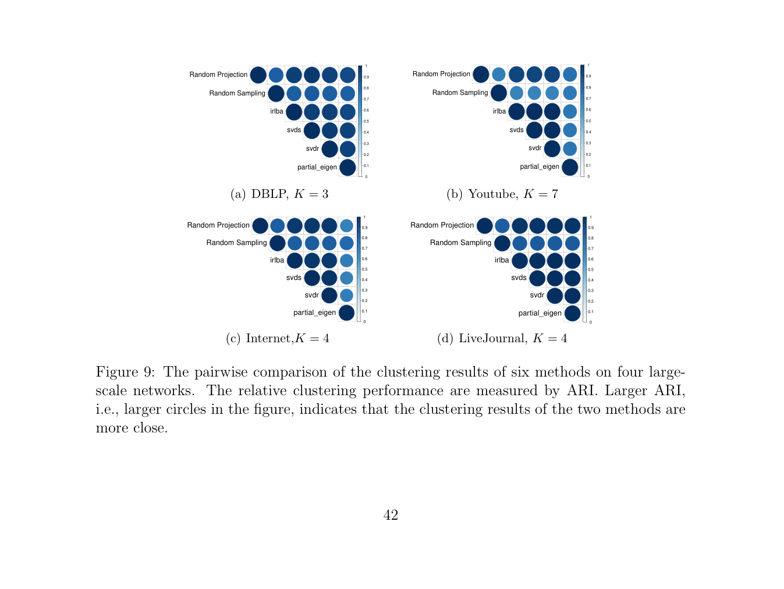
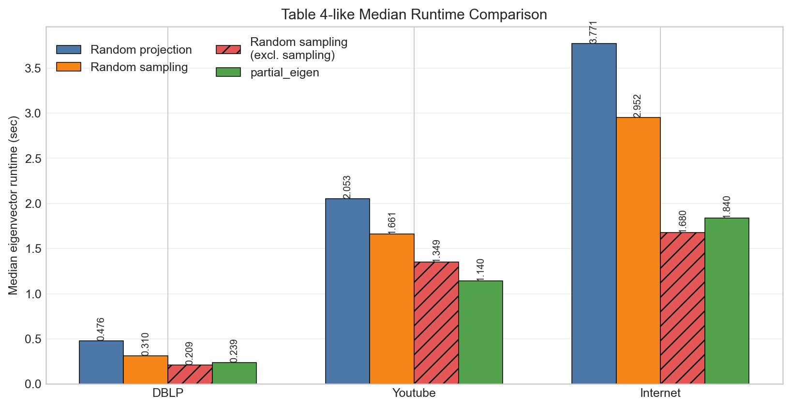
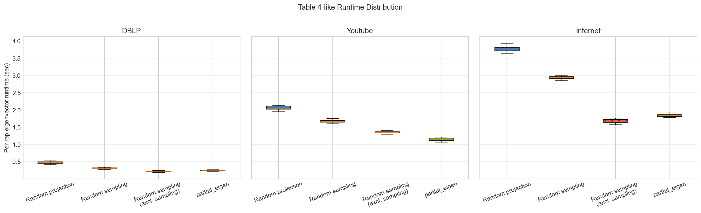

# Section 8 논문 Figure/Table vs 재현 결과 PNG 비교

이 문서는 논문 원문에서 캡처한 Table/Figure 이미지와 현재 재현 결과 PNG를 한눈에 비교하기 위한 보조 문서이다.

## 1. Section 8.1 비교

Section 8.1은 **European Email network의 clustering accuracy 비교 실험**이다.  
논문에서는 Table 2(a)에 성능 수치가 정리되어 있고, 현재 재현에서는 성능표와 함께 pairwise ARI heatmap을 추가로 저장하였다.

### 1.1 논문 원문 캡처: Table 2가 포함된 페이지

### 1.2 우리 재현 결과: Section 8.1 성능표

- [email_eu_table2a_like.md](../reference_1_section8_1/results/exp8_1_email_eu_core_table2_like/email_eu_table2a_like.md)

### 1.3 우리 재현 결과: Section 8.1 PNG

### 1.4 비교 해석

- 논문 Table 2(a)는 성능 수치 중심의 표이다.
- 현재 재현 결과는 표 수치가 논문과 매우 가깝고, 추가적으로 pairwise ARI heatmap까지 제공한다.
- 즉 Section 8.1은 논문 표와 정량적으로도 잘 맞고, 재현 결과를 시각적으로도 확인할 수 있다.

## 2. Section 8.2 비교

Section 8.2는 **대규모 실제 네트워크에서 eigenvector computation runtime을 비교하는 효율성 실험**이다.

### 2.1 논문 원문 캡처: Table 4

### 2.2 논문 원문 캡처: Figure 9

### 2.3 우리 재현 결과: Table 4 유사 표

- [table4_like_median_time.md](results/exp8_2_table4_paper_aligned/table4_like_median_time.md)

### 2.4 우리 재현 결과 PNG 1: Median runtime bar

### 2.5 우리 재현 결과 PNG 2: Runtime boxplots

### 2.6 비교 해석

- 논문 Table 4는 runtime 수치를 표로 직접 보여준다.
- 현재 재현 결과는 같은 정보를 markdown 표와 PNG bar chart로 함께 보여준다.
- 논문 Figure 9는 방법 간 clustering 결과 유사성을 ARI 기반으로 시각화한 그림인데, 현재 재현에서는 Section 8.2를 timing 중심으로 재구성했기 때문에 이에 정확히 대응하는 ARI 그림은 포함하지 않았다.
- 따라서 현재 비교 문서는:
  - 논문 Table 4 vs 우리 Table 4 유사 표
  - 논문 Figure 9 vs 현재 재현의 runtime 시각화
  를 한 문서 안에서 나란히 볼 수 있게 구성한 것이다.

## 3. 요약

- Section 8.1은 논문 Table 2(a)와 재현 성능표가 매우 잘 맞는다.
- Section 8.2는 논문 Table 4의 실험 구조를 따라가지만, 절대 runtime 값은 구현체 차이로 인해 일부 차이가 있다.
- 이 문서는 논문 캡처 이미지와 로컬 PNG를 함께 배치하여, 교수님께 설명할 때 시각적으로 바로 비교할 수 있도록 만든 보조 자료이다.

