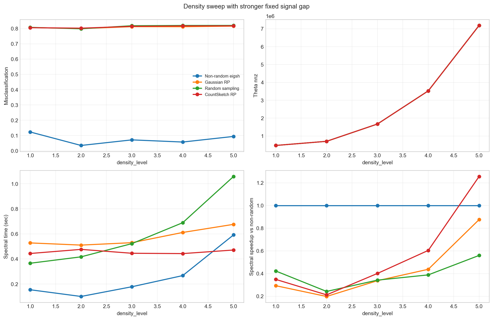
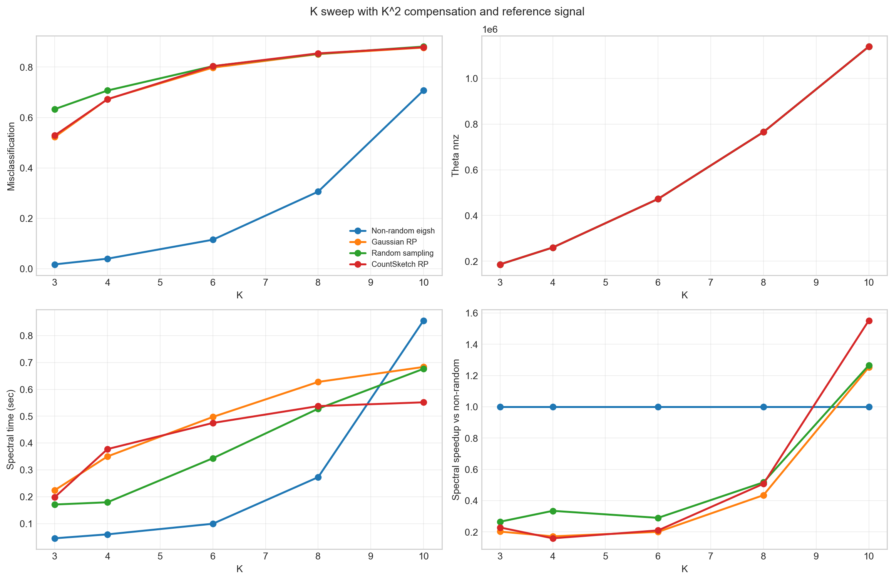
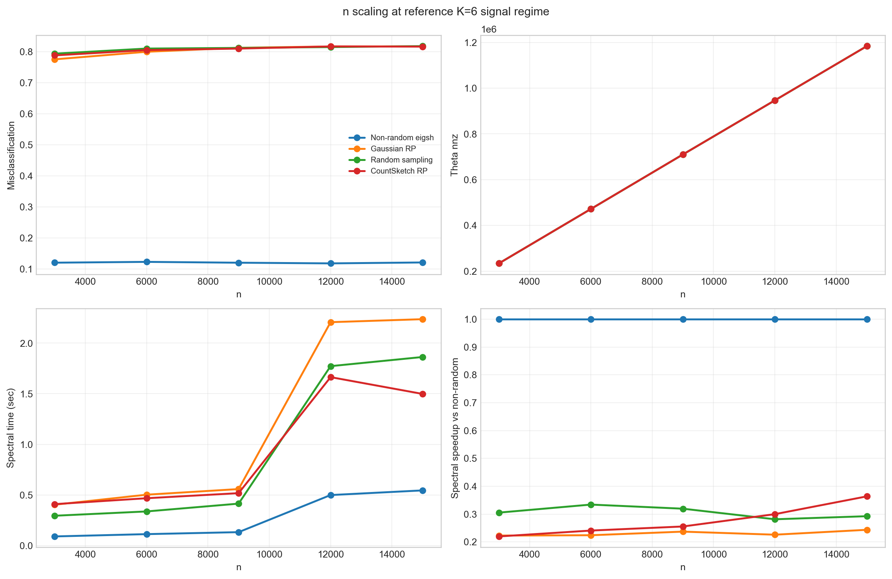
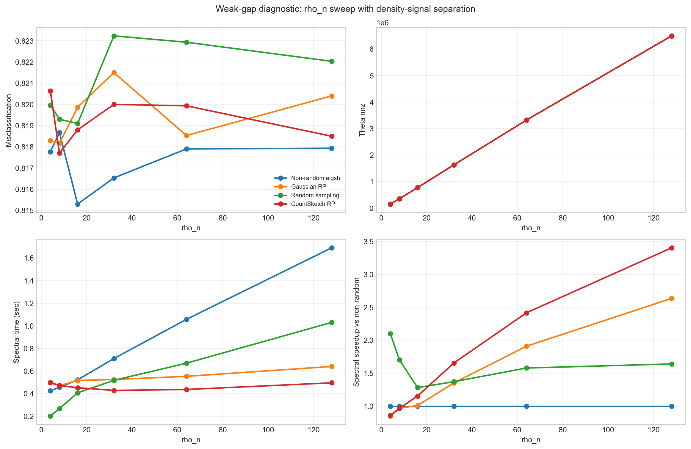
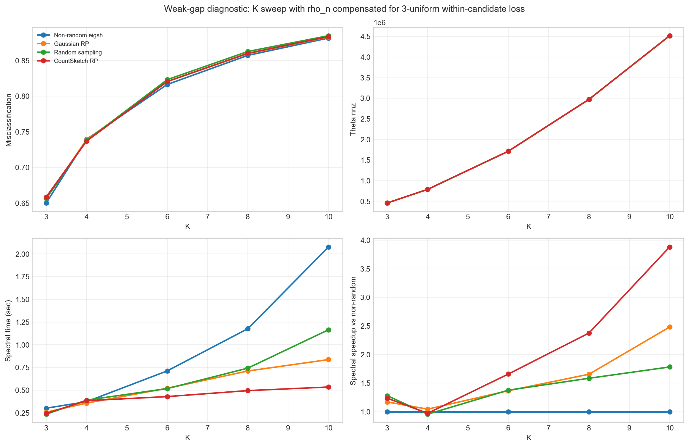
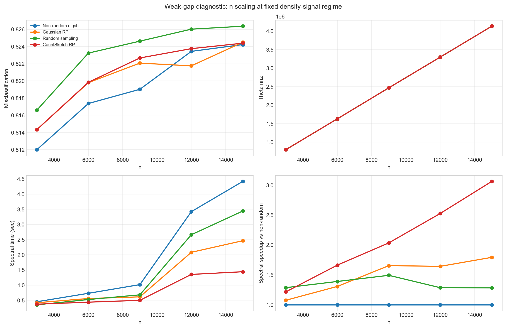

# 균일 HSBM density-signal 재설계 실험 결과보고서

이 보고서는 기존 `rho_n`/`K` sweep에서 보였던 정확도 포화와 K 증가 시 급격한 붕괴를 피하기 위해, density, signal gap, target rank 효과를 분리해서 다시 실행한 결과입니다. 모든 결과와 CSV는 이 새 폴더 안에만 저장했습니다.

## 실험 설계

- 주요 density sweep: `n=6000`, `K=6`에서 `(rho_n, a_in, b_out)`을 `(16,36,4)`, `(24,36,4)`, `(32,40,8)`, `(48,44,12)`, `(64,52,20)`으로 바꿉니다. background density를 키우되 signal gap은 충분히 크게 유지해 정확도와 계산량을 함께 봅니다.
- 주요 `K` sweep: `n=6000`, `K={3,4,6,8,10}`, `a_in=36`, `b_out=4`, `rho_n=16*(K/6)^2`. 3-uniform에서 within 후보 비율이 대략 `1/K^2`로 줄어드는 것을 보정합니다.
- 주요 `n` sweep: `K=6`, `rho_n=16`, `a_in=36`, `b_out=4`, `n={3000,6000,9000,12000,15000}`. 같은 signal regime에서 scaling을 봅니다.
- 진단용 weak-gap 블록도 함께 남겼습니다. `center=10` 근처에서 gap을 작게 잡으면 계산 speedup은 보이지만 non-random 자체가 random baseline에 머무는 것을 확인하기 위한 대조군입니다.
- randomized method의 본 실험 설정은 계산 이점을 보기 위해 `oversampling=30`, `power_iter=1`, random sampling `p=0.3`으로 낮췄습니다. 별도 진단 표에서는 RP 폭/반복과 sampling 확률을 키워도 정확도가 회복되는지 확인했습니다.
- 확률 계산은 `clip=False`로 수행해 잘못된 큰 확률이 조용히 잘리지 않게 했습니다.

## 핵심 결론

- 새 density sweep에서는 `Theta.nnz`가 470960.8에서 7186700.8까지 커졌습니다. Non-random 오분류율은 0.0345~0.1227 범위라, `rho_n` 증가가 단순한 즉시 포화만 만들지는 않았습니다.
- 반대로 빠른 randomized 설정은 평균 오분류율이 0.8115로 거의 random baseline입니다. 고밀도에서 speedup이 보여도 정확도를 잃은 speedup이라 실험 주장에는 쓰기 어렵습니다.
- `K^2` 보정을 넣어도 `K=8,10`에서는 Non-random 오분류율이 각각 0.3059, 0.7075까지 올라갑니다. `K` 증가는 단순 density 문제가 아니라 target rank와 spectral gap 문제를 같이 키웁니다.

## 스펙트럼/랜덤화 진단

| block | x | value | K | Theta nnz | lambda_K | lambda_K+1 | relative gap |
| --- | --- | --- | --- | --- | --- | --- | --- |
| density_background_fixed_gap | density_level | 1.0000 | 6 | 469936.0 | 0.504703 | 0.490698 | 0.027749 |
| density_background_fixed_gap | density_level | 2.0000 | 6 | 702826.0 | 0.486152 | 0.460535 | 0.052695 |
| density_background_fixed_gap | density_level | 3.0000 | 6 | 1667166.0 | 0.423797 | 0.414252 | 0.022522 |
| density_background_fixed_gap | density_level | 4.0000 | 6 | 3520318.0 | 0.393892 | 0.387714 | 0.015683 |
| density_background_fixed_gap | density_level | 5.0000 | 6 | 7191232.0 | 0.372975 | 0.370013 | 0.007942 |
| K_compensated_reference_signal | K | 3.0000 | 3 | 185308.0 | 0.693845 | 0.590662 | 0.148713 |
| K_compensated_reference_signal | K | 4.0000 | 4 | 260262.0 | 0.606064 | 0.547137 | 0.097228 |
| K_compensated_reference_signal | K | 6.0000 | 6 | 473132.0 | 0.505470 | 0.489945 | 0.030713 |
| K_compensated_reference_signal | K | 8.0000 | 8 | 762520.0 | 0.456175 | 0.455150 | 0.002245 |
| K_compensated_reference_signal | K | 10.0000 | 10 | 1137062.0 | 0.431364 | 0.431262 | 0.000237 |

대표 인스턴스에서 `lambda_K`와 `lambda_{K+1}`가 매우 붙어 있습니다. 이 gap이 작으면 randomized range finder가 상위 K 공간을 조금만 잘못 잡아도 clustering이 무너집니다.

| method | setting | 오분류율 | ARI | NMI | spectral초 | speedup |
| --- | --- | --- | --- | --- | --- | --- |
| Non-random eigsh | baseline | 0.0973 | 0.7799 | 0.7357 | 0.7159 | 1.0000 |
| Gaussian RP r=30 q=1 | fast | 0.8210 | 0.0000 | 0.0012 | 0.7639 | 0.9373 |
| Gaussian RP r=160 q=3 | wide | 0.7988 | 0.0030 | 0.0052 | 2.3489 | 0.3048 |
| CountSketch RP r=30 q=1 | fast | 0.8225 | -0.0000 | 0.0011 | 0.4761 | 1.5039 |
| CountSketch RP r=160 q=3 | wide | 0.7973 | 0.0047 | 0.0076 | 2.0838 | 0.3436 |
| Random sampling p=0.3 | fast | 0.8222 | 0.0000 | 0.0023 | 1.1861 | 0.6036 |
| Random sampling p=0.7 | less_sparse | 0.6692 | 0.0526 | 0.0799 | 2.2696 | 0.3155 |
| Random sampling p=0.9 | near_full | 0.2483 | 0.4799 | 0.4948 | 1.1122 | 0.6437 |
| Random sampling p=1.0 | full_control | 0.0973 | 0.7799 | 0.7357 | 0.7329 | 0.9768 |

고밀도 level 5에서 RP를 `r=160,q=3`까지 키워도 정확도는 회복되지 않았고, sampling은 `p=1.0`에 가까워져야 Non-random 수준으로 돌아옵니다. 이 경우 계산 이점은 사라집니다.

## 전체 요약

| block | method | 평균 오분류율 | 평균 ARI | 평균 NMI | 평균 Theta nnz | 평균 spectral초 | 평균 speedup |
| --- | --- | --- | --- | --- | --- | --- | --- |
| density_background_fixed_gap | Non-random eigsh | 0.0757 | 0.8279 | 0.7877 | 2711315.4 | 0.2587 | 1.0000 |
| density_background_fixed_gap | Gaussian RP | 0.8097 | 0.0018 | 0.0037 | 2711315.4 | 0.5713 | 0.4280 |
| density_background_fixed_gap | Random sampling | 0.8133 | 0.0012 | 0.0039 | 2711315.4 | 0.6106 | 0.3907 |
| density_background_fixed_gap | CountSketch RP | 0.8117 | 0.0015 | 0.0032 | 2711315.4 | 0.4560 | 0.5640 |
| K_compensated_reference_signal | Non-random eigsh | 0.2371 | 0.6162 | 0.5969 | 564494.4 | 0.2669 | 1.0000 |
| K_compensated_reference_signal | Gaussian RP | 0.7444 | 0.0147 | 0.0157 | 564494.4 | 0.4766 | 0.4524 |
| K_compensated_reference_signal | Random sampling | 0.7755 | 0.0030 | 0.0062 | 564494.4 | 0.3797 | 0.5345 |
| K_compensated_reference_signal | CountSketch RP | 0.7475 | 0.0130 | 0.0139 | 564494.4 | 0.4281 | 0.5314 |
| n_scaling_reference_signal | Non-random eigsh | 0.1209 | 0.7310 | 0.6874 | 709190.8 | 0.2756 | 1.0000 |
| n_scaling_reference_signal | Gaussian RP | 0.8043 | 0.0031 | 0.0053 | 709190.8 | 1.1813 | 0.2307 |
| n_scaling_reference_signal | Random sampling | 0.8097 | 0.0017 | 0.0036 | 709190.8 | 0.9360 | 0.3065 |
| n_scaling_reference_signal | CountSketch RP | 0.8073 | 0.0024 | 0.0045 | 709190.8 | 0.9110 | 0.2759 |
| rho_density_signal_control | Non-random eigsh | 0.8174 | 0.0003 | 0.0015 | 2123149.3 | 0.8108 | 1.0000 |
| rho_density_signal_control | Gaussian RP | 0.8195 | 0.0000 | 0.0012 | 2123149.3 | 0.5354 | 1.4542 |
| rho_density_signal_control | Random sampling | 0.8211 | 0.0000 | 0.0014 | 2123149.3 | 0.5163 | 1.6125 |
| rho_density_signal_control | CountSketch RP | 0.8193 | 0.0001 | 0.0014 | 2123149.3 | 0.4642 | 1.7428 |
| K_compensated_rank_scaling | Non-random eigsh | 0.7890 | 0.0002 | 0.0017 | 2091010.5 | 0.9286 | 1.0000 |
| K_compensated_rank_scaling | Gaussian RP | 0.7918 | 0.0000 | 0.0014 | 2091010.5 | 0.5372 | 1.5434 |
| K_compensated_rank_scaling | Random sampling | 0.7930 | 0.0000 | 0.0016 | 2091010.5 | 0.6107 | 1.3955 |
| K_compensated_rank_scaling | CountSketch RP | 0.7920 | -0.0000 | 0.0014 | 2091010.5 | 0.4179 | 2.0248 |
| n_scaling_fixed_density_signal | Non-random eigsh | 0.8192 | 0.0001 | 0.0012 | 2465935.4 | 2.0102 | 1.0000 |
| n_scaling_fixed_density_signal | Gaussian RP | 0.8205 | 0.0000 | 0.0011 | 2465935.4 | 1.2294 | 1.4950 |
| n_scaling_fixed_density_signal | Random sampling | 0.8234 | 0.0000 | 0.0014 | 2465935.4 | 1.5340 | 1.3478 |
| n_scaling_fixed_density_signal | CountSketch RP | 0.8210 | -0.0000 | 0.0010 | 2465935.4 | 0.8225 | 2.1010 |

## Density sweep with stronger fixed signal gap

### density_level = 1.0000

| 방법 | 오분류율 | ARI | NMI | spectral초 | speedup |
| --- | --- | --- | --- | --- | --- |
| CountSketch RP | 0.8060 | 0.0026 | 0.0048 | 0.4438 | 0.3482 |
| Gaussian RP | 0.8070 | 0.0026 | 0.0049 | 0.5281 | 0.2926 |
| **Non-random eigsh** | **0.1227** | **0.7273** | **0.6837** | **0.1545** | **1.0000** |
| Random sampling | 0.8080 | 0.0018 | 0.0040 | 0.3659 | 0.4222 |

| n | K | rho_n | a_in | b_out | gap | 하이퍼엣지 | 평균degree | Theta nnz | Theta density |
| --- | --- | --- | --- | --- | --- | --- | --- | --- | --- |
| 6000.0 | 6 | 16.0000 | 36.0000 | 4.0000 | 32.0000 | 78072.6 | 39.0363 | 470960.8 | 0.013082 |

### density_level = 2.0000

| 방법 | 오분류율 | ARI | NMI | spectral초 | speedup |
| --- | --- | --- | --- | --- | --- |
| CountSketch RP | 0.8027 | 0.0032 | 0.0056 | 0.4765 | 0.2118 |
| Gaussian RP | 0.8002 | 0.0039 | 0.0067 | 0.5107 | 0.1977 |
| **Non-random eigsh** | **0.0345** | **0.9190** | **0.8870** | **0.1009** | **1.0000** |
| Random sampling | 0.7987 | 0.0039 | 0.0066 | 0.4171 | 0.2420 |

| n | K | rho_n | a_in | b_out | gap | 하이퍼엣지 | 평균degree | Theta nnz | Theta density |
| --- | --- | --- | --- | --- | --- | --- | --- | --- | --- |
| 6000.0 | 6 | 24.0000 | 36.0000 | 4.0000 | 32.0000 | 117469.6 | 58.7348 | 702929.2 | 0.019526 |

### density_level = 3.0000

| 방법 | 오분류율 | ARI | NMI | spectral초 | speedup |
| --- | --- | --- | --- | --- | --- |
| CountSketch RP | 0.8146 | 0.0009 | 0.0024 | 0.4455 | 0.4006 |
| Gaussian RP | 0.8126 | 0.0012 | 0.0028 | 0.5300 | 0.3368 |
| **Non-random eigsh** | **0.0710** | **0.8368** | **0.7950** | **0.1785** | **1.0000** |
| Random sampling | 0.8187 | 0.0002 | 0.0034 | 0.5224 | 0.3416 |

| n | K | rho_n | a_in | b_out | gap | 하이퍼엣지 | 평균degree | Theta nnz | Theta density |
| --- | --- | --- | --- | --- | --- | --- | --- | --- | --- |
| 6000.0 | 6 | 32.0000 | 40.0000 | 8.0000 | 32.0000 | 284316.2 | 142.1581 | 1670096.4 | 0.046392 |

### density_level = 4.0000

| 방법 | 오분류율 | ARI | NMI | spectral초 | speedup |
| --- | --- | --- | --- | --- | --- |
| CountSketch RP | 0.8172 | 0.0003 | 0.0016 | 0.4429 | 0.6038 |
| Gaussian RP | 0.8123 | 0.0009 | 0.0024 | 0.6116 | 0.4373 |
| **Non-random eigsh** | **0.0569** | **0.8682** | **0.8284** | **0.2674** | **1.0000** |
| Random sampling | 0.8204 | 0.0002 | 0.0032 | 0.6894 | 0.3879 |

| n | K | rho_n | a_in | b_out | gap | 하이퍼엣지 | 평균degree | Theta nnz | Theta density |
| --- | --- | --- | --- | --- | --- | --- | --- | --- | --- |
| 6000.0 | 6 | 48.0000 | 44.0000 | 12.0000 | 32.0000 | 618068.6 | 309.0343 | 3525889.6 | 0.097941 |

### density_level = 5.0000

| 방법 | 오분류율 | ARI | NMI | spectral초 | speedup |
| --- | --- | --- | --- | --- | --- |
| CountSketch RP | 0.8180 | 0.0003 | 0.0015 | 0.4715 | 1.2558 |
| Gaussian RP | 0.8162 | 0.0005 | 0.0019 | 0.6762 | 0.8756 |
| **Non-random eigsh** | **0.0936** | **0.7880** | **0.7444** | **0.5921** | **1.0000** |
| Random sampling | 0.8206 | 0.0001 | 0.0022 | 1.0582 | 0.5595 |

| n | K | rho_n | a_in | b_out | gap | 하이퍼엣지 | 평균degree | Theta nnz | Theta density |
| --- | --- | --- | --- | --- | --- | --- | --- | --- | --- |
| 6000.0 | 6 | 64.0000 | 52.0000 | 20.0000 | 32.0000 | 1336350.4 | 668.1752 | 7186700.8 | 0.199631 |

### 요약 그림

## K sweep with K^2 compensation and reference signal

### K = 3.0000

| 방법 | 오분류율 | ARI | NMI | spectral초 | speedup |
| --- | --- | --- | --- | --- | --- |
| CountSketch RP | 0.5288 | 0.0452 | 0.0399 | 0.1987 | 0.2284 |
| Gaussian RP | 0.5226 | 0.0513 | 0.0457 | 0.2246 | 0.2021 |
| **Non-random eigsh** | **0.0174** | **0.9486** | **0.9098** | **0.0454** | **1.0000** |
| Random sampling | 0.6332 | 0.0042 | 0.0091 | 0.1712 | 0.2651 |

| n | K | rho_n | a_in | b_out | gap | 하이퍼엣지 | 평균degree | Theta nnz | Theta density |
| --- | --- | --- | --- | --- | --- | --- | --- | --- | --- |
| 6000.0 | 3 | 4.0000 | 36.0000 | 4.0000 | 32.0000 | 30140.4 | 15.0702 | 186207.2 | 0.005172 |

### K = 4.0000

| 방법 | 오분류율 | ARI | NMI | spectral초 | speedup |
| --- | --- | --- | --- | --- | --- |
| CountSketch RP | 0.6722 | 0.0155 | 0.0167 | 0.3776 | 0.1591 |
| Gaussian RP | 0.6727 | 0.0160 | 0.0177 | 0.3502 | 0.1716 |
| **Non-random eigsh** | **0.0399** | **0.8965** | **0.8486** | **0.0601** | **1.0000** |
| Random sampling | 0.7069 | 0.0074 | 0.0093 | 0.1795 | 0.3348 |

| n | K | rho_n | a_in | b_out | gap | 하이퍼엣지 | 평균degree | Theta nnz | Theta density |
| --- | --- | --- | --- | --- | --- | --- | --- | --- | --- |
| 6000.0 | 4 | 7.1111 | 36.0000 | 4.0000 | 32.0000 | 42518.4 | 21.2592 | 259919.2 | 0.007220 |

### K = 6.0000

| 방법 | 오분류율 | ARI | NMI | spectral초 | speedup |
| --- | --- | --- | --- | --- | --- |
| CountSketch RP | 0.8036 | 0.0031 | 0.0054 | 0.4749 | 0.2096 |
| Gaussian RP | 0.7978 | 0.0038 | 0.0065 | 0.4973 | 0.2002 |
| **Non-random eigsh** | **0.1151** | **0.7431** | **0.6995** | **0.0995** | **1.0000** |
| Random sampling | 0.8036 | 0.0021 | 0.0043 | 0.3434 | 0.2899 |

| n | K | rho_n | a_in | b_out | gap | 하이퍼엣지 | 평균degree | Theta nnz | Theta density |
| --- | --- | --- | --- | --- | --- | --- | --- | --- | --- |
| 6000.0 | 6 | 16.0000 | 36.0000 | 4.0000 | 32.0000 | 78341.4 | 39.1707 | 472463.2 | 0.013124 |

### K = 8.0000

| 방법 | 오분류율 | ARI | NMI | spectral초 | speedup |
| --- | --- | --- | --- | --- | --- |
| CountSketch RP | 0.8543 | 0.0006 | 0.0031 | 0.5377 | 0.5076 |
| Gaussian RP | 0.8514 | 0.0011 | 0.0038 | 0.6277 | 0.4348 |
| **Non-random eigsh** | **0.3059** | **0.4244** | **0.4235** | **0.2730** | **1.0000** |
| Random sampling | 0.8525 | 0.0010 | 0.0043 | 0.5279 | 0.5171 |

| n | K | rho_n | a_in | b_out | gap | 하이퍼엣지 | 평균degree | Theta nnz | Theta density |
| --- | --- | --- | --- | --- | --- | --- | --- | --- | --- |
| 6000.0 | 8 | 28.4444 | 36.0000 | 4.0000 | 32.0000 | 127960.2 | 63.9801 | 764949.2 | 0.021249 |

### K = 10.0000

| 방법 | 오분류율 | ARI | NMI | spectral초 | speedup |
| --- | --- | --- | --- | --- | --- |
| CountSketch RP | 0.8786 | 0.0006 | 0.0042 | 0.5517 | 1.5523 |
| Gaussian RP | 0.8774 | 0.0010 | 0.0048 | 0.6834 | 1.2532 |
| **Non-random eigsh** | **0.7075** | **0.0686** | **0.1029** | **0.8565** | **1.0000** |
| Random sampling | 0.8813 | 0.0004 | 0.0042 | 0.6766 | 1.2659 |

| n | K | rho_n | a_in | b_out | gap | 하이퍼엣지 | 평균degree | Theta nnz | Theta density |
| --- | --- | --- | --- | --- | --- | --- | --- | --- | --- |
| 6000.0 | 10 | 44.4444 | 36.0000 | 4.0000 | 32.0000 | 191988.6 | 95.9943 | 1138933.2 | 0.031637 |

### 요약 그림

## n scaling at reference K=6 signal regime

### n = 3000.0

| 방법 | 오분류율 | ARI | NMI | spectral초 | speedup |
| --- | --- | --- | --- | --- | --- |
| CountSketch RP | 0.7881 | 0.0063 | 0.0113 | 0.4089 | 0.2197 |
| Gaussian RP | 0.7753 | 0.0093 | 0.0151 | 0.4033 | 0.2228 |
| **Non-random eigsh** | **0.1207** | **0.7314** | **0.6900** | **0.0898** | **1.0000** |
| Random sampling | 0.7937 | 0.0041 | 0.0083 | 0.2943 | 0.3053 |

| n | K | rho_n | a_in | b_out | gap | 하이퍼엣지 | 평균degree | Theta nnz | Theta density |
| --- | --- | --- | --- | --- | --- | --- | --- | --- | --- |
| 3000.0 | 6 | 16.0000 | 36.0000 | 4.0000 | 32.0000 | 39080.0 | 39.0800 | 233888.4 | 0.025988 |

### n = 6000.0

| 방법 | 오분류율 | ARI | NMI | spectral초 | speedup |
| --- | --- | --- | --- | --- | --- |
| CountSketch RP | 0.8052 | 0.0024 | 0.0045 | 0.4673 | 0.2408 |
| Gaussian RP | 0.7997 | 0.0031 | 0.0054 | 0.5023 | 0.2240 |
| **Non-random eigsh** | **0.1233** | **0.7260** | **0.6826** | **0.1125** | **1.0000** |
| Random sampling | 0.8101 | 0.0014 | 0.0034 | 0.3368 | 0.3341 |

| n | K | rho_n | a_in | b_out | gap | 하이퍼엣지 | 평균degree | Theta nnz | Theta density |
| --- | --- | --- | --- | --- | --- | --- | --- | --- | --- |
| 6000.0 | 6 | 16.0000 | 36.0000 | 4.0000 | 32.0000 | 78220.0 | 39.1100 | 471734.4 | 0.013104 |

### n = 9000.0

| 방법 | 오분류율 | ARI | NMI | spectral초 | speedup |
| --- | --- | --- | --- | --- | --- |
| CountSketch RP | 0.8100 | 0.0016 | 0.0030 | 0.5174 | 0.2555 |
| Gaussian RP | 0.8125 | 0.0013 | 0.0026 | 0.5578 | 0.2370 |
| **Non-random eigsh** | **0.1206** | **0.7316** | **0.6875** | **0.1322** | **1.0000** |
| Random sampling | 0.8121 | 0.0014 | 0.0026 | 0.4139 | 0.3194 |

| n | K | rho_n | a_in | b_out | gap | 하이퍼엣지 | 평균degree | Theta nnz | Theta density |
| --- | --- | --- | --- | --- | --- | --- | --- | --- | --- |
| 9000.0 | 6 | 16.0000 | 36.0000 | 4.0000 | 32.0000 | 117432.8 | 39.1443 | 709998.8 | 0.008765 |

### n = 12000.0

| 방법 | 오분류율 | ARI | NMI | spectral초 | speedup |
| --- | --- | --- | --- | --- | --- |
| CountSketch RP | 0.8170 | 0.0009 | 0.0018 | 1.6637 | 0.2997 |
| Gaussian RP | 0.8168 | 0.0008 | 0.0017 | 2.2069 | 0.2260 |
| **Non-random eigsh** | **0.1184** | **0.7359** | **0.6915** | **0.4987** | **1.0000** |
| Random sampling | 0.8149 | 0.0008 | 0.0019 | 1.7724 | 0.2814 |

| n | K | rho_n | a_in | b_out | gap | 하이퍼엣지 | 평균degree | Theta nnz | Theta density |
| --- | --- | --- | --- | --- | --- | --- | --- | --- | --- |
| 12000.0 | 6 | 16.0000 | 36.0000 | 4.0000 | 32.0000 | 156366.8 | 39.0917 | 946659.2 | 0.006574 |

### n = 15000.0

| 방법 | 오분류율 | ARI | NMI | spectral초 | speedup |
| --- | --- | --- | --- | --- | --- |
| CountSketch RP | 0.8163 | 0.0010 | 0.0018 | 1.4978 | 0.3636 |
| Gaussian RP | 0.8170 | 0.0009 | 0.0018 | 2.2363 | 0.2435 |
| **Non-random eigsh** | **0.1214** | **0.7299** | **0.6855** | **0.5446** | **1.0000** |
| Random sampling | 0.8179 | 0.0008 | 0.0016 | 1.8627 | 0.2924 |

| n | K | rho_n | a_in | b_out | gap | 하이퍼엣지 | 평균degree | Theta nnz | Theta density |
| --- | --- | --- | --- | --- | --- | --- | --- | --- | --- |
| 15000.0 | 6 | 16.0000 | 36.0000 | 4.0000 | 32.0000 | 195381.4 | 39.0763 | 1183673.2 | 0.005261 |

### 요약 그림

## Weak-gap diagnostic: rho_n sweep with density-signal separation

### rho_n = 4.0000

| 방법 | 오분류율 | ARI | NMI | spectral초 | speedup |
| --- | --- | --- | --- | --- | --- |
| CountSketch RP | 0.8206 | 0.0001 | 0.0013 | 0.4964 | 0.8591 |
| Gaussian RP | 0.8183 | 0.0000 | 0.0012 | 0.5020 | 0.8495 |
| **Non-random eigsh** | **0.8178** | **0.0002** | **0.0015** | **0.4265** | **1.0000** |
| Random sampling | 0.8200 | 0.0001 | 0.0014 | 0.2030 | 2.1012 |

| n | K | rho_n | a_in | b_out | gap | 하이퍼엣지 | 평균degree | Theta nnz | Theta density |
| --- | --- | --- | --- | --- | --- | --- | --- | --- | --- |
| 6000.0 | 6 | 4.0000 | 14.0000 | 6.0000 | 8.0000 | 24884.8 | 12.4424 | 154976.8 | 0.004305 |

### rho_n = 8.0000

| 방법 | 오분류율 | ARI | NMI | spectral초 | speedup |
| --- | --- | --- | --- | --- | --- |
| **CountSketch RP** | **0.8177** | **0.0002** | **0.0014** | **0.4728** | **0.9664** |
| Gaussian RP | 0.8182 | 0.0000 | 0.0012 | 0.4720 | 0.9680 |
| Non-random eigsh | 0.8187 | 0.0002 | 0.0014 | 0.4569 | 1.0000 |
| Random sampling | 0.8193 | 0.0001 | 0.0012 | 0.2685 | 1.7019 |

| n | K | rho_n | a_in | b_out | gap | 하이퍼엣지 | 평균degree | Theta nnz | Theta density |
| --- | --- | --- | --- | --- | --- | --- | --- | --- | --- |
| 6000.0 | 6 | 8.0000 | 12.8284 | 7.1716 | 5.6569 | 58831.2 | 29.4156 | 357253.2 | 0.009924 |

### rho_n = 16.0000

| 방법 | 오분류율 | ARI | NMI | spectral초 | speedup |
| --- | --- | --- | --- | --- | --- |
| CountSketch RP | 0.8188 | 0.0002 | 0.0015 | 0.4530 | 1.1533 |
| Gaussian RP | 0.8199 | -0.0000 | 0.0012 | 0.5177 | 1.0091 |
| **Non-random eigsh** | **0.8153** | **0.0004** | **0.0017** | **0.5224** | **1.0000** |
| Random sampling | 0.8191 | -0.0000 | 0.0011 | 0.4078 | 1.2812 |

| n | K | rho_n | a_in | b_out | gap | 하이퍼엣지 | 평균degree | Theta nnz | Theta density |
| --- | --- | --- | --- | --- | --- | --- | --- | --- | --- |
| 6000.0 | 6 | 16.0000 | 12.0000 | 8.0000 | 4.0000 | 129506.8 | 64.7534 | 774695.6 | 0.021519 |

### rho_n = 32.0000

| 방법 | 오분류율 | ARI | NMI | spectral초 | speedup |
| --- | --- | --- | --- | --- | --- |
| CountSketch RP | 0.8200 | 0.0001 | 0.0014 | 0.4295 | 1.6552 |
| Gaussian RP | 0.8215 | -0.0001 | 0.0010 | 0.5258 | 1.3518 |
| **Non-random eigsh** | **0.8165** | **0.0003** | **0.0016** | **0.7108** | **1.0000** |
| Random sampling | 0.8232 | -0.0000 | 0.0013 | 0.5184 | 1.3713 |

| n | K | rho_n | a_in | b_out | gap | 하이퍼엣지 | 평균degree | Theta nnz | Theta density |
| --- | --- | --- | --- | --- | --- | --- | --- | --- | --- |
| 6000.0 | 6 | 32.0000 | 11.4142 | 8.5858 | 2.8284 | 277198.4 | 138.5992 | 1631235.6 | 0.045312 |

### rho_n = 64.0000

| 방법 | 오분류율 | ARI | NMI | spectral초 | speedup |
| --- | --- | --- | --- | --- | --- |
| CountSketch RP | 0.8199 | 0.0000 | 0.0012 | 0.4375 | 2.4178 |
| Gaussian RP | 0.8185 | 0.0001 | 0.0013 | 0.5538 | 1.9100 |
| **Non-random eigsh** | **0.8179** | **0.0002** | **0.0014** | **1.0578** | **1.0000** |
| Random sampling | 0.8229 | 0.0001 | 0.0019 | 0.6700 | 1.5787 |

| n | K | rho_n | a_in | b_out | gap | 하이퍼엣지 | 평균degree | Theta nnz | Theta density |
| --- | --- | --- | --- | --- | --- | --- | --- | --- | --- |
| 6000.0 | 6 | 64.0000 | 11.0000 | 9.0000 | 2.0000 | 579687.4 | 289.8437 | 3321432.0 | 0.092262 |

### rho_n = 128.0000

| 방법 | 오분류율 | ARI | NMI | spectral초 | speedup |
| --- | --- | --- | --- | --- | --- |
| CountSketch RP | 0.8185 | 0.0002 | 0.0015 | 0.4963 | 3.4052 |
| Gaussian RP | 0.8204 | -0.0000 | 0.0011 | 0.6410 | 2.6366 |
| **Non-random eigsh** | **0.8179** | **0.0003** | **0.0016** | **1.6901** | **1.0000** |
| Random sampling | 0.8220 | 0.0001 | 0.0015 | 1.0303 | 1.6405 |

| n | K | rho_n | a_in | b_out | gap | 하이퍼엣지 | 평균degree | Theta nnz | Theta density |
| --- | --- | --- | --- | --- | --- | --- | --- | --- | --- |
| 6000.0 | 6 | 128.0000 | 10.7071 | 9.2929 | 1.4142 | 1193324.8 | 596.6624 | 6499302.4 | 0.180536 |

### 요약 그림

## Weak-gap diagnostic: K sweep with rho_n compensated for 3-uniform within-candidate loss

### K = 3.0000

| 방법 | 오분류율 | ARI | NMI | spectral초 | speedup |
| --- | --- | --- | --- | --- | --- |
| CountSketch RP | 0.6586 | -0.0001 | 0.0002 | 0.2444 | 1.2354 |
| Gaussian RP | 0.6569 | 0.0000 | 0.0003 | 0.2582 | 1.1696 |
| **Non-random eigsh** | **0.6502** | **0.0006** | **0.0008** | **0.3020** | **1.0000** |
| Random sampling | 0.6563 | 0.0001 | 0.0004 | 0.2362 | 1.2784 |

| n | K | rho_n | a_in | b_out | gap | 하이퍼엣지 | 평균degree | Theta nnz | Theta density |
| --- | --- | --- | --- | --- | --- | --- | --- | --- | --- |
| 6000.0 | 3 | 9.0000 | 12.0000 | 8.0000 | 4.0000 | 76046.2 | 38.0231 | 459350.4 | 0.012760 |

### K = 4.0000

| 방법 | 오분류율 | ARI | NMI | spectral초 | speedup |
| --- | --- | --- | --- | --- | --- |
| **CountSketch RP** | **0.7370** | **0.0001** | **0.0007** | **0.3846** | **0.9712** |
| Gaussian RP | 0.7389 | 0.0001 | 0.0007 | 0.3577 | 1.0441 |
| Non-random eigsh | 0.7395 | 0.0000 | 0.0006 | 0.3735 | 1.0000 |
| Random sampling | 0.7378 | 0.0001 | 0.0007 | 0.3906 | 0.9563 |

| n | K | rho_n | a_in | b_out | gap | 하이퍼엣지 | 평균degree | Theta nnz | Theta density |
| --- | --- | --- | --- | --- | --- | --- | --- | --- | --- |
| 6000.0 | 4 | 16.0000 | 12.0000 | 8.0000 | 4.0000 | 131875.0 | 65.9375 | 788659.6 | 0.021907 |

### K = 6.0000

| 방법 | 오분류율 | ARI | NMI | spectral초 | speedup |
| --- | --- | --- | --- | --- | --- |
| CountSketch RP | 0.8206 | 0.0000 | 0.0012 | 0.4297 | 1.6582 |
| Gaussian RP | 0.8205 | -0.0001 | 0.0011 | 0.5214 | 1.3666 |
| **Non-random eigsh** | **0.8165** | **0.0003** | **0.0016** | **0.7125** | **1.0000** |
| Random sampling | 0.8233 | -0.0000 | 0.0014 | 0.5177 | 1.3763 |

| n | K | rho_n | a_in | b_out | gap | 하이퍼엣지 | 평균degree | Theta nnz | Theta density |
| --- | --- | --- | --- | --- | --- | --- | --- | --- | --- |
| 6000.0 | 6 | 36.0000 | 12.0000 | 8.0000 | 4.0000 | 291761.8 | 145.8809 | 1714509.6 | 0.047625 |

### K = 8.0000

| 방법 | 오분류율 | ARI | NMI | spectral초 | speedup |
| --- | --- | --- | --- | --- | --- |
| CountSketch RP | 0.8602 | 0.0000 | 0.0021 | 0.4956 | 2.3762 |
| Gaussian RP | 0.8598 | 0.0000 | 0.0020 | 0.7115 | 1.6550 |
| **Non-random eigsh** | **0.8573** | **0.0002** | **0.0024** | **1.1776** | **1.0000** |
| Random sampling | 0.8628 | -0.0001 | 0.0021 | 0.7432 | 1.5845 |

| n | K | rho_n | a_in | b_out | gap | 하이퍼엣지 | 평균degree | Theta nnz | Theta density |
| --- | --- | --- | --- | --- | --- | --- | --- | --- | --- |
| 6000.0 | 8 | 64.0000 | 12.0000 | 8.0000 | 4.0000 | 516173.4 | 258.0867 | 2973868.8 | 0.082607 |

### K = 10.0000

| 방법 | 오분류율 | ARI | NMI | spectral초 | speedup |
| --- | --- | --- | --- | --- | --- |
| CountSketch RP | 0.8837 | -0.0001 | 0.0026 | 0.5350 | 3.8831 |
| Gaussian RP | 0.8832 | 0.0000 | 0.0031 | 0.8372 | 2.4815 |
| **Non-random eigsh** | **0.8817** | **0.0001** | **0.0031** | **2.0776** | **1.0000** |
| Random sampling | 0.8849 | -0.0000 | 0.0033 | 1.1657 | 1.7823 |

| n | K | rho_n | a_in | b_out | gap | 하이퍼엣지 | 평균degree | Theta nnz | Theta density |
| --- | --- | --- | --- | --- | --- | --- | --- | --- | --- |
| 6000.0 | 10 | 100.0000 | 12.0000 | 8.0000 | 4.0000 | 803534.8 | 401.7674 | 4518664.0 | 0.125518 |

### 요약 그림

## Weak-gap diagnostic: n scaling at fixed density-signal regime

### n = 3000.0

| 방법 | 오분류율 | ARI | NMI | spectral초 | speedup |
| --- | --- | --- | --- | --- | --- |
| CountSketch RP | 0.8143 | -0.0000 | 0.0022 | 0.3733 | 1.2163 |
| Gaussian RP | 0.8143 | -0.0002 | 0.0021 | 0.4218 | 1.0764 |
| **Non-random eigsh** | **0.8120** | **0.0001** | **0.0025** | **0.4541** | **1.0000** |
| Random sampling | 0.8166 | 0.0002 | 0.0037 | 0.3529 | 1.2867 |

| n | K | rho_n | a_in | b_out | gap | 하이퍼엣지 | 평균degree | Theta nnz | Theta density |
| --- | --- | --- | --- | --- | --- | --- | --- | --- | --- |
| 3000.0 | 6 | 32.0000 | 11.4142 | 8.5858 | 2.8284 | 138721.0 | 138.7210 | 797890.0 | 0.088654 |

### n = 6000.0

| 방법 | 오분류율 | ARI | NMI | spectral초 | speedup |
| --- | --- | --- | --- | --- | --- |
| CountSketch RP | 0.8198 | -0.0000 | 0.0011 | 0.4403 | 1.6633 |
| Gaussian RP | 0.8198 | -0.0000 | 0.0011 | 0.5602 | 1.3071 |
| **Non-random eigsh** | **0.8174** | **0.0001** | **0.0013** | **0.7323** | **1.0000** |
| Random sampling | 0.8232 | -0.0000 | 0.0012 | 0.5268 | 1.3901 |

| n | K | rho_n | a_in | b_out | gap | 하이퍼엣지 | 평균degree | Theta nnz | Theta density |
| --- | --- | --- | --- | --- | --- | --- | --- | --- | --- |
| 6000.0 | 6 | 32.0000 | 11.4142 | 8.5858 | 2.8284 | 277086.4 | 138.5432 | 1630790.0 | 0.045300 |

### n = 9000.0

| 방법 | 오분류율 | ARI | NMI | spectral초 | speedup |
| --- | --- | --- | --- | --- | --- |
| CountSketch RP | 0.8227 | -0.0000 | 0.0007 | 0.5005 | 2.0350 |
| Gaussian RP | 0.8221 | 0.0001 | 0.0009 | 0.6155 | 1.6548 |
| **Non-random eigsh** | **0.8190** | **0.0003** | **0.0011** | **1.0185** | **1.0000** |
| Random sampling | 0.8246 | 0.0000 | 0.0009 | 0.6822 | 1.4930 |

| n | K | rho_n | a_in | b_out | gap | 하이퍼엣지 | 평균degree | Theta nnz | Theta density |
| --- | --- | --- | --- | --- | --- | --- | --- | --- | --- |
| 9000.0 | 6 | 32.0000 | 11.4142 | 8.5858 | 2.8284 | 416267.4 | 138.7558 | 2468476.8 | 0.030475 |

### n = 12000.0

| 방법 | 오분류율 | ARI | NMI | spectral초 | speedup |
| --- | --- | --- | --- | --- | --- |
| CountSketch RP | 0.8238 | -0.0000 | 0.0005 | 1.3550 | 2.5272 |
| **Gaussian RP** | **0.8218** | **0.0001** | **0.0008** | **2.0838** | **1.6433** |
| Non-random eigsh | 0.8234 | 0.0001 | 0.0007 | 3.4243 | 1.0000 |
| Random sampling | 0.8260 | 0.0000 | 0.0008 | 2.6631 | 1.2858 |

| n | K | rho_n | a_in | b_out | gap | 하이퍼엣지 | 평균degree | Theta nnz | Theta density |
| --- | --- | --- | --- | --- | --- | --- | --- | --- | --- |
| 12000.0 | 6 | 32.0000 | 11.4142 | 8.5858 | 2.8284 | 554304.2 | 138.5761 | 3299558.4 | 0.022914 |

### n = 15000.0

| 방법 | 오분류율 | ARI | NMI | spectral초 | speedup |
| --- | --- | --- | --- | --- | --- |
| CountSketch RP | 0.8244 | 0.0000 | 0.0005 | 1.4435 | 3.0633 |
| Gaussian RP | 0.8245 | 0.0000 | 0.0005 | 2.4658 | 1.7932 |
| **Non-random eigsh** | **0.8242** | **0.0001** | **0.0006** | **4.4218** | **1.0000** |
| Random sampling | 0.8264 | 0.0000 | 0.0007 | 3.4451 | 1.2835 |

| n | K | rho_n | a_in | b_out | gap | 하이퍼엣지 | 평균degree | Theta nnz | Theta density |
| --- | --- | --- | --- | --- | --- | --- | --- | --- | --- |
| 15000.0 | 6 | 32.0000 | 11.4142 | 8.5858 | 2.8284 | 692705.2 | 138.5410 | 4132962.0 | 0.018369 |

### 요약 그림

## 해석 메모

- `Theta.nnz`는 하이퍼엣지 수가 아니라, 하이퍼엣지에서 함께 등장한 vertex pair의 unique support에 가깝습니다. 같은 pair가 반복되면 nnz가 아니라 weight가 커집니다.
- 주요 density sweep은 signal gap을 크게 유지하면서 background density를 키운 블록입니다. weak-gap diagnostic은 speedup이 좋아 보여도 non-random 자체가 실패하는 대조군으로만 해석해야 합니다.
- `K` sweep에서 `rho_n`을 `K^2`로 보정해도 큰 `K`에서는 target rank 증가와 `lambda_K-lambda_{K+1}` gap 축소가 남습니다. 따라서 K 문제는 density 하나로 해결되지 않습니다.
- `speedup`은 generation/build를 제외한 spectral clustering 단계 기준입니다. randomized method의 speedup은 정확도가 Non-random과 비슷할 때만 의미가 있습니다.
