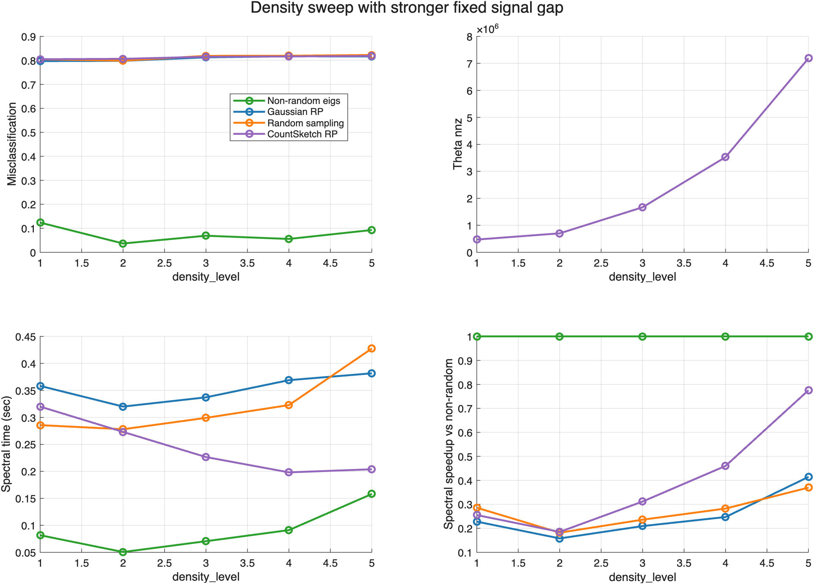
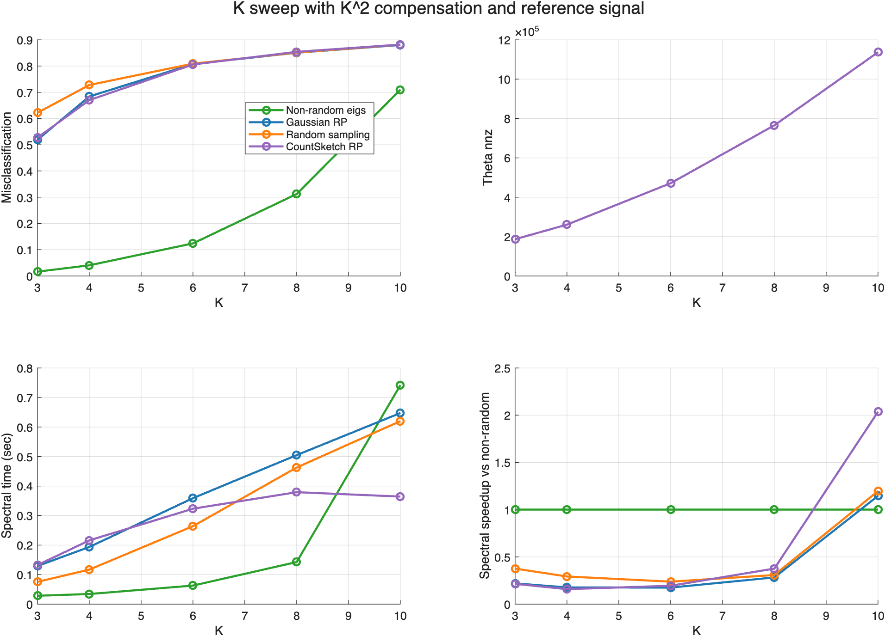
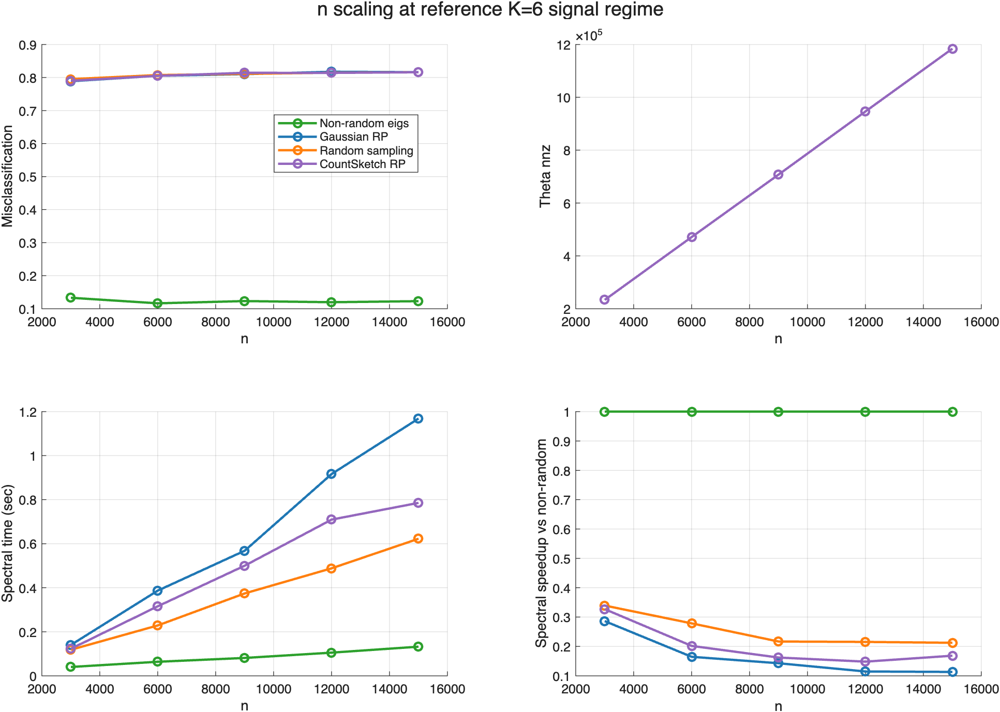
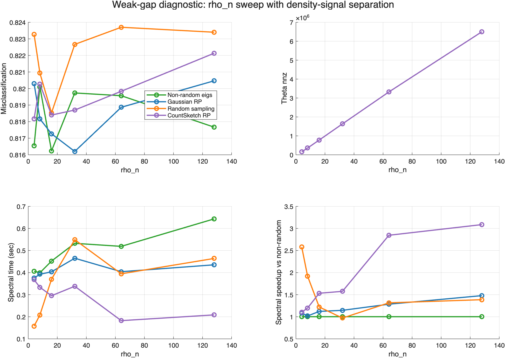
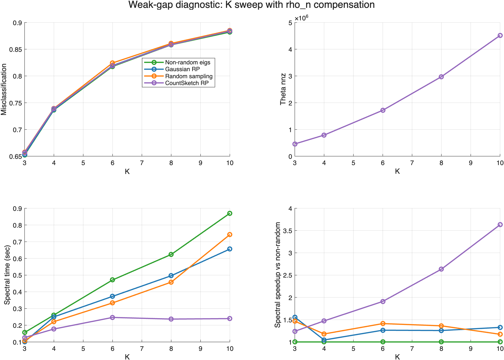
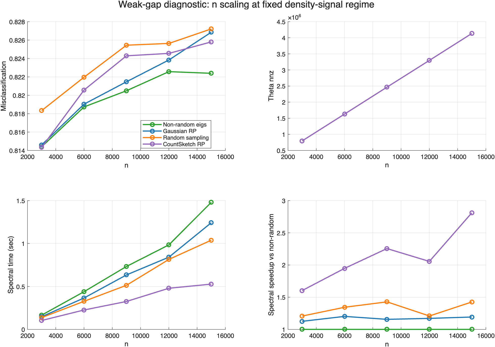

# 균일 HSBM density-signal 재설계 MATLAB 실험 보고서

이 보고서는 Python 재설계 실험을 MATLAB 코드로 다시 구현해 실행한 결과입니다. strong-signal sweep과 weak-gap diagnostic sweep을 분리해 저장했고, 결과는 이 MATLAB 폴더 아래에만 남겼습니다.

## 실행 요약

| 항목 | 값 |
|---|---|
| 구현 위치 | `experiments/균일 HSBM density-signal 재설계 실험_matlab/` |
| MATLAB 버전 | `26.1.0.3234472 (R2026a) Update 1` |
| 반복 횟수 | `5` |
| seed 기준 | `20260507` |
| smoke 실행 | `false` |

## 전체 요약

| block | method | 평균 오분류율 | 평균 ARI | 평균 NMI | 평균 Theta nnz | 평균 spectral초 | 평균 speedup |
|---|---|---:|---:|---:|---:|---:|---:|
| density_background_fixed_gap | Non-random eigs | 0.0755 | 0.8282 | 0.7882 | 2711110.9 | 0.0904 | 1.0000 |
| density_background_fixed_gap | Gaussian RP | 0.8081 | 0.0019 | 0.0038 | 2711110.9 | 0.3531 | 0.2513 |
| density_background_fixed_gap | Random sampling | 0.8126 | 0.0015 | 0.0043 | 2711110.9 | 0.3226 | 0.2711 |
| density_background_fixed_gap | CountSketch RP | 0.8120 | 0.0014 | 0.0032 | 2711110.9 | 0.2442 | 0.3975 |
| K_compensated_reference_signal | Non-random eigs | 0.2405 | 0.6108 | 0.5910 | 564151.3 | 0.2019 | 1.0000 |
| K_compensated_reference_signal | Gaussian RP | 0.7482 | 0.0144 | 0.0153 | 564151.3 | 0.3667 | 0.3999 |
| K_compensated_reference_signal | Random sampling | 0.7782 | 0.0023 | 0.0062 | 564151.3 | 0.3078 | 0.4822 |
| K_compensated_reference_signal | CountSketch RP | 0.7477 | 0.0146 | 0.0156 | 564151.3 | 0.2829 | 0.5958 |
| n_scaling_reference_signal | Non-random eigs | 0.1230 | 0.7267 | 0.6834 | 708585.7 | 0.0845 | 1.0000 |
| n_scaling_reference_signal | Gaussian RP | 0.8075 | 0.0025 | 0.0045 | 708585.7 | 0.6360 | 0.1643 |
| n_scaling_reference_signal | Random sampling | 0.8088 | 0.0020 | 0.0040 | 708585.7 | 0.3664 | 0.2525 |
| n_scaling_reference_signal | CountSketch RP | 0.8078 | 0.0023 | 0.0043 | 708585.7 | 0.4867 | 0.2015 |
| rho_density_signal_control | Non-random eigs | 0.8183 | 0.0002 | 0.0015 | 2123106.7 | 0.4920 | 1.0000 |
| rho_density_signal_control | Gaussian RP | 0.8185 | 0.0001 | 0.0014 | 2123106.7 | 0.4126 | 1.1878 |
| rho_density_signal_control | Random sampling | 0.8221 | 0.0000 | 0.0014 | 2123106.7 | 0.3571 | 1.5655 |
| rho_density_signal_control | CountSketch RP | 0.8196 | 0.0000 | 0.0012 | 2123106.7 | 0.2875 | 1.8901 |
| K_compensated_rank_scaling | Non-random eigs | 0.7894 | 0.0003 | 0.0018 | 2090813.2 | 0.4765 | 1.0000 |
| K_compensated_rank_scaling | Gaussian RP | 0.7906 | 0.0001 | 0.0015 | 2090813.2 | 0.3752 | 1.2893 |
| K_compensated_rank_scaling | Random sampling | 0.7935 | -0.0000 | 0.0016 | 2090813.2 | 0.3724 | 1.3183 |
| K_compensated_rank_scaling | CountSketch RP | 0.7914 | 0.0001 | 0.0015 | 2090813.2 | 0.2054 | 2.1769 |
| n_scaling_fixed_density_signal | Non-random eigs | 0.8197 | 0.0002 | 0.0013 | 2464280.8 | 0.7604 | 1.0000 |
| n_scaling_fixed_density_signal | Gaussian RP | 0.8212 | -0.0000 | 0.0010 | 2464280.8 | 0.6460 | 1.1688 |
| n_scaling_fixed_density_signal | Random sampling | 0.8237 | 0.0000 | 0.0014 | 2464280.8 | 0.5663 | 1.3219 |
| n_scaling_fixed_density_signal | CountSketch RP | 0.8219 | -0.0001 | 0.0010 | 2464280.8 | 0.3319 | 2.1338 |

## 스펙트럼 진단

| block | x | K | Theta nnz | lambda_K | lambda_K+1 | relative gap |
|---|---:|---:|---:|---:|---:|---:|
| density_background_fixed_gap | 1 | 6 | 472672 | 0.504007 | 0.489587 | 0.028611 |
| density_background_fixed_gap | 2 | 6 | 699910 | 0.486451 | 0.460523 | 0.053300 |
| density_background_fixed_gap | 3 | 6 | 1669622 | 0.424070 | 0.413950 | 0.023864 |
| density_background_fixed_gap | 4 | 6 | 3525200 | 0.394288 | 0.387654 | 0.016825 |
| density_background_fixed_gap | 5 | 6 | 7197916 | 0.373060 | 0.369969 | 0.008286 |
| K_compensated_reference_signal | 3 | 3 | 186488 | 0.696074 | 0.590357 | 0.151877 |
| K_compensated_reference_signal | 4 | 4 | 260578 | 0.605515 | 0.547959 | 0.095053 |
| K_compensated_reference_signal | 6 | 6 | 470260 | 0.505094 | 0.489885 | 0.030112 |
| K_compensated_reference_signal | 8 | 8 | 770674 | 0.455844 | 0.454374 | 0.003224 |
| K_compensated_reference_signal | 10 | 10 | 1133304 | 0.431391 | 0.431098 | 0.000681 |

## 랜덤화 파라미터 진단

| method | setting | 오분류율 | ARI | NMI | spectral초 | speedup |
|---|---|---:|---:|---:|---:|---:|
| Non-random eigs | baseline | 0.0980 | 0.7787 | 0.7352 | 0.1361 | 1.0000 |
| Gaussian RP r=30 q=1 | fast | 0.8232 | -0.0001 | 0.0011 | 0.3910 | 0.3481 |
| Gaussian RP r=160 q=3 | wide | 0.8007 | 0.0028 | 0.0051 | 0.8794 | 0.1548 |
| CountSketch RP r=30 q=1 | fast | 0.8203 | 0.0003 | 0.0015 | 0.2192 | 0.6210 |
| CountSketch RP r=160 q=3 | wide | 0.8033 | 0.0035 | 0.0062 | 0.7220 | 0.1885 |
| Random sampling p=0.3 | fast | 0.8203 | 0.0001 | 0.0027 | 0.3910 | 0.3482 |
| Random sampling p=0.7 | less_sparse | 0.6630 | 0.0537 | 0.0820 | 0.6871 | 0.1981 |
| Random sampling p=0.9 | near_full | 0.2372 | 0.4995 | 0.5085 | 0.3243 | 0.4198 |
| Random sampling p=1.0 | full_control | 0.0980 | 0.7787 | 0.7352 | 0.2208 | 0.6166 |

## Density sweep with stronger fixed signal gap

### density_level = 1

| 방법 | 오분류율 | ARI | NMI | spectral초 | speedup |
|---|---:|---:|---:|---:|---:|
| **Non-random eigs** | **0.1237** | **0.7252** | **0.6820** | **0.0816** | **1.0000** |
| Gaussian RP | 0.7970 | 0.0039 | 0.0065 | 0.3582 | 0.2279 |
| Random sampling | 0.8043 | 0.0025 | 0.0050 | 0.2856 | 0.2858 |
| CountSketch RP | 0.8047 | 0.0029 | 0.0053 | 0.3199 | 0.2552 |

### density_level = 2

| 방법 | 오분류율 | ARI | NMI | spectral초 | speedup |
|---|---:|---:|---:|---:|---:|
| **Non-random eigs** | **0.0366** | **0.9141** | **0.8811** | **0.0505** | **1.0000** |
| Gaussian RP | 0.7980 | 0.0038 | 0.0065 | 0.3199 | 0.1579 |
| Random sampling | 0.7986 | 0.0045 | 0.0074 | 0.2780 | 0.1818 |
| CountSketch RP | 0.8063 | 0.0027 | 0.0051 | 0.2730 | 0.1851 |

### density_level = 3

| 방법 | 오분류율 | ARI | NMI | spectral초 | speedup |
|---|---:|---:|---:|---:|---:|
| **Non-random eigs** | **0.0690** | **0.8413** | **0.7996** | **0.0706** | **1.0000** |
| Gaussian RP | 0.8125 | 0.0011 | 0.0027 | 0.3371 | 0.2094 |
| Random sampling | 0.8187 | 0.0003 | 0.0038 | 0.2991 | 0.2360 |
| CountSketch RP | 0.8149 | 0.0007 | 0.0021 | 0.2264 | 0.3117 |

### density_level = 4

| 방법 | 오분류율 | ARI | NMI | spectral초 | speedup |
|---|---:|---:|---:|---:|---:|
| **Non-random eigs** | **0.0556** | **0.8711** | **0.8318** | **0.0911** | **1.0000** |
| Gaussian RP | 0.8167 | 0.0004 | 0.0018 | 0.3689 | 0.2471 |
| Random sampling | 0.8191 | 0.0002 | 0.0030 | 0.3227 | 0.2824 |
| CountSketch RP | 0.8161 | 0.0004 | 0.0018 | 0.1981 | 0.4601 |

### density_level = 5

| 방법 | 오분류율 | ARI | NMI | spectral초 | speedup |
|---|---:|---:|---:|---:|---:|
| **Non-random eigs** | **0.0928** | **0.7896** | **0.7463** | **0.1581** | **1.0000** |
| Gaussian RP | 0.8162 | 0.0003 | 0.0016 | 0.3816 | 0.4143 |
| Random sampling | 0.8223 | 0.0000 | 0.0023 | 0.4275 | 0.3697 |
| CountSketch RP | 0.8182 | 0.0002 | 0.0015 | 0.2038 | 0.7755 |

## K sweep with K^2 compensation and reference signal

### K = 3

| 방법 | 오분류율 | ARI | NMI | spectral초 | speedup |
|---|---:|---:|---:|---:|---:|
| **Non-random eigs** | **0.0163** | **0.9517** | **0.9143** | **0.0283** | **1.0000** |
| Gaussian RP | 0.5190 | 0.0517 | 0.0454 | 0.1290 | 0.2196 |
| Random sampling | 0.6218 | 0.0062 | 0.0145 | 0.0753 | 0.3761 |
| CountSketch RP | 0.5269 | 0.0515 | 0.0466 | 0.1321 | 0.2144 |

### K = 4

| 방법 | 오분류율 | ARI | NMI | spectral초 | speedup |
|---|---:|---:|---:|---:|---:|
| **Non-random eigs** | **0.0405** | **0.8949** | **0.8463** | **0.0342** | **1.0000** |
| Gaussian RP | 0.6839 | 0.0156 | 0.0172 | 0.1936 | 0.1766 |
| Random sampling | 0.7276 | 0.0022 | 0.0039 | 0.1169 | 0.2924 |
| CountSketch RP | 0.6700 | 0.0177 | 0.0196 | 0.2159 | 0.1583 |

### K = 6

| 방법 | 오분류율 | ARI | NMI | spectral초 | speedup |
|---|---:|---:|---:|---:|---:|
| **Non-random eigs** | **0.1241** | **0.7242** | **0.6808** | **0.0628** | **1.0000** |
| Gaussian RP | 0.8074 | 0.0027 | 0.0049 | 0.3590 | 0.1748 |
| Random sampling | 0.8089 | 0.0017 | 0.0039 | 0.2640 | 0.2377 |
| CountSketch RP | 0.8057 | 0.0025 | 0.0046 | 0.3232 | 0.1942 |

### K = 8

| 방법 | 오분류율 | ARI | NMI | spectral초 | speedup |
|---|---:|---:|---:|---:|---:|
| **Non-random eigs** | **0.3122** | **0.4146** | **0.4140** | **0.1425** | **1.0000** |
| Gaussian RP | 0.8506 | 0.0016 | 0.0046 | 0.5047 | 0.2823 |
| Random sampling | 0.8512 | 0.0012 | 0.0042 | 0.4627 | 0.3080 |
| CountSketch RP | 0.8540 | 0.0009 | 0.0035 | 0.3791 | 0.3759 |

### K = 10

| 방법 | 오분류율 | ARI | NMI | spectral초 | speedup |
|---|---:|---:|---:|---:|---:|
| **Non-random eigs** | **0.7096** | **0.0686** | **0.0999** | **0.7417** | **1.0000** |
| Gaussian RP | 0.8801 | 0.0006 | 0.0041 | 0.6472 | 1.1461 |
| Random sampling | 0.8813 | 0.0003 | 0.0042 | 0.6198 | 1.1967 |
| CountSketch RP | 0.8817 | 0.0003 | 0.0035 | 0.3642 | 2.0364 |

## n scaling at reference K=6 signal regime

### n = 3000

| 방법 | 오분류율 | ARI | NMI | spectral초 | speedup |
|---|---:|---:|---:|---:|---:|
| **Non-random eigs** | **0.1331** | **0.7061** | **0.6660** | **0.0401** | **1.0000** |
| Gaussian RP | 0.7887 | 0.0063 | 0.0110 | 0.1402 | 0.2862 |
| Random sampling | 0.7951 | 0.0041 | 0.0084 | 0.1183 | 0.3393 |
| CountSketch RP | 0.7901 | 0.0057 | 0.0103 | 0.1227 | 0.3270 |

### n = 6000

| 방법 | 오분류율 | ARI | NMI | spectral초 | speedup |
|---|---:|---:|---:|---:|---:|
| **Non-random eigs** | **0.1163** | **0.7404** | **0.6967** | **0.0637** | **1.0000** |
| Gaussian RP | 0.8052 | 0.0027 | 0.0050 | 0.3869 | 0.1647 |
| Random sampling | 0.8074 | 0.0020 | 0.0041 | 0.2288 | 0.2786 |
| CountSketch RP | 0.8050 | 0.0028 | 0.0051 | 0.3158 | 0.2019 |

### n = 9000

| 방법 | 오분류율 | ARI | NMI | spectral초 | speedup |
|---|---:|---:|---:|---:|---:|
| **Non-random eigs** | **0.1231** | **0.7265** | **0.6824** | **0.0811** | **1.0000** |
| Gaussian RP | 0.8102 | 0.0016 | 0.0030 | 0.5680 | 0.1428 |
| Random sampling | 0.8111 | 0.0017 | 0.0033 | 0.3742 | 0.2168 |
| CountSketch RP | 0.8142 | 0.0011 | 0.0024 | 0.5001 | 0.1622 |

### n = 1.2e+04

| 방법 | 오분류율 | ARI | NMI | spectral초 | speedup |
|---|---:|---:|---:|---:|---:|
| **Non-random eigs** | **0.1196** | **0.7336** | **0.6891** | **0.1052** | **1.0000** |
| Gaussian RP | 0.8174 | 0.0008 | 0.0017 | 0.9165 | 0.1148 |
| Random sampling | 0.8144 | 0.0011 | 0.0022 | 0.4882 | 0.2154 |
| CountSketch RP | 0.8139 | 0.0011 | 0.0021 | 0.7095 | 0.1482 |

### n = 1.5e+04

| 방법 | 오분류율 | ARI | NMI | spectral초 | speedup |
|---|---:|---:|---:|---:|---:|
| **Non-random eigs** | **0.1228** | **0.7270** | **0.6827** | **0.1323** | **1.0000** |
| Gaussian RP | 0.8161 | 0.0009 | 0.0017 | 1.1683 | 0.1132 |
| Random sampling | 0.8159 | 0.0009 | 0.0019 | 0.6225 | 0.2125 |
| CountSketch RP | 0.8159 | 0.0010 | 0.0018 | 0.7854 | 0.1684 |

## Weak-gap diagnostic: rho_n sweep with density-signal separation

### rho_n = 4

| 방법 | 오분류율 | ARI | NMI | spectral초 | speedup |
|---|---:|---:|---:|---:|---:|
| **Non-random eigs** | **0.8165** | **0.0002** | **0.0015** | **0.4062** | **1.0000** |
| Gaussian RP | 0.8203 | 0.0001 | 0.0013 | 0.3754 | 1.0819 |
| Random sampling | 0.8233 | -0.0001 | 0.0014 | 0.1575 | 2.5794 |
| CountSketch RP | 0.8182 | 0.0001 | 0.0014 | 0.3678 | 1.1045 |

### rho_n = 8

| 방법 | 오분류율 | ARI | NMI | spectral초 | speedup |
|---|---:|---:|---:|---:|---:|
| Non-random eigs | 0.8201 | 0.0001 | 0.0014 | 0.3993 | 1.0000 |
| **Gaussian RP** | **0.8182** | **0.0003** | **0.0015** | **0.3926** | **1.0171** |
| Random sampling | 0.8209 | 0.0000 | 0.0013 | 0.2079 | 1.9204 |
| CountSketch RP | 0.8203 | -0.0001 | 0.0011 | 0.3335 | 1.1972 |

### rho_n = 16

| 방법 | 오분류율 | ARI | NMI | spectral초 | speedup |
|---|---:|---:|---:|---:|---:|
| **Non-random eigs** | **0.8162** | **0.0004** | **0.0017** | **0.4521** | **1.0000** |
| Gaussian RP | 0.8173 | 0.0002 | 0.0014 | 0.4034 | 1.1208 |
| Random sampling | 0.8185 | 0.0001 | 0.0013 | 0.3699 | 1.2221 |
| CountSketch RP | 0.8184 | 0.0001 | 0.0014 | 0.2951 | 1.5318 |

### rho_n = 32

| 방법 | 오분류율 | ARI | NMI | spectral초 | speedup |
|---|---:|---:|---:|---:|---:|
| Non-random eigs | 0.8197 | 0.0002 | 0.0014 | 0.5325 | 1.0000 |
| **Gaussian RP** | **0.8162** | **0.0003** | **0.0016** | **0.4650** | **1.1452** |
| Random sampling | 0.8227 | 0.0001 | 0.0016 | 0.5489 | 0.9701 |
| CountSketch RP | 0.8187 | 0.0001 | 0.0012 | 0.3381 | 1.5751 |

### rho_n = 64

| 방법 | 오분류율 | ARI | NMI | spectral초 | speedup |
|---|---:|---:|---:|---:|---:|
| Non-random eigs | 0.8196 | 0.0002 | 0.0014 | 0.5188 | 1.0000 |
| **Gaussian RP** | **0.8189** | **0.0001** | **0.0013** | **0.4040** | **1.2841** |
| Random sampling | 0.8237 | 0.0000 | 0.0014 | 0.3945 | 1.3151 |
| CountSketch RP | 0.8198 | -0.0000 | 0.0012 | 0.1823 | 2.8451 |

### rho_n = 128

| 방법 | 오분류율 | ARI | NMI | spectral초 | speedup |
|---|---:|---:|---:|---:|---:|
| **Non-random eigs** | **0.8177** | **0.0002** | **0.0014** | **0.6433** | **1.0000** |
| Gaussian RP | 0.8205 | -0.0001 | 0.0010 | 0.4352 | 1.4780 |
| Random sampling | 0.8234 | -0.0000 | 0.0015 | 0.4640 | 1.3862 |
| CountSketch RP | 0.8221 | -0.0001 | 0.0010 | 0.2084 | 3.0866 |

## Weak-gap diagnostic: K sweep with rho_n compensation

### K = 3

| 방법 | 오분류율 | ARI | NMI | spectral초 | speedup |
|---|---:|---:|---:|---:|---:|
| **Non-random eigs** | **0.6522** | **0.0008** | **0.0011** | **0.1565** | **1.0000** |
| Gaussian RP | 0.6533 | 0.0004 | 0.0007 | 0.1006 | 1.5557 |
| Random sampling | 0.6576 | 0.0000 | 0.0004 | 0.1068 | 1.4658 |
| CountSketch RP | 0.6567 | 0.0001 | 0.0004 | 0.1263 | 1.2396 |

### K = 4

| 방법 | 오분류율 | ARI | NMI | spectral초 | speedup |
|---|---:|---:|---:|---:|---:|
| **Non-random eigs** | **0.7365** | **0.0002** | **0.0007** | **0.2612** | **1.0000** |
| Gaussian RP | 0.7372 | 0.0002 | 0.0008 | 0.2502 | 1.0440 |
| Random sampling | 0.7394 | -0.0000 | 0.0005 | 0.2215 | 1.1795 |
| CountSketch RP | 0.7388 | 0.0001 | 0.0006 | 0.1774 | 1.4722 |

### K = 6

| 방법 | 오분류율 | ARI | NMI | spectral초 | speedup |
|---|---:|---:|---:|---:|---:|
| **Non-random eigs** | **0.8178** | **0.0004** | **0.0017** | **0.4711** | **1.0000** |
| Gaussian RP | 0.8195 | -0.0001 | 0.0011 | 0.3728 | 1.2635 |
| Random sampling | 0.8244 | -0.0001 | 0.0012 | 0.3336 | 1.4121 |
| CountSketch RP | 0.8189 | 0.0001 | 0.0012 | 0.2467 | 1.9095 |

### K = 8

| 방법 | 오분류율 | ARI | NMI | spectral초 | speedup |
|---|---:|---:|---:|---:|---:|
| **Non-random eigs** | **0.8583** | **0.0001** | **0.0022** | **0.6235** | **1.0000** |
| Gaussian RP | 0.8591 | 0.0001 | 0.0021 | 0.4962 | 1.2566 |
| Random sampling | 0.8609 | 0.0000 | 0.0026 | 0.4579 | 1.3618 |
| CountSketch RP | 0.8585 | 0.0002 | 0.0023 | 0.2368 | 2.6331 |

### K = 10

| 방법 | 오분류율 | ARI | NMI | spectral초 | speedup |
|---|---:|---:|---:|---:|---:|
| **Non-random eigs** | **0.8821** | **0.0001** | **0.0031** | **0.8702** | **1.0000** |
| Gaussian RP | 0.8838 | -0.0001 | 0.0028 | 0.6559 | 1.3267 |
| Random sampling | 0.8853 | -0.0000 | 0.0036 | 0.7424 | 1.1721 |
| CountSketch RP | 0.8841 | -0.0000 | 0.0029 | 0.2397 | 3.6301 |

## Weak-gap diagnostic: n scaling at fixed density-signal regime

### n = 3000

| 방법 | 오분류율 | ARI | NMI | spectral초 | speedup |
|---|---:|---:|---:|---:|---:|
| Non-random eigs | 0.8144 | 0.0003 | 0.0028 | 0.1655 | 1.0000 |
| Gaussian RP | 0.8146 | -0.0001 | 0.0022 | 0.1472 | 1.1247 |
| Random sampling | 0.8183 | -0.0000 | 0.0031 | 0.1372 | 1.2066 |
| **CountSketch RP** | **0.8143** | **-0.0001** | **0.0023** | **0.1033** | **1.6025** |

### n = 6000

| 방법 | 오분류율 | ARI | NMI | spectral초 | speedup |
|---|---:|---:|---:|---:|---:|
| **Non-random eigs** | **0.8187** | **0.0001** | **0.0013** | **0.4391** | **1.0000** |
| Gaussian RP | 0.8190 | 0.0001 | 0.0012 | 0.3655 | 1.2014 |
| Random sampling | 0.8220 | 0.0000 | 0.0017 | 0.3269 | 1.3432 |
| CountSketch RP | 0.8206 | -0.0001 | 0.0011 | 0.2255 | 1.9471 |

### n = 9000

| 방법 | 오분류율 | ARI | NMI | spectral초 | speedup |
|---|---:|---:|---:|---:|---:|
| **Non-random eigs** | **0.8205** | **0.0002** | **0.0010** | **0.7329** | **1.0000** |
| Gaussian RP | 0.8215 | -0.0000 | 0.0007 | 0.6342 | 1.1557 |
| Random sampling | 0.8254 | -0.0000 | 0.0010 | 0.5135 | 1.4272 |
| CountSketch RP | 0.8243 | -0.0001 | 0.0006 | 0.3250 | 2.2549 |

### n = 1.2e+04

| 방법 | 오분류율 | ARI | NMI | spectral초 | speedup |
|---|---:|---:|---:|---:|---:|
| **Non-random eigs** | **0.8226** | **0.0002** | **0.0008** | **0.9841** | **1.0000** |
| Gaussian RP | 0.8238 | 0.0001 | 0.0007 | 0.8408 | 1.1704 |
| Random sampling | 0.8256 | -0.0000 | 0.0007 | 0.8149 | 1.2076 |
| CountSketch RP | 0.8246 | -0.0001 | 0.0005 | 0.4788 | 2.0554 |

### n = 1.5e+04

| 방법 | 오분류율 | ARI | NMI | spectral초 | speedup |
|---|---:|---:|---:|---:|---:|
| **Non-random eigs** | **0.8224** | **0.0001** | **0.0006** | **1.4804** | **1.0000** |
| Gaussian RP | 0.8269 | -0.0001 | 0.0003 | 1.2422 | 1.1917 |
| Random sampling | 0.8272 | 0.0000 | 0.0006 | 1.0387 | 1.4252 |
| CountSketch RP | 0.8258 | -0.0000 | 0.0004 | 0.5270 | 2.8093 |

## 해석 메모

- `speedup`은 generation/build를 제외한 spectral clustering 단계 기준입니다.
- randomized method의 speedup은 Non-random과 정확도가 비슷할 때만 의미 있게 해석해야 합니다.
- MATLAB 구현은 Python과 같은 설계를 따르지만 RNG와 solver 차이로 결과값은 달라질 수 있습니다.
