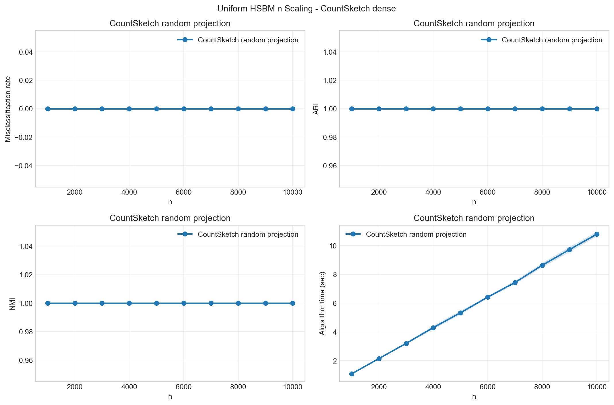
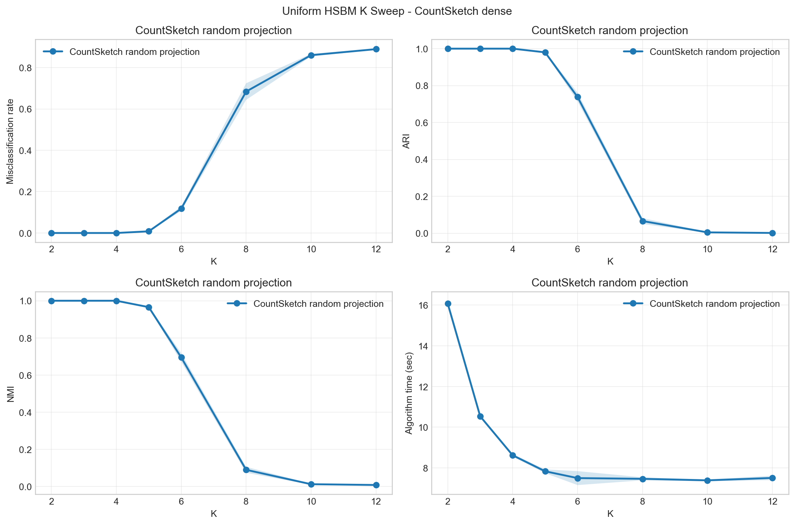
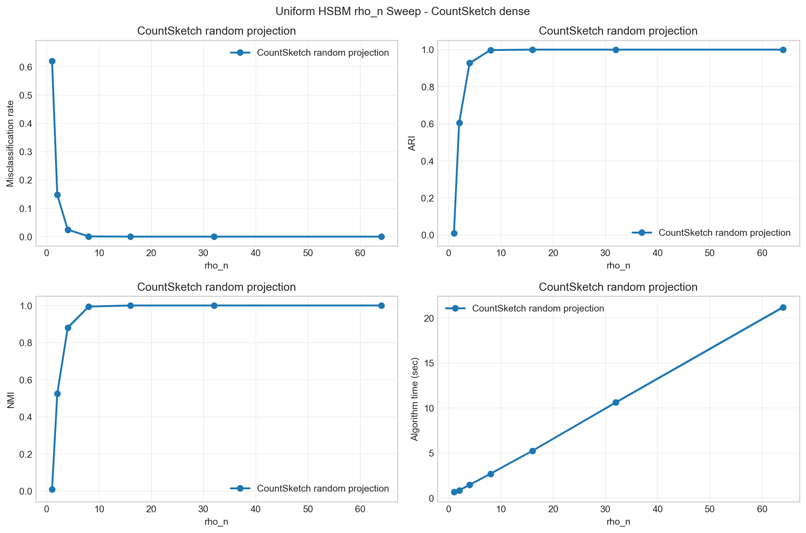

# 균일 HSBM CountSketch dense 실험 결과보고서

이 보고서는 `균일 HSBM 실험/countsketch` 폴더에서 실행한 CountSketch random projection 실험을 정리한 것입니다. 기존 가우시안 랜덤 프로젝션과 동일한 subspace iteration 구조를 사용하되, Gaussian test matrix 대신 각 노드가 하나의 bucket과 부호만 갖는 CountSketch test matrix를 사용했습니다.

## 실험 구성

- `n변화`: `K=3`, dense `rho_n=16.0`을 고정하고 `n`을 1000부터 10000까지 바꿉니다.
- `K변화`: `n=5000`, dense `rho_n=32.0`을 고정하고 `K`를 바꿉니다.
- `rho_n변화`: 기존 `{0.25, 0.5, 1, 2, 4, 8, 16}` schedule에 4를 곱한 `{1, 2, 4, 8, 16, 32, 64}`를 사용합니다.
- `CountSketch random projection`: `ell = K + 160`, power iteration `q=4`로 설정했습니다.
- `dense`는 full matrix 저장이 아니라 `rho_n`을 4배 키운 denser HSBM regime을 뜻합니다. `n=10000`에서 모든 3-uniform 후보를 열거하는 완전 dense Bernoulli 방식은 계산량이 너무 커서 사용하지 않았습니다.
- 세부 표는 같은 `n`, `K`, `rho_n` 값끼리 작은 표로 묶었습니다.

## 전체 요약

| sweep | method | 평균_오분류율 | 평균_ARI | 평균_NMI | 평균_주요시간초 | 평균_spectral초 | 평균degree |
| --- | --- | --- | --- | --- | --- | --- | --- |
| K | CountSketch random projection | 0.3198 | 0.5988 | 0.5966 | 9.1143 | 0.9068 | 97.4204 |
| n | CountSketch random projection | 0.0000 | 1.0000 | 1.0000 | 5.9053 | 0.5314 | 60.3526 |
| rho_n | CountSketch random projection | 0.1134 | 0.7915 | 0.7729 | 6.1116 | 0.5185 | 68.4575 |

## n 변화 실험

### n = 1000.0

| 방법 | 오분류율 | ARI | NMI | 주요시간초 | spectral초 | 하이퍼엣지수 | 평균degree | Theta density |
| --- | --- | --- | --- | --- | --- | --- | --- | --- |
| CountSketch random projection | 0.0000 | 1.0000 | 1.0000 | 1.0815 | 0.1180 | 20001.7 | 60.0051 | 0.1113 |

### n = 2000.0

| 방법 | 오분류율 | ARI | NMI | 주요시간초 | spectral초 | 하이퍼엣지수 | 평균degree | Theta density |
| --- | --- | --- | --- | --- | --- | --- | --- | --- |
| CountSketch random projection | 0.0000 | 1.0000 | 1.0000 | 2.1424 | 0.2095 | 40249.4 | 60.3741 | 0.0583 |

### n = 3000.0

| 방법 | 오분류율 | ARI | NMI | 주요시간초 | spectral초 | 하이퍼엣지수 | 평균degree | Theta density |
| --- | --- | --- | --- | --- | --- | --- | --- | --- |
| CountSketch random projection | 0.0000 | 1.0000 | 1.0000 | 3.1965 | 0.2919 | 60444.7 | 60.4447 | 0.0395 |

### n = 4000.0

| 방법 | 오분류율 | ARI | NMI | 주요시간초 | spectral초 | 하이퍼엣지수 | 평균degree | Theta density |
| --- | --- | --- | --- | --- | --- | --- | --- | --- |
| CountSketch random projection | 0.0000 | 1.0000 | 1.0000 | 4.2994 | 0.3844 | 80550.4 | 60.4128 | 0.0298 |

### n = 5000.0

| 방법 | 오분류율 | ARI | NMI | 주요시간초 | spectral초 | 하이퍼엣지수 | 평균degree | Theta density |
| --- | --- | --- | --- | --- | --- | --- | --- | --- |
| CountSketch random projection | 0.0000 | 1.0000 | 1.0000 | 5.3339 | 0.4713 | 100718.2 | 60.4309 | 0.0240 |

### n = 6000.0

| 방법 | 오분류율 | ARI | NMI | 주요시간초 | spectral초 | 하이퍼엣지수 | 평균degree | Theta density |
| --- | --- | --- | --- | --- | --- | --- | --- | --- |
| CountSketch random projection | 0.0000 | 1.0000 | 1.0000 | 6.4190 | 0.5617 | 120756.4 | 60.3782 | 0.0200 |

### n = 7000.0

| 방법 | 오분류율 | ARI | NMI | 주요시간초 | spectral초 | 하이퍼엣지수 | 평균degree | Theta density |
| --- | --- | --- | --- | --- | --- | --- | --- | --- |
| CountSketch random projection | 0.0000 | 1.0000 | 1.0000 | 7.4346 | 0.6352 | 140814.1 | 60.3489 | 0.0172 |

### n = 8000.0

| 방법 | 오분류율 | ARI | NMI | 주요시간초 | spectral초 | 하이퍼엣지수 | 평균degree | Theta density |
| --- | --- | --- | --- | --- | --- | --- | --- | --- |
| CountSketch random projection | 0.0000 | 1.0000 | 1.0000 | 8.6312 | 0.7574 | 160962.6 | 60.3610 | 0.0151 |

### n = 9000.0

| 방법 | 오분류율 | ARI | NMI | 주요시간초 | spectral초 | 하이퍼엣지수 | 평균degree | Theta density |
| --- | --- | --- | --- | --- | --- | --- | --- | --- |
| CountSketch random projection | 0.0000 | 1.0000 | 1.0000 | 9.7243 | 0.8738 | 181089.5 | 60.3632 | 0.0134 |

### n = 10000.0

| 방법 | 오분류율 | ARI | NMI | 주요시간초 | spectral초 | 하이퍼엣지수 | 평균degree | Theta density |
| --- | --- | --- | --- | --- | --- | --- | --- | --- |
| CountSketch random projection | 0.0000 | 1.0000 | 1.0000 | 10.7902 | 1.0104 | 201358.1 | 60.4074 | 0.0121 |

### 그림

## K 변화 실험

### K = 2.0000

| 방법 | 오분류율 | ARI | NMI | 주요시간초 | spectral초 | 하이퍼엣지수 | 평균degree | Theta density |
| --- | --- | --- | --- | --- | --- | --- | --- | --- |
| CountSketch random projection | 0.0000 | 1.0000 | 1.0000 | 16.0768 | 0.9524 | 319805.4 | 191.8832 | 0.0729 |

### K = 3.0000

| 방법 | 오분류율 | ARI | NMI | 주요시간초 | spectral초 | 하이퍼엣지수 | 평균degree | Theta density |
| --- | --- | --- | --- | --- | --- | --- | --- | --- |
| CountSketch random projection | 0.0000 | 1.0000 | 1.0000 | 10.5342 | 0.7238 | 201188.9 | 120.7133 | 0.0469 |

### K = 4.0000

| 방법 | 오분류율 | ARI | NMI | 주요시간초 | spectral초 | 하이퍼엣지수 | 평균degree | Theta density |
| --- | --- | --- | --- | --- | --- | --- | --- | --- |
| CountSketch random projection | 0.0000 | 1.0000 | 1.0000 | 8.6191 | 0.5715 | 159799.6 | 95.8798 | 0.0376 |

### K = 5.0000

| 방법 | 오분류율 | ARI | NMI | 주요시간초 | spectral초 | 하이퍼엣지수 | 평균degree | Theta density |
| --- | --- | --- | --- | --- | --- | --- | --- | --- |
| CountSketch random projection | 0.0080 | 0.9800 | 0.9656 | 7.8327 | 0.6076 | 140546.2 | 84.3277 | 0.0332 |

### K = 6.0000

| 방법 | 오분류율 | ARI | NMI | 주요시간초 | spectral초 | 하이퍼엣지수 | 평균degree | Theta density |
| --- | --- | --- | --- | --- | --- | --- | --- | --- |
| CountSketch random projection | 0.1176 | 0.7380 | 0.6954 | 7.4974 | 0.6060 | 130461.0 | 78.2766 | 0.0309 |

### K = 8.0000

| 방법 | 오분류율 | ARI | NMI | 주요시간초 | spectral초 | 하이퍼엣지수 | 평균degree | Theta density |
| --- | --- | --- | --- | --- | --- | --- | --- | --- |
| CountSketch random projection | 0.6838 | 0.0663 | 0.0903 | 7.4619 | 1.1250 | 119734.9 | 71.8409 | 0.0285 |

### K = 10.0000

| 방법 | 오분류율 | ARI | NMI | 주요시간초 | spectral초 | 하이퍼엣지수 | 평균degree | Theta density |
| --- | --- | --- | --- | --- | --- | --- | --- | --- |
| CountSketch random projection | 0.8598 | 0.0048 | 0.0129 | 7.3869 | 1.2639 | 115120.9 | 69.0725 | 0.0274 |

### K = 12.0000

| 방법 | 오분류율 | ARI | NMI | 주요시간초 | spectral초 | 하이퍼엣지수 | 평균degree | Theta density |
| --- | --- | --- | --- | --- | --- | --- | --- | --- |
| CountSketch random projection | 0.8890 | 0.0017 | 0.0087 | 7.5054 | 1.4039 | 112281.7 | 67.3690 | 0.0268 |

### 그림

## rho_n 변화 실험

### rho_n = 1.0000

| 방법 | 오분류율 | ARI | NMI | 주요시간초 | spectral초 | 하이퍼엣지수 | 평균degree | Theta density |
| --- | --- | --- | --- | --- | --- | --- | --- | --- |
| CountSketch random projection | 0.6201 | 0.0108 | 0.0102 | 0.6828 | 0.3728 | 6319.8 | 3.7919 | 0.0017 |

### rho_n = 2.0000

| 방법 | 오분류율 | ARI | NMI | 주요시간초 | spectral초 | 하이퍼엣지수 | 평균degree | Theta density |
| --- | --- | --- | --- | --- | --- | --- | --- | --- |
| CountSketch random projection | 0.1481 | 0.6050 | 0.5257 | 0.8583 | 0.2450 | 12618.6 | 7.5712 | 0.0032 |

### rho_n = 4.0000

| 방법 | 오분류율 | ARI | NMI | 주요시간초 | spectral초 | 하이퍼엣지수 | 평균degree | Theta density |
| --- | --- | --- | --- | --- | --- | --- | --- | --- |
| CountSketch random projection | 0.0247 | 0.9274 | 0.8799 | 1.4744 | 0.2596 | 25177.2 | 15.1063 | 0.0062 |

### rho_n = 8.0000

| 방법 | 오분류율 | ARI | NMI | 주요시간초 | spectral초 | 하이퍼엣지수 | 평균degree | Theta density |
| --- | --- | --- | --- | --- | --- | --- | --- | --- |
| CountSketch random projection | 0.0008 | 0.9976 | 0.9941 | 2.7071 | 0.3179 | 50327.7 | 30.1966 | 0.0122 |

### rho_n = 16.0000

| 방법 | 오분류율 | ARI | NMI | 주요시간초 | spectral초 | 하이퍼엣지수 | 평균degree | Theta density |
| --- | --- | --- | --- | --- | --- | --- | --- | --- |
| CountSketch random projection | 0.0000 | 1.0000 | 1.0000 | 5.2439 | 0.4579 | 100519.7 | 60.3118 | 0.0239 |

### rho_n = 32.0000

| 방법 | 오분류율 | ARI | NMI | 주요시간초 | spectral초 | 하이퍼엣지수 | 평균degree | Theta density |
| --- | --- | --- | --- | --- | --- | --- | --- | --- |
| CountSketch random projection | 0.0000 | 1.0000 | 1.0000 | 10.6242 | 0.7507 | 201319.1 | 120.7915 | 0.0469 |

### rho_n = 64.0000

| 방법 | 오분류율 | ARI | NMI | 주요시간초 | spectral초 | 하이퍼엣지수 | 평균degree | Theta density |
| --- | --- | --- | --- | --- | --- | --- | --- | --- |
| CountSketch random projection | 0.0000 | 1.0000 | 1.0000 | 21.1907 | 1.2257 | 402389.3 | 241.4336 | 0.0904 |

### 그림

## 기존 결과와의 비교 메모

`rho_n` 변화 실험의 `rho_n in {1, 2, 4, 8, 16}` 구간은 기존 보고서의 실제 `rho_n` 값과 직접 겹치므로, 그 구간에서는 CountSketch와 기존 Gaussian/Non-random을 나란히 볼 수 있습니다.

| rho_n | CountSketch 오분류율 | Gaussian 오분류율 | Non-random 오분류율 |
| --- | --- | --- | --- |
| 1.0000 | 0.6201 | 0.6293 | 0.6267 |
| 2.0000 | 0.1481 | 0.1466 | 0.1034 |
| 4.0000 | 0.0247 | 0.0237 | 0.0171 |
| 8.0000 | 0.0008 | 0.0010 | 0.0006 |
| 16.0000 | 0.0000 | 0.0000 | 0.0000 |

이 겹치는 구간에서는 CountSketch가 tuned Gaussian random projection과 매우 비슷한 패턴을 보입니다. `rho_n=2`에서는 둘 다 non-random보다 높지만, `rho_n>=4`부터는 차이가 작아지고 `rho_n>=8`에서는 거의 완전 복원에 가깝습니다.

## CountSketch 결과 해석

- 전체 sweep 중 가장 낮은 평균 오분류율은 `K=2.0000`에서 `0.0000`이고, 가장 어려운 지점은 `K=12.0000`의 `0.8890`입니다.
- `rho_n >= 16`인 조밀한 구간의 평균 오분류율은 `0.0000`로 낮습니다. 즉 sparse regime에서 보이던 랜덤 스케치의 손실은 density를 올리면 상당히 줄어듭니다.
- 다만 `K`가 커지는 sweep에서는 `rho_n`을 4배 키워도 큰 `K` 구간이 여전히 어렵습니다. 이는 CountSketch 자체만의 문제라기보다, 기존 보고서에서 지적한 것처럼 `K` 증가와 함께 within-community 후보 비율 및 effective signal이 같이 바뀌는 효과가 남아 있기 때문입니다.
- CountSketch는 Gaussian projection보다 test matrix 생성 비용과 저장량은 작지만, 여기서는 `ell=K+160`, `q=4`를 유지했기 때문에 spectral 단계의 주된 비용은 여전히 반복적인 `Theta @ Y` 곱입니다.

## 해석 메모

- 오분류율은 Hungarian matching으로 예측 label을 true label에 맞춘 뒤 계산했습니다.
- ARI와 NMI는 label permutation에 불변이므로 원 label을 그대로 사용했습니다.
- `algorithm_sec`는 생성, hypergraph Laplacian/operator 구성, CountSketch spectral embedding, row normalization, k-means 주요 단계의 합입니다.
- `sampling_mode=sparse`는 후보를 전부 열거하지 않는 생성 알고리즘의 이름입니다. 이번 실험의 denser 조건은 `rho_n_x4`로 기록된 밀도 배율에서 옵니다.
