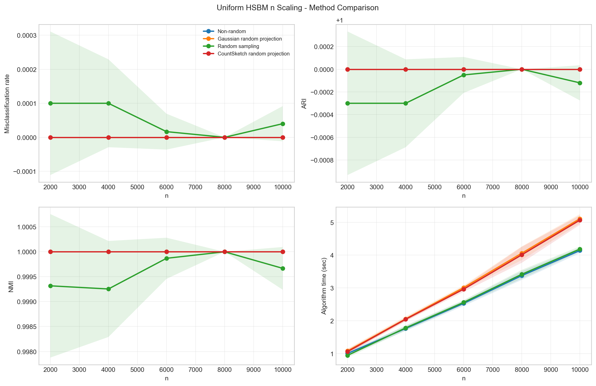
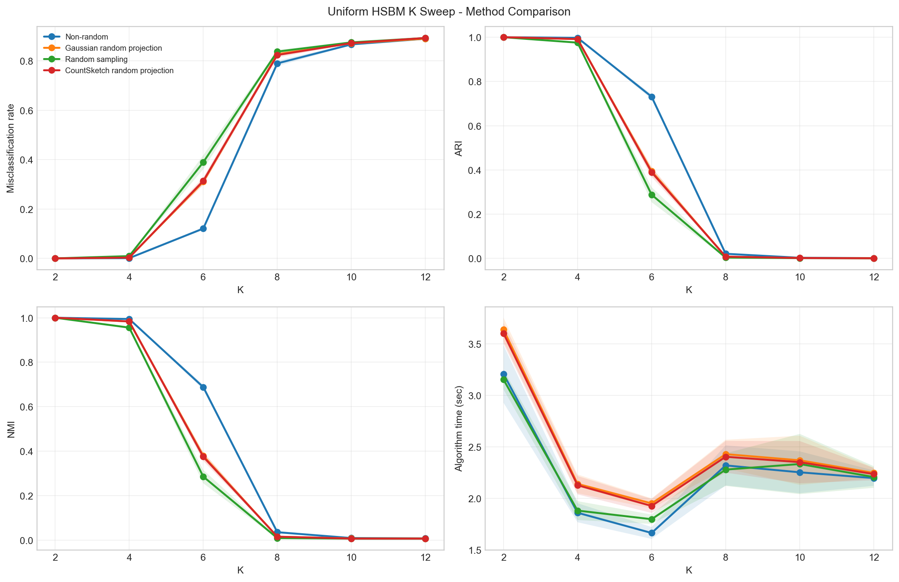
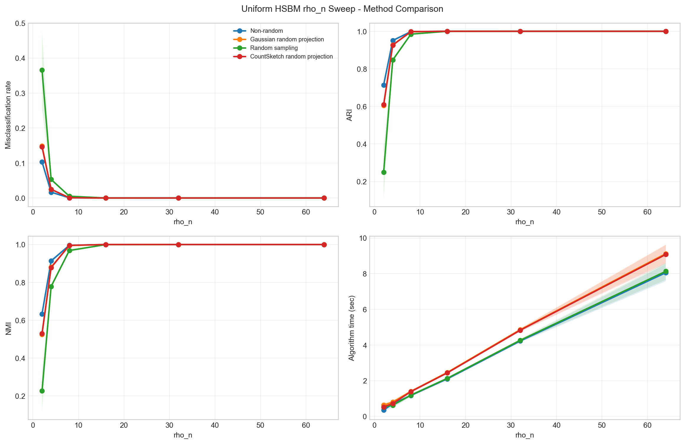

# 균일 HSBM sparse CountSketch method comparison 결과보고서

이 보고서는 교수님 지시에 따라 CountSketch random projection을 sparse sketch matrix 저장 방식으로 실행한 새 비교 결과입니다. 기존 method comparison의 실험 세팅은 바꾸지 않고, 결과만 새 폴더에 다시 생성했습니다.

## 실행 메모

- 결과 루트: `results/EXP-20260514_sparse_cs/`
- CountSketch RP는 `src/common.py`의 `generate_hash_and_signs`와 `sparse_explicit_countsketch`를 사용합니다.
- 즉, CountSketch 행렬 `S`를 scipy CSR sparse matrix로 저장하고 `S @ Theta`를 계산합니다.
- `index_set_countsketch` 방식은 이번 HSBM method comparison 실행 경로에서 사용하지 않았습니다.
- `n`, `K`, `rho_n`, 반복 횟수, seed, `ell = K + 160`, power iteration `q=4`, eigensolver `eigsh`, k-means 설정은 기존 비교 실험과 동일합니다.
- Gaussian RP의 test matrix는 `N(0, 1) / sqrt(ell)`로 스케일링했습니다.
- raw CSV의 `cs_sparse_explicit_sketch_sec` 컬럼으로 sparse explicit sketch 단계 시간을 확인할 수 있습니다.

## 전체 요약

| sweep | method | 평균 오분류율 | 평균 ARI | 평균 NMI | 평균 algorithm_sec | 평균 spectral_sec |
| --- | --- | --- | --- | --- | --- | --- |
| **K** | **Non-random** | **0.4446** | **0.4590** | **0.4559** | **2.2499** | **0.4587** |
| K | Gaussian random projection | 0.4835 | 0.3995 | 0.3988 | 2.4625 | 0.6714 |
| K | Random sampling | 0.5005 | 0.3782 | 0.3773 | 2.2750 | 0.4839 |
| K | CountSketch random projection | 0.4841 | 0.3987 | 0.3980 | 2.4412 | 0.6500 |
| **n** | **Non-random** | **0.0000** | **1.0000** | **1.0000** | **2.5637** | **0.0963** |
| **n** | **Gaussian random projection** | **0.0000** | **1.0000** | **1.0000** | **3.0644** | **0.5970** |
| n | Random sampling | 0.0001 | 0.9998 | 0.9996 | 2.5787 | 0.1113 |
| **n** | **CountSketch random projection** | **0.0000** | **1.0000** | **1.0000** | **3.0292** | **0.5618** |
| **rho_n** | **Non-random** | **0.0201** | **0.9439** | **0.9237** | **2.7668** | **0.0995** |
| rho_n | Gaussian random projection | 0.0290 | 0.9216 | 0.9000 | 3.2123 | 0.5451 |
| rho_n | Random sampling | 0.0707 | 0.8468 | 0.8288 | 2.8099 | 0.1426 |
| rho_n | CountSketch random projection | 0.0287 | 0.9223 | 0.9006 | 3.1616 | 0.4943 |

## n 변화 실험

### n = 2000.0

| 방법 | 오분류율 | ARI | NMI | algorithm_sec | spectral_sec | 하이퍼엣지수 | 평균 degree |
| --- | --- | --- | --- | --- | --- | --- | --- |
| **Non-random** | **0.0000** | **1.0000** | **1.0000** | **1.0049** | **0.1892** | **40249.4** | **60.3741** |
| **Gaussian random projection** | **0.0000** | **1.0000** | **1.0000** | **1.0820** | **0.2663** | **40249.4** | **60.3741** |
| Random sampling | 0.0001 | 0.9997 | 0.9993 | 0.9460 | 0.1303 | 40249.4 | 60.3741 |
| **CountSketch random projection** | **0.0000** | **1.0000** | **1.0000** | **1.0589** | **0.2432** | **40249.4** | **60.3741** |

### n = 4000.0

| 방법 | 오분류율 | ARI | NMI | algorithm_sec | spectral_sec | 하이퍼엣지수 | 평균 degree |
| --- | --- | --- | --- | --- | --- | --- | --- |
| **Non-random** | **0.0000** | **1.0000** | **1.0000** | **1.7647** | **0.0587** | **80550.4** | **60.4128** |
| **Gaussian random projection** | **0.0000** | **1.0000** | **1.0000** | **2.0573** | **0.3512** | **80550.4** | **60.4128** |
| Random sampling | 0.0001 | 0.9997 | 0.9993 | 1.7833 | 0.0773 | 80550.4 | 60.4128 |
| **CountSketch random projection** | **0.0000** | **1.0000** | **1.0000** | **2.0451** | **0.3391** | **80550.4** | **60.4128** |

### n = 6000.0

| 방법 | 오분류율 | ARI | NMI | algorithm_sec | spectral_sec | 하이퍼엣지수 | 평균 degree |
| --- | --- | --- | --- | --- | --- | --- | --- |
| **Non-random** | **0.0000** | **1.0000** | **1.0000** | **2.5310** | **0.0671** | **120756.4** | **60.3782** |
| **Gaussian random projection** | **0.0000** | **1.0000** | **1.0000** | **3.0125** | **0.5486** | **120756.4** | **60.3782** |
| Random sampling | 0.0000 | 0.9999 | 0.9999 | 2.5610 | 0.0971 | 120756.4 | 60.3782 |
| **CountSketch random projection** | **0.0000** | **1.0000** | **1.0000** | **2.9645** | **0.5006** | **120756.4** | **60.3782** |

### n = 8000.0

| 방법 | 오분류율 | ARI | NMI | algorithm_sec | spectral_sec | 하이퍼엣지수 | 평균 degree |
| --- | --- | --- | --- | --- | --- | --- | --- |
| **Non-random** | **0.0000** | **1.0000** | **1.0000** | **3.3774** | **0.0782** | **160962.6** | **60.3610** |
| **Gaussian random projection** | **0.0000** | **1.0000** | **1.0000** | **4.0597** | **0.7604** | **160962.6** | **60.3610** |
| **Random sampling** | **0.0000** | **1.0000** | **1.0000** | **3.4172** | **0.1180** | **160962.6** | **60.3610** |
| **CountSketch random projection** | **0.0000** | **1.0000** | **1.0000** | **4.0102** | **0.7110** | **160962.6** | **60.3610** |

### n = 10000.0

| 방법 | 오분류율 | ARI | NMI | algorithm_sec | spectral_sec | 하이퍼엣지수 | 평균 degree |
| --- | --- | --- | --- | --- | --- | --- | --- |
| **Non-random** | **0.0000** | **1.0000** | **1.0000** | **4.1407** | **0.0885** | **201358.1** | **60.4074** |
| **Gaussian random projection** | **0.0000** | **1.0000** | **1.0000** | **5.1104** | **1.0582** | **201358.1** | **60.4074** |
| Random sampling | 0.0000 | 0.9999 | 0.9997 | 4.1860 | 0.1338 | 201358.1 | 60.4074 |
| **CountSketch random projection** | **0.0000** | **1.0000** | **1.0000** | **5.0674** | **1.0152** | **201358.1** | **60.4074** |

### 그림

## K 변화 실험

### K = 2.0000

| 방법 | 오분류율 | ARI | NMI | algorithm_sec | spectral_sec | 하이퍼엣지수 | 평균 degree |
| --- | --- | --- | --- | --- | --- | --- | --- |
| **Non-random** | **0.0000** | **1.0000** | **1.0000** | **3.2094** | **0.1416** | **159726.9** | **95.8361** |
| **Gaussian random projection** | **0.0000** | **1.0000** | **1.0000** | **3.6399** | **0.5721** | **159726.9** | **95.8361** |
| **Random sampling** | **0.0000** | **1.0000** | **1.0000** | **3.1550** | **0.0872** | **159726.9** | **95.8361** |
| **CountSketch random projection** | **0.0000** | **1.0000** | **1.0000** | **3.6045** | **0.5367** | **159726.9** | **95.8361** |

### K = 4.0000

| 방법 | 오분류율 | ARI | NMI | algorithm_sec | spectral_sec | 하이퍼엣지수 | 평균 degree |
| --- | --- | --- | --- | --- | --- | --- | --- |
| **Non-random** | **0.0010** | **0.9973** | **0.9942** | **1.8592** | **0.0816** | **79758.7** | **47.8552** |
| Gaussian random projection | 0.0032 | 0.9915 | 0.9831 | 2.1401 | 0.3625 | 79758.7 | 47.8552 |
| Random sampling | 0.0093 | 0.9755 | 0.9556 | 1.8803 | 0.1027 | 79758.7 | 47.8552 |
| CountSketch random projection | 0.0031 | 0.9917 | 0.9835 | 2.1269 | 0.3493 | 79758.7 | 47.8552 |

### K = 6.0000

| 방법 | 오분류율 | ARI | NMI | algorithm_sec | spectral_sec | 하이퍼엣지수 | 평균 degree |
| --- | --- | --- | --- | --- | --- | --- | --- |
| **Non-random** | **0.1207** | **0.7312** | **0.6882** | **1.6624** | **0.1669** | **65140.3** | **39.0842** |
| Gaussian random projection | 0.3104 | 0.3945 | 0.3791 | 1.9501 | 0.4546 | 65140.3 | 39.0842 |
| Random sampling | 0.3893 | 0.2883 | 0.2856 | 1.7962 | 0.3007 | 65140.3 | 39.0842 |
| CountSketch random projection | 0.3137 | 0.3897 | 0.3751 | 1.9254 | 0.4299 | 65140.3 | 39.0842 |

### K = 8.0000

| 방법 | 오분류율 | ARI | NMI | algorithm_sec | spectral_sec | 하이퍼엣지수 | 평균 degree |
| --- | --- | --- | --- | --- | --- | --- | --- |
| **Non-random** | **0.7897** | **0.0212** | **0.0357** | **2.3197** | **0.7460** | **59917.0** | **35.9502** |
| Gaussian random projection | 0.8269 | 0.0078 | 0.0153 | 2.4292 | 0.8556 | 59917.0 | 35.9502 |
| Random sampling | 0.8374 | 0.0037 | 0.0093 | 2.2787 | 0.7050 | 59917.0 | 35.9502 |
| CountSketch random projection | 0.8235 | 0.0082 | 0.0157 | 2.4037 | 0.8301 | 59917.0 | 35.9502 |

### K = 10.0000

| 방법 | 오분류율 | ARI | NMI | algorithm_sec | spectral_sec | 하이퍼엣지수 | 평균 degree |
| --- | --- | --- | --- | --- | --- | --- | --- |
| **Non-random** | **0.8665** | **0.0030** | **0.0094** | **2.2525** | **0.7801** | **57509.4** | **34.5056** |
| Gaussian random projection | 0.8710 | 0.0021 | 0.0077 | 2.3692 | 0.8968 | 57509.4 | 34.5056 |
| Random sampling | 0.8747 | 0.0013 | 0.0066 | 2.3331 | 0.8606 | 57509.4 | 34.5056 |
| CountSketch random projection | 0.8719 | 0.0018 | 0.0070 | 2.3511 | 0.8786 | 57509.4 | 34.5056 |

### K = 12.0000

| 방법 | 오분류율 | ARI | NMI | algorithm_sec | spectral_sec | 하이퍼엣지수 | 평균 degree |
| --- | --- | --- | --- | --- | --- | --- | --- |
| **Non-random** | **0.8895** | **0.0015** | **0.0081** | **2.1961** | **0.8361** | **56276.9** | **33.7661** |
| Gaussian random projection | 0.8896 | 0.0012 | 0.0076 | 2.2468 | 0.8868 | 56276.9 | 33.7661 |
| Random sampling | 0.8925 | 0.0007 | 0.0067 | 2.2068 | 0.8468 | 56276.9 | 33.7661 |
| CountSketch random projection | 0.8926 | 0.0009 | 0.0068 | 2.2352 | 0.8753 | 56276.9 | 33.7661 |

### 그림

## rho_n 변화 실험

### rho_n = 2.0000

| 방법 | 오분류율 | ARI | NMI | algorithm_sec | spectral_sec | 하이퍼엣지수 | 평균 degree |
| --- | --- | --- | --- | --- | --- | --- | --- |
| **Non-random** | **0.1033** | **0.7141** | **0.6331** | **0.3510** | **0.0882** | **12618.6** | **7.5712** |
| Gaussian random projection | 0.1485 | 0.6045 | 0.5252 | 0.6315 | 0.3688 | 12618.6 | 7.5712 |
| Random sampling | 0.3657 | 0.2490 | 0.2265 | 0.5206 | 0.2579 | 12618.6 | 7.5712 |
| CountSketch random projection | 0.1464 | 0.6092 | 0.5295 | 0.5265 | 0.2637 | 12618.6 | 7.5712 |

### rho_n = 4.0000

| 방법 | 오분류율 | ARI | NMI | algorithm_sec | spectral_sec | 하이퍼엣지수 | 평균 degree |
| --- | --- | --- | --- | --- | --- | --- | --- |
| **Non-random** | **0.0166** | **0.9508** | **0.9133** | **0.7008** | **0.2048** | **25177.2** | **15.1063** |
| Gaussian random projection | 0.0247 | 0.9274 | 0.8801 | 0.8018 | 0.3059 | 25177.2 | 15.1063 |
| Random sampling | 0.0531 | 0.8471 | 0.7783 | 0.6223 | 0.1264 | 25177.2 | 15.1063 |
| CountSketch random projection | 0.0250 | 0.9264 | 0.8785 | 0.7169 | 0.2210 | 25177.2 | 15.1063 |

### rho_n = 8.0000

| 방법 | 오분류율 | ARI | NMI | algorithm_sec | spectral_sec | 하이퍼엣지수 | 평균 degree |
| --- | --- | --- | --- | --- | --- | --- | --- |
| **Non-random** | **0.0006** | **0.9983** | **0.9958** | **1.1724** | **0.0693** | **50327.7** | **30.1966** |
| Gaussian random projection | 0.0008 | 0.9977 | 0.9944 | 1.3995 | 0.2964 | 50327.7 | 30.1966 |
| Random sampling | 0.0051 | 0.9848 | 0.9683 | 1.1865 | 0.0834 | 50327.7 | 30.1966 |
| CountSketch random projection | 0.0006 | 0.9982 | 0.9955 | 1.3878 | 0.2848 | 50327.7 | 30.1966 |

### rho_n = 16.0000

| 방법 | 오분류율 | ARI | NMI | algorithm_sec | spectral_sec | 하이퍼엣지수 | 평균 degree |
| --- | --- | --- | --- | --- | --- | --- | --- |
| **Non-random** | **0.0000** | **1.0000** | **1.0000** | **2.0997** | **0.0613** | **100519.7** | **60.3118** |
| **Gaussian random projection** | **0.0000** | **1.0000** | **1.0000** | **2.4635** | **0.4251** | **100519.7** | **60.3118** |
| Random sampling | 0.0001 | 0.9998 | 0.9995 | 2.1332 | 0.0947 | 100519.7 | 60.3118 |
| **CountSketch random projection** | **0.0000** | **1.0000** | **1.0000** | **2.4364** | **0.3980** | **100519.7** | **60.3118** |

### rho_n = 32.0000

| 방법 | 오분류율 | ARI | NMI | algorithm_sec | spectral_sec | 하이퍼엣지수 | 평균 degree |
| --- | --- | --- | --- | --- | --- | --- | --- |
| **Non-random** | **0.0000** | **1.0000** | **1.0000** | **4.2216** | **0.0760** | **201319.1** | **120.7915** |
| **Gaussian random projection** | **0.0000** | **1.0000** | **1.0000** | **4.8531** | **0.7076** | **201319.1** | **120.7915** |
| **Random sampling** | **0.0000** | **1.0000** | **1.0000** | **4.2637** | **0.1181** | **201319.1** | **120.7915** |
| **CountSketch random projection** | **0.0000** | **1.0000** | **1.0000** | **4.8254** | **0.6799** | **201319.1** | **120.7915** |

### rho_n = 64.0000

| 방법 | 오분류율 | ARI | NMI | algorithm_sec | spectral_sec | 하이퍼엣지수 | 평균 degree |
| --- | --- | --- | --- | --- | --- | --- | --- |
| **Non-random** | **0.0000** | **1.0000** | **1.0000** | **8.0550** | **0.0973** | **402389.3** | **241.4336** |
| **Gaussian random projection** | **0.0000** | **1.0000** | **1.0000** | **9.1244** | **1.1667** | **402389.3** | **241.4336** |
| **Random sampling** | **0.0000** | **1.0000** | **1.0000** | **8.1328** | **0.1750** | **402389.3** | **241.4336** |
| **CountSketch random projection** | **0.0000** | **1.0000** | **1.0000** | **9.0764** | **1.1186** | **402389.3** | **241.4336** |

### 그림

## CountSketch와 Gaussian RP 비교

- Gaussian RP와 직접 비교한 17개 sweep 지점 중 CountSketch의 오분류율이 더 낮은 지점은 4개, 동률은 9개, 더 높은 지점은 4개입니다.
- CountSketch의 spectral 단계 시간은 Gaussian RP 대비 평균 `0.9250`배입니다.

| sweep | x | Gaussian mis | CountSketch mis | Gaussian spectral_sec | CountSketch spectral_sec |
| --- | --- | --- | --- | --- | --- |
| K | 2.0000 | 0.0000 | 0.0000 | 0.5721 | 0.5367 |
| K | 4.0000 | 0.0032 | 0.0031 | 0.3625 | 0.3493 |
| K | 6.0000 | 0.3104 | 0.3137 | 0.4546 | 0.4299 |
| K | 8.0000 | 0.8269 | 0.8235 | 0.8556 | 0.8301 |
| K | 10.0000 | 0.8710 | 0.8719 | 0.8968 | 0.8786 |
| K | 12.0000 | 0.8896 | 0.8926 | 0.8868 | 0.8753 |
| n | 2000.0000 | 0.0000 | 0.0000 | 0.2663 | 0.2432 |
| n | 4000.0000 | 0.0000 | 0.0000 | 0.3512 | 0.3391 |
| n | 6000.0000 | 0.0000 | 0.0000 | 0.5486 | 0.5006 |
| n | 8000.0000 | 0.0000 | 0.0000 | 0.7604 | 0.7110 |
| n | 10000.0000 | 0.0000 | 0.0000 | 1.0582 | 1.0152 |
| rho_n | 2.0000 | 0.1485 | 0.1464 | 0.3688 | 0.2637 |
| rho_n | 4.0000 | 0.0247 | 0.0250 | 0.3059 | 0.2210 |
| rho_n | 8.0000 | 0.0008 | 0.0006 | 0.2964 | 0.2848 |
| rho_n | 16.0000 | 0.0000 | 0.0000 | 0.4251 | 0.3980 |
| rho_n | 32.0000 | 0.0000 | 0.0000 | 0.7076 | 0.6799 |
| rho_n | 64.0000 | 0.0000 | 0.0000 | 1.1667 | 1.1186 |

## 해석 메모

- 이번 실행은 sparse explicit CountSketch 경로를 검증하기 위한 재실험입니다.
- CountSketch의 `S @ Theta` 단계는 별도 컬럼으로 기록했지만, 전체 spectral 시간에는 이후 power iteration, QR, core matrix 구성, 작은 고유값 문제, lift, k-means까지 포함됩니다.
- 따라서 CountSketch sparse matrix 저장 자체가 빠르더라도 전체 시간은 후속 dense 연산 비용의 영향을 함께 받습니다.
- 오분류율은 Hungarian matching으로 예측 label을 true label에 맞춘 뒤 계산했고, ARI/NMI는 label permutation에 불변인 값을 사용했습니다.
