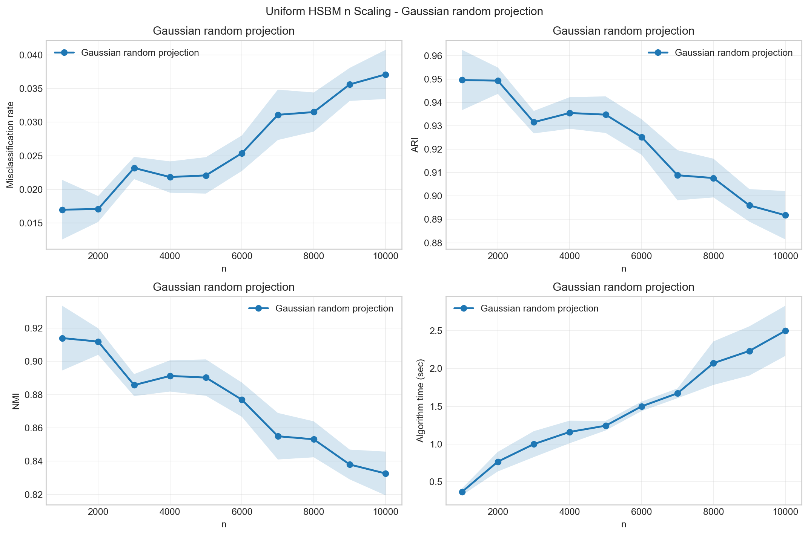
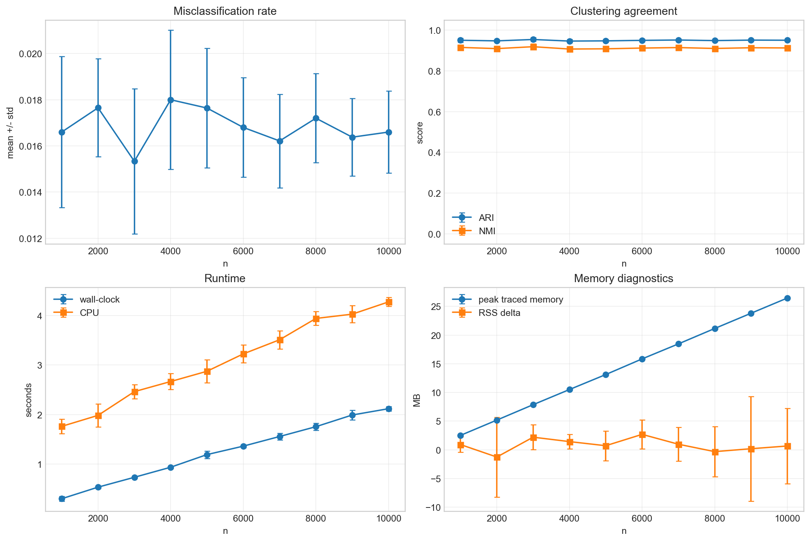
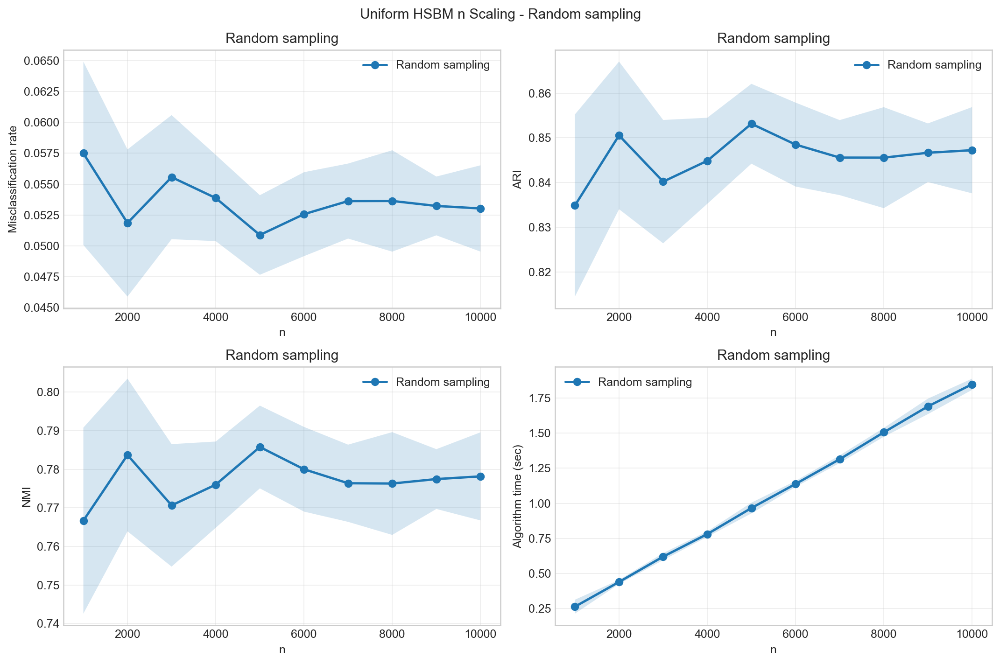
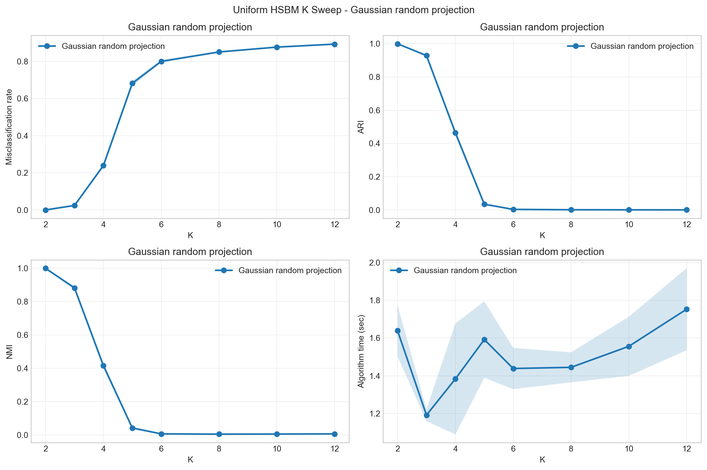
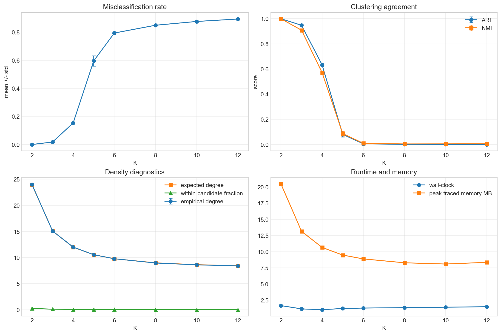
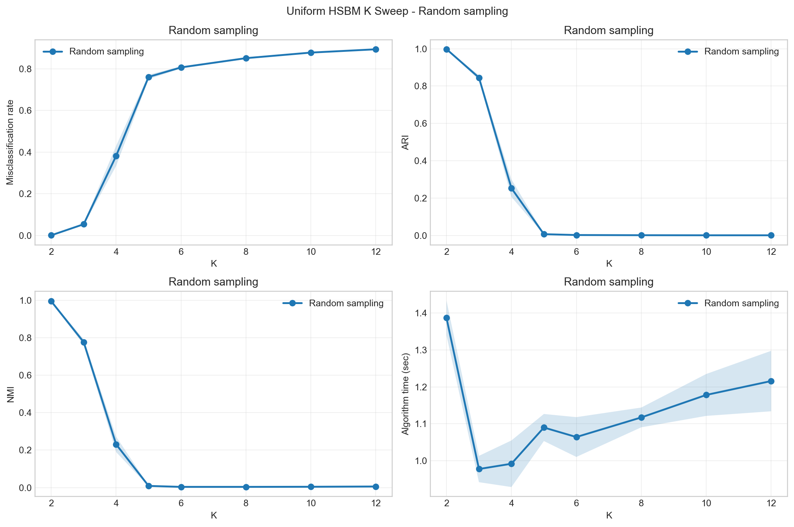
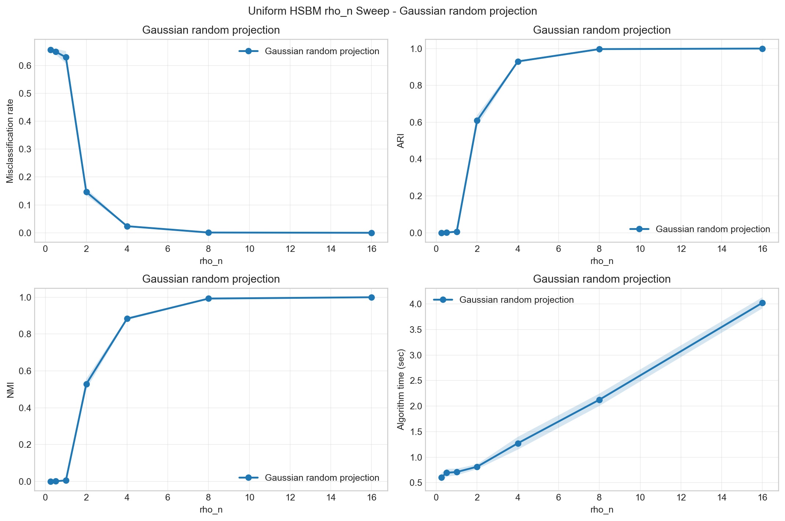
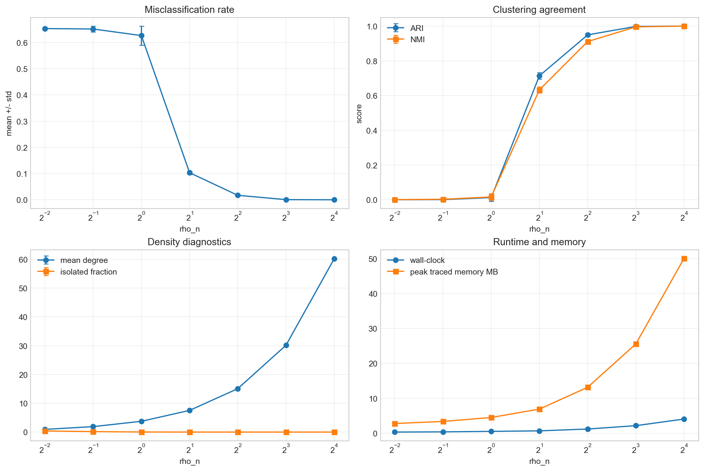
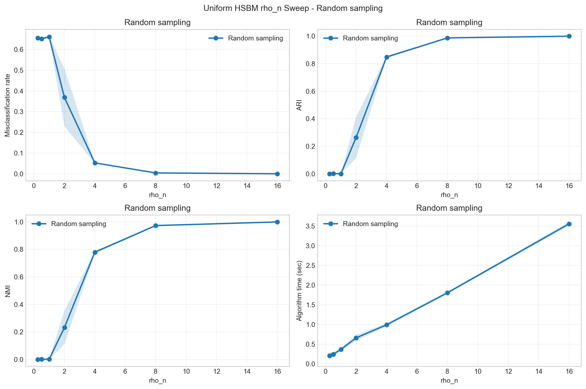

# 균일 HSBM 실험 결과보고서

이 보고서는 `균일 HSBM 실험` 폴더의 비랜덤 spectral clustering, 가우시안 랜덤 프로젝션, 랜덤 샘플링 실험을 한곳에 모아 정리한 것입니다. 모든 실험은 Zhou operator `Theta = I - Delta`에서 spectral embedding을 만든 뒤 k-means를 수행합니다.

## 실험 구성

- `n변화`: `K=3`, `rho_n=4.0`을 고정하고 `n`을 1000부터 10000까지 바꿉니다.
- `K변화`: `n=5000`, `rho_n=4.0`을 고정하고 `K`를 바꿉니다.
- `rho_n변화`: `n=5000`, `K=3`을 고정하고 `rho_n`을 바꿉니다.
- `Non-random`: `Theta`에 대해 `eigsh`로 top-`K` 고유벡터를 직접 계산합니다.
- `Gaussian random projection`: Gaussian test matrix와 power iteration으로 작은 core matrix를 만든 뒤 고유벡터를 lift합니다.
- `Random sampling`: `Theta`의 sparse nonzero entry를 확률 `p=0.7`로 샘플링하고 `1/p`로 rescale한 뒤 `eigsh`를 적용합니다.

## 전체 요약

| sweep | method | 평균_오분류율 | 평균_ARI | 평균_NMI | 평균_주요시간초 | 평균_spectral초 |
| --- | --- | --- | --- | --- | --- | --- |
| K | Gaussian random projection | 0.5459 | 0.3043 | 0.2951 | 1.4995 | 0.7732 |
| K | Non-random | 0.5224 | 0.3336 | 0.3238 | 1.2305 | 0.4673 |
| K | Random sampling | 0.5782 | 0.2634 | 0.2537 | 1.1276 | 0.4166 |
| n | Gaussian random projection | 0.0262 | 0.9230 | 0.8749 | 1.4508 | 0.4731 |
| n | Non-random | 0.0168 | 0.9501 | 0.9125 | 1.1132 | 0.0876 |
| n | Random sampling | 0.0536 | 0.8457 | 0.7771 | 1.0567 | 0.1044 |
| rho_n | Gaussian random projection | 0.3008 | 0.5061 | 0.4876 | 1.4626 | 0.4523 |
| rho_n | Non-random | 0.2933 | 0.5251 | 0.5085 | 1.1770 | 0.1392 |
| rho_n | Random sampling | 0.3419 | 0.4432 | 0.4272 | 1.1220 | 0.1246 |

## n 변화 실험

| n | 방법 | 오분류율 | ARI | NMI | 주요시간초 | spectral초 | 하이퍼엣지수 | 평균degree |
| --- | --- | --- | --- | --- | --- | --- | --- | --- |
| 1000.0 | Gaussian random projection | 0.0170 | 0.9496 | 0.9140 | 0.3672 | 0.1805 | 5012.9 | 15.0387 |
| 1000.0 | Non-random | 0.0166 | 0.9507 | 0.9156 | 0.2725 | 0.0590 | 5028.5 | 15.0855 |
| 1000.0 | Random sampling | 0.0575 | 0.8349 | 0.7667 | 0.2627 | 0.0655 | 5012.9 | 15.0387 |
| 2000.0 | Gaussian random projection | 0.0171 | 0.9493 | 0.9119 | 0.7677 | 0.4024 | 10065.6 | 15.0984 |
| 2000.0 | Non-random | 0.0176 | 0.9477 | 0.9097 | 0.4807 | 0.0611 | 10066.8 | 15.1002 |
| 2000.0 | Random sampling | 0.0518 | 0.8506 | 0.7837 | 0.4389 | 0.0715 | 10065.6 | 15.0984 |
| 3000.0 | Gaussian random projection | 0.0232 | 0.9316 | 0.8857 | 0.9992 | 0.4462 | 15109.4 | 15.1094 |
| 3000.0 | Non-random | 0.0153 | 0.9545 | 0.9191 | 0.6609 | 0.0783 | 15157.7 | 15.1577 |
| 3000.0 | Random sampling | 0.0556 | 0.8402 | 0.7706 | 0.6197 | 0.0941 | 15109.4 | 15.1094 |
| 4000.0 | Gaussian random projection | 0.0219 | 0.9355 | 0.8912 | 1.1607 | 0.4212 | 20159.4 | 15.1196 |
| 4000.0 | Non-random | 0.0180 | 0.9467 | 0.9076 | 0.8381 | 0.0787 | 20148.1 | 15.1111 |
| 4000.0 | Random sampling | 0.0539 | 0.8449 | 0.7760 | 0.7805 | 0.0985 | 20159.4 | 15.1196 |
| 5000.0 | Gaussian random projection | 0.0221 | 0.9348 | 0.8902 | 1.2429 | 0.3752 | 25181.6 | 15.1090 |
| 5000.0 | Non-random | 0.0176 | 0.9478 | 0.9088 | 1.0543 | 0.0930 | 25090.1 | 15.0541 |
| 5000.0 | Random sampling | 0.0509 | 0.8532 | 0.7858 | 0.9663 | 0.1040 | 25181.6 | 15.1090 |
| 6000.0 | Gaussian random projection | 0.0254 | 0.9253 | 0.8769 | 1.4990 | 0.4427 | 30186.8 | 15.0934 |
| 6000.0 | Non-random | 0.0168 | 0.9502 | 0.9124 | 1.2168 | 0.1019 | 30254.5 | 15.1273 |
| 6000.0 | Random sampling | 0.0526 | 0.8485 | 0.7800 | 1.1379 | 0.1076 | 30186.8 | 15.0934 |
| 7000.0 | Gaussian random projection | 0.0311 | 0.9089 | 0.8550 | 1.6714 | 0.4703 | 35245.9 | 15.1054 |
| 7000.0 | Non-random | 0.0162 | 0.9519 | 0.9148 | 1.3906 | 0.0948 | 35202.6 | 15.0868 |
| 7000.0 | Random sampling | 0.0536 | 0.8456 | 0.7764 | 1.3144 | 0.1181 | 35245.9 | 15.1054 |
| 8000.0 | Gaussian random projection | 0.0315 | 0.9077 | 0.8531 | 2.0701 | 0.6413 | 40249.8 | 15.0937 |
| 8000.0 | Non-random | 0.0172 | 0.9491 | 0.9104 | 1.5621 | 0.1016 | 40285.8 | 15.1072 |
| 8000.0 | Random sampling | 0.0536 | 0.8456 | 0.7763 | 1.5062 | 0.1226 | 40249.8 | 15.0937 |
| 9000.0 | Gaussian random projection | 0.0356 | 0.8960 | 0.8380 | 2.2320 | 0.6295 | 45343.4 | 15.1145 |
| 9000.0 | Non-random | 0.0164 | 0.9515 | 0.9140 | 1.7697 | 0.1030 | 45309.1 | 15.1030 |
| 9000.0 | Random sampling | 0.0532 | 0.8467 | 0.7775 | 1.6911 | 0.1269 | 45343.4 | 15.1145 |
| 10000.0 | Gaussian random projection | 0.0371 | 0.8918 | 0.8326 | 2.4977 | 0.7213 | 50329.3 | 15.0988 |
| 10000.0 | Non-random | 0.0166 | 0.9508 | 0.9130 | 1.8869 | 0.1047 | 50327.4 | 15.0982 |
| 10000.0 | Random sampling | 0.0530 | 0.8472 | 0.7782 | 1.8489 | 0.1355 | 50329.3 | 15.0988 |

### 그림

## K 변화 실험

| K | 방법 | 오분류율 | ARI | NMI | 주요시간초 | spectral초 | 하이퍼엣지수 | 평균degree |
| --- | --- | --- | --- | --- | --- | --- | --- | --- |
| 2.0000 | Gaussian random projection | 0.0000 | 0.9998 | 0.9995 | 1.6384 | 0.3306 | 39967.1 | 23.9803 |
| 2.0000 | Non-random | 0.0001 | 0.9998 | 0.9992 | 1.4823 | 0.0706 | 39999.8 | 23.9999 |
| 2.0000 | Random sampling | 0.0005 | 0.9981 | 0.9944 | 1.3865 | 0.0838 | 39967.1 | 23.9803 |
| 3.0000 | Gaussian random projection | 0.0241 | 0.9289 | 0.8819 | 1.1913 | 0.3317 | 25078.4 | 15.0470 |
| 3.0000 | Non-random | 0.0177 | 0.9475 | 0.9086 | 1.0347 | 0.0912 | 25125.7 | 15.0754 |
| 3.0000 | Random sampling | 0.0536 | 0.8456 | 0.7764 | 0.9775 | 0.1110 | 25078.4 | 15.0470 |
| 4.0000 | Gaussian random projection | 0.2391 | 0.4643 | 0.4157 | 1.3832 | 0.6461 | 20063.4 | 12.0380 |
| 4.0000 | Non-random | 0.1533 | 0.6331 | 0.5706 | 0.9224 | 0.1518 | 20014.5 | 12.0087 |
| 4.0000 | Random sampling | 0.3818 | 0.2531 | 0.2308 | 0.9918 | 0.2942 | 20063.4 | 12.0380 |
| 5.0000 | Gaussian random projection | 0.6821 | 0.0347 | 0.0414 | 1.5919 | 0.9307 | 17566.3 | 10.5398 |
| 5.0000 | Non-random | 0.5955 | 0.0802 | 0.0868 | 1.1437 | 0.4799 | 17569.4 | 10.5416 |
| 5.0000 | Random sampling | 0.7608 | 0.0064 | 0.0091 | 1.0899 | 0.4616 | 17566.3 | 10.5398 |
| 6.0000 | Gaussian random projection | 0.8004 | 0.0035 | 0.0063 | 1.4383 | 0.8311 | 16276.3 | 9.7658 |
| 6.0000 | Non-random | 0.7937 | 0.0060 | 0.0098 | 1.2124 | 0.5871 | 16296.2 | 9.7777 |
| 6.0000 | Random sampling | 0.8065 | 0.0019 | 0.0040 | 1.0641 | 0.4807 | 16276.3 | 9.7658 |
| 8.0000 | Gaussian random projection | 0.8510 | 0.0013 | 0.0045 | 1.4445 | 0.8862 | 14983.1 | 8.9899 |
| 8.0000 | Non-random | 0.8491 | 0.0013 | 0.0045 | 1.2792 | 0.6923 | 14935.0 | 8.9610 |
| 8.0000 | Random sampling | 0.8509 | 0.0009 | 0.0040 | 1.1172 | 0.5663 | 14983.1 | 8.9899 |
| 10.0000 | Gaussian random projection | 0.8771 | 0.0008 | 0.0052 | 1.5559 | 1.0117 | 14361.5 | 8.6169 |
| 10.0000 | Non-random | 0.8761 | 0.0008 | 0.0051 | 1.3528 | 0.8004 | 14343.5 | 8.6061 |
| 10.0000 | Random sampling | 0.8777 | 0.0005 | 0.0046 | 1.1780 | 0.6497 | 14361.5 | 8.6169 |
| 12.0000 | Gaussian random projection | 0.8932 | 0.0006 | 0.0062 | 1.7529 | 1.2173 | 14093.9 | 8.4563 |
| 12.0000 | Non-random | 0.8934 | 0.0005 | 0.0060 | 1.4168 | 0.8651 | 14012.2 | 8.4073 |
| 12.0000 | Random sampling | 0.8935 | 0.0005 | 0.0060 | 1.2156 | 0.6859 | 14093.9 | 8.4563 |

### 그림

## rho_n 변화 실험

| rho_n | 방법 | 오분류율 | ARI | NMI | 주요시간초 | spectral초 | 하이퍼엣지수 | 평균degree |
| --- | --- | --- | --- | --- | --- | --- | --- | --- |
| 0.2500 | Gaussian random projection | 0.6560 | 0.0002 | 0.0006 | 0.6031 | 0.5423 | 1563.5 | 0.9381 |
| 0.2500 | Non-random | 0.6534 | 0.0005 | 0.0010 | 0.2736 | 0.1939 | 1561.3 | 0.9368 |
| 0.2500 | Random sampling | 0.6551 | 0.0003 | 0.0007 | 0.2086 | 0.1302 | 1563.5 | 0.9381 |
| 0.5000 | Gaussian random projection | 0.6491 | 0.0010 | 0.0013 | 0.6937 | 0.5666 | 3145.0 | 1.8870 |
| 0.5000 | Non-random | 0.6518 | 0.0010 | 0.0030 | 0.3257 | 0.1960 | 3145.4 | 1.8872 |
| 0.5000 | Random sampling | 0.6520 | 0.0009 | 0.0018 | 0.2474 | 0.1063 | 3145.0 | 1.8870 |
| 1.0000 | Gaussian random projection | 0.6293 | 0.0059 | 0.0058 | 0.7085 | 0.4768 | 6268.2 | 3.7609 |
| 1.0000 | Non-random | 0.6267 | 0.0129 | 0.0162 | 0.4565 | 0.2355 | 6242.8 | 3.7457 |
| 1.0000 | Random sampling | 0.6607 | 0.0001 | 0.0022 | 0.3705 | 0.1347 | 6268.2 | 3.7609 |
| 2.0000 | Gaussian random projection | 0.1466 | 0.6087 | 0.5292 | 0.8116 | 0.3680 | 12621.1 | 7.5727 |
| 2.0000 | Non-random | 0.1034 | 0.7139 | 0.6329 | 0.5806 | 0.1155 | 12549.8 | 7.5299 |
| 2.0000 | Random sampling | 0.3686 | 0.2645 | 0.2326 | 0.6639 | 0.2150 | 12621.1 | 7.5727 |
| 4.0000 | Gaussian random projection | 0.0237 | 0.9301 | 0.8836 | 1.2722 | 0.3782 | 25165.7 | 15.0994 |
| 4.0000 | Non-random | 0.0171 | 0.9494 | 0.9110 | 1.0525 | 0.0821 | 25141.5 | 15.0849 |
| 4.0000 | Random sampling | 0.0525 | 0.8486 | 0.7801 | 0.9942 | 0.1123 | 25165.7 | 15.0994 |
| 8.0000 | Gaussian random projection | 0.0010 | 0.9971 | 0.9929 | 2.1247 | 0.3746 | 50272.0 | 30.1632 |
| 8.0000 | Non-random | 0.0006 | 0.9982 | 0.9956 | 1.8991 | 0.0799 | 50289.2 | 30.1735 |
| 8.0000 | Random sampling | 0.0041 | 0.9877 | 0.9735 | 1.8083 | 0.0858 | 50272.0 | 30.1632 |
| 16.0000 | Gaussian random projection | 0.0000 | 1.0000 | 1.0000 | 4.0245 | 0.4595 | 100616.5 | 60.3699 |
| 16.0000 | Non-random | 0.0000 | 1.0000 | 1.0000 | 3.6508 | 0.0716 | 100384.8 | 60.2309 |
| 16.0000 | Random sampling | 0.0000 | 0.9999 | 0.9998 | 3.5611 | 0.0882 | 100616.5 | 60.3699 |

### 그림

## 가우시안 랜덤 프로젝션 오분류율 해석

초기 설정인 `rp_oversampling=10`, `rp_power_iter=2`에서는 가우시안 랜덤 프로젝션의 오분류율이 높았습니다. 원인은 HSBM 생성 모델 자체가 아니라, 해당 설정이 `Theta`의 top-`K` 고유공간을 충분히 잘 근사하지 못한 데 있었습니다. 진단용으로 `n=5000`, `K=3`, `rho_n=4.0`인 같은 인스턴스에서 비교했을 때, non-random `eigsh`의 top eigenvalues는 대략 `[1.0, 0.699, 0.698]`였지만 초기 RP 설정은 작은 core matrix에서 세 번째 고유값을 약 `0.54~0.56` 수준으로 낮게 잡았습니다. 이 상태에서는 non-random eigenspace와의 principal angle도 크게 남아 row-normalization과 k-means 이후 community 방향이 섞였습니다.

그래서 가우시안 랜덤 프로젝션 실험은 `rp_oversampling=160`, `rp_power_iter=4`로 올려 다시 실행했습니다. 그 결과 `n` 변화 실험의 평균 오분류율은 크게 개선되어 non-random 결과에 가까워졌습니다. `rho_n` 변화 실험에서도 `rho_n >= 4`인 충분히 조밀한 구간에서는 거의 non-random에 가까운 결과가 나왔습니다. 다만 `rho_n <= 1`처럼 그래프가 매우 희소한 구간은 non-random도 성능이 낮기 때문에 RP만으로 해결되는 문제가 아니며, `K` 변화 실험의 큰 `K` 구간도 within-community 후보 비율과 평균 degree가 함께 낮아져 세 방법 모두 어려운 구간입니다.

정리하면, 가우시안 랜덤 프로젝션은 `r`과 `q`를 충분히 키우면 정확도는 회복됩니다. 하지만 그만큼 `Theta @ Y`, QR, core matrix 구성 비용이 증가하므로 현재 재실행 결과에서는 정확도 개선의 대가로 runtime이 늘어난 상태입니다.

## 해석 메모

- 오분류율은 Hungarian matching으로 예측 label을 true label에 맞춘 뒤 계산했습니다.
- ARI와 NMI는 label permutation에 불변이므로 원 label을 그대로 사용했습니다.
- 랜덤화 방법은 반복마다 같은 HSBM 생성 규칙을 사용하지만, spectral 단계에서 추가 난수를 사용합니다.
- `algorithm_sec`는 생성, Zhou operator 구성, spectral embedding, row normalization, k-means 주요 단계의 합입니다.
- 큰 `n`에서는 하이퍼그래프 생성 시간이 전체 시간을 지배할 수 있으므로, spectral 단계 시간도 함께 보시는 것이 좋습니다.
