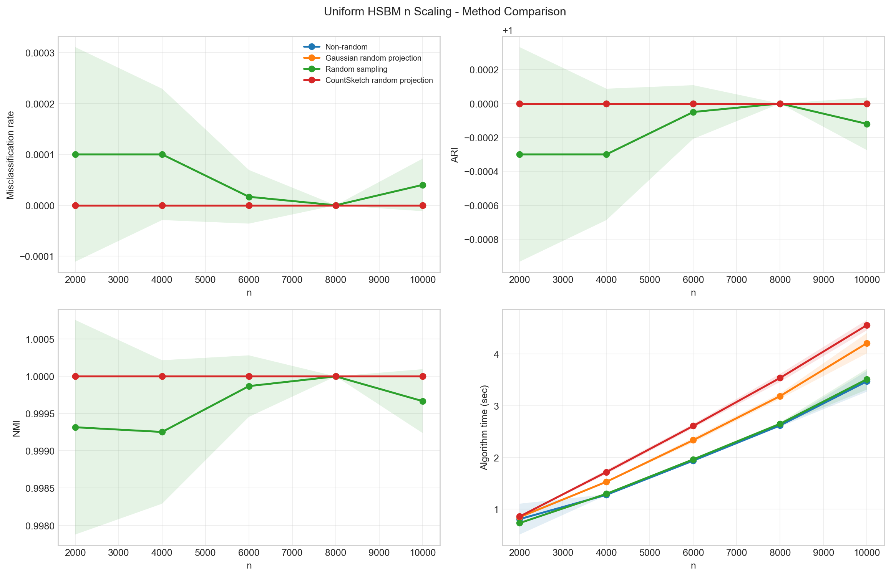
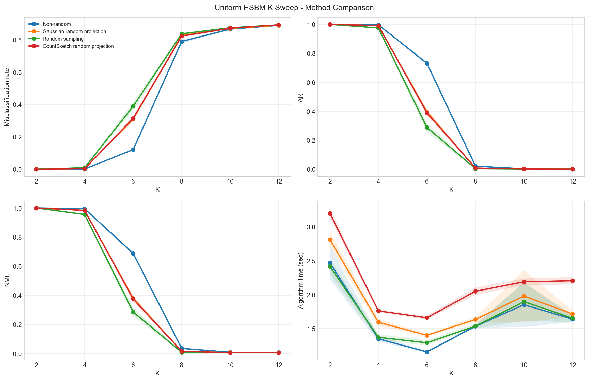
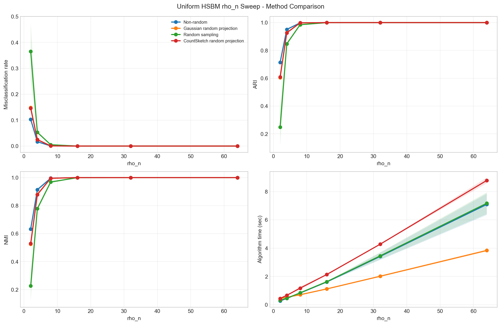

# 균일 HSBM 실험 결과보고서

이 보고서는 같은 로컬 실행 환경에서 `Non-random`, `Gaussian random projection`, `Random sampling`, `CountSketch random projection`을 모두 다시 실행해 비교한 결과입니다. 각 `(sweep 값, 반복 번호)`마다 하나의 균일 HSBM 인스턴스를 생성하고 네 방법을 같은 `Theta = I - Delta`에 적용했습니다.

## 실험 구성

- `n변화`: `K=3`, `rho_n=16.0`을 고정하고 `n`을 `{2000, 4000, 6000, 8000, 10000}`으로 바꿉니다.
- `K변화`: `n=5000`, `rho_n=16.0`을 고정하고 `K`를 `{2, 4, 6, 8, 10, 12}`로 바꿉니다.
- `rho_n변화`: `n=5000`, `K=3`을 고정하고 `rho_n`을 `{2, 4, 8, 16, 32, 64}`로 바꿉니다.
- 모든 method의 eigensolver 단계는 공정한 비교를 위해 `scipy.sparse.linalg.eigsh`로 통일했습니다.
- Gaussian RP와 CountSketch RP는 모두 `ell = K + 160`, power iteration `q=4`를 사용했습니다.
- Random sampling은 기존과 같이 `Theta`의 sparse nonzero entry를 확률 `p=0.7`로 샘플링하고 `1/p`로 rescale한 뒤 `eigsh`를 적용했습니다.
- Laplacian sparsity는 모든 sweep 값마다 `L.nnz`와 `L.nnz / n^2`를 따로 표로 기록했습니다.
- 볼드 처리된 행은 같은 `x` 값 안에서 평균 오분류율이 가장 낮은 방법입니다.

## 전체 요약

| sweep | method | 평균_오분류율 | 평균_ARI | 평균_NMI | 평균_주요시간초 | 평균_spectral초 |
| --- | --- | --- | --- | --- | --- | --- |
| **K** | **Non-random** | **0.4446** | **0.4590** | **0.4559** | **1.6677** | **0.3848** |
| K | Gaussian random projection | 0.4835 | 0.3995 | 0.3988 | 1.8571 | 0.5743 |
| K | Random sampling | 0.5005 | 0.3782 | 0.3773 | 1.6951 | 0.4122 |
| K | CountSketch random projection | 0.4845 | 0.3973 | 0.3968 | 1.8374 | 0.5546 |
| **n** | **Non-random** | **0.0000** | **1.0000** | **1.0000** | **2.0233** | **0.0887** |
| **n** | **Gaussian random projection** | **0.0000** | **1.0000** | **1.0000** | **2.4214** | **0.4868** |
| n | Random sampling | 0.0001 | 0.9998 | 0.9996 | 2.0312 | 0.0966 |
| **n** | **CountSketch random projection** | **0.0000** | **1.0000** | **1.0000** | **2.3799** | **0.4453** |
| **rho_n** | **Non-random** | **0.0201** | **0.9439** | **0.9237** | **2.2780** | **0.0660** |
| rho_n | Gaussian random projection | 0.0290 | 0.9216 | 0.9000 | 2.6649 | 0.4530 |
| rho_n | Random sampling | 0.0707 | 0.8468 | 0.8288 | 2.3139 | 0.1019 |
| rho_n | CountSketch random projection | 0.0286 | 0.9225 | 0.9010 | 2.6267 | 0.4147 |

## n 변화 실험

### n = 2000.0

| 방법 | 오분류율 | ARI | NMI | 주요시간초 | spectral초 | 하이퍼엣지수 | 평균degree |
| --- | --- | --- | --- | --- | --- | --- | --- |
| **Non-random** | **0.0000** | **1.0000** | **1.0000** | **0.8081** | **0.1820** | **40249.4** | **60.3741** |
| **Gaussian random projection** | **0.0000** | **1.0000** | **1.0000** | **0.8457** | **0.2196** | **40249.4** | **60.3741** |
| Random sampling | 0.0001 | 0.9997 | 0.9993 | 0.7320 | 0.1059 | 40249.4 | 60.3741 |
| **CountSketch random projection** | **0.0000** | **1.0000** | **1.0000** | **0.8372** | **0.2111** | **40249.4** | **60.3741** |

### n = 4000.0

| 방법 | 오분류율 | ARI | NMI | 주요시간초 | spectral초 | 하이퍼엣지수 | 평균degree |
| --- | --- | --- | --- | --- | --- | --- | --- |
| **Non-random** | **0.0000** | **1.0000** | **1.0000** | **1.2777** | **0.0513** | **80550.4** | **60.4128** |
| **Gaussian random projection** | **0.0000** | **1.0000** | **1.0000** | **1.5299** | **0.3035** | **80550.4** | **60.4128** |
| Random sampling | 0.0001 | 0.9997 | 0.9993 | 1.2974 | 0.0710 | 80550.4 | 60.4128 |
| **CountSketch random projection** | **0.0000** | **1.0000** | **1.0000** | **1.5147** | **0.2882** | **80550.4** | **60.4128** |

### n = 6000.0

| 방법 | 오분류율 | ARI | NMI | 주요시간초 | spectral초 | 하이퍼엣지수 | 평균degree |
| --- | --- | --- | --- | --- | --- | --- | --- |
| **Non-random** | **0.0000** | **1.0000** | **1.0000** | **1.9388** | **0.0598** | **120756.4** | **60.3782** |
| **Gaussian random projection** | **0.0000** | **1.0000** | **1.0000** | **2.3352** | **0.4561** | **120756.4** | **60.3782** |
| Random sampling | 0.0000 | 0.9999 | 0.9999 | 1.9627 | 0.0837 | 120756.4 | 60.3782 |
| **CountSketch random projection** | **0.0000** | **1.0000** | **1.0000** | **2.2944** | **0.4154** | **120756.4** | **60.3782** |

### n = 8000.0

| 방법 | 오분류율 | ARI | NMI | 주요시간초 | spectral초 | 하이퍼엣지수 | 평균degree |
| --- | --- | --- | --- | --- | --- | --- | --- |
| **Non-random** | **0.0000** | **1.0000** | **1.0000** | **2.6193** | **0.0710** | **160962.6** | **60.3610** |
| **Gaussian random projection** | **0.0000** | **1.0000** | **1.0000** | **3.1862** | **0.6379** | **160962.6** | **60.3610** |
| **Random sampling** | **0.0000** | **1.0000** | **1.0000** | **2.6508** | **0.1025** | **160962.6** | **60.3610** |
| **CountSketch random projection** | **0.0000** | **1.0000** | **1.0000** | **3.1387** | **0.5904** | **160962.6** | **60.3610** |

### n = 10000.0

| 방법 | 오분류율 | ARI | NMI | 주요시간초 | spectral초 | 하이퍼엣지수 | 평균degree |
| --- | --- | --- | --- | --- | --- | --- | --- |
| **Non-random** | **0.0000** | **1.0000** | **1.0000** | **3.4723** | **0.0794** | **201358.1** | **60.4074** |
| **Gaussian random projection** | **0.0000** | **1.0000** | **1.0000** | **4.2100** | **0.8171** | **201358.1** | **60.4074** |
| Random sampling | 0.0000 | 0.9999 | 0.9997 | 3.5130 | 0.1201 | 201358.1 | 60.4074 |
| **CountSketch random projection** | **0.0000** | **1.0000** | **1.0000** | **4.1145** | **0.7216** | **201358.1** | **60.4074** |

### 그림

## K 변화 실험

### K = 2.0000

| 방법 | 오분류율 | ARI | NMI | 주요시간초 | spectral초 | 하이퍼엣지수 | 평균degree |
| --- | --- | --- | --- | --- | --- | --- | --- |
| **Non-random** | **0.0000** | **1.0000** | **1.0000** | **2.4704** | **0.1289** | **159726.9** | **95.8361** |
| **Gaussian random projection** | **0.0000** | **1.0000** | **1.0000** | **2.8146** | **0.4730** | **159726.9** | **95.8361** |
| **Random sampling** | **0.0000** | **1.0000** | **1.0000** | **2.4170** | **0.0754** | **159726.9** | **95.8361** |
| **CountSketch random projection** | **0.0000** | **1.0000** | **1.0000** | **2.7901** | **0.4486** | **159726.9** | **95.8361** |

### K = 4.0000

| 방법 | 오분류율 | ARI | NMI | 주요시간초 | spectral초 | 하이퍼엣지수 | 평균degree |
| --- | --- | --- | --- | --- | --- | --- | --- |
| **Non-random** | **0.0010** | **0.9973** | **0.9942** | **1.3504** | **0.0703** | **79758.7** | **47.8552** |
| Gaussian random projection | 0.0032 | 0.9915 | 0.9831 | 1.5940 | 0.3140 | 79758.7 | 47.8552 |
| Random sampling | 0.0093 | 0.9755 | 0.9556 | 1.3720 | 0.0919 | 79758.7 | 47.8552 |
| CountSketch random projection | 0.0032 | 0.9915 | 0.9830 | 1.5702 | 0.2901 | 79758.7 | 47.8552 |

### K = 6.0000

| 방법 | 오분류율 | ARI | NMI | 주요시간초 | spectral초 | 하이퍼엣지수 | 평균degree |
| --- | --- | --- | --- | --- | --- | --- | --- |
| **Non-random** | **0.1207** | **0.7312** | **0.6882** | **1.1570** | **0.1197** | **65140.3** | **39.0842** |
| Gaussian random projection | 0.3104 | 0.3945 | 0.3791 | 1.4016 | 0.3643 | 65140.3 | 39.0842 |
| Random sampling | 0.3893 | 0.2883 | 0.2856 | 1.2919 | 0.2547 | 65140.3 | 39.0842 |
| CountSketch random projection | 0.3201 | 0.3806 | 0.3665 | 1.3857 | 0.3485 | 65140.3 | 39.0842 |

### K = 8.0000

| 방법 | 오분류율 | ARI | NMI | 주요시간초 | spectral초 | 하이퍼엣지수 | 평균degree |
| --- | --- | --- | --- | --- | --- | --- | --- |
| **Non-random** | **0.7897** | **0.0212** | **0.0357** | **1.5350** | **0.5589** | **59917.0** | **35.9502** |
| Gaussian random projection | 0.8269 | 0.0078 | 0.0153 | 1.6357 | 0.6596 | 59917.0 | 35.9502 |
| Random sampling | 0.8374 | 0.0037 | 0.0093 | 1.5371 | 0.5611 | 59917.0 | 35.9502 |
| CountSketch random projection | 0.8217 | 0.0089 | 0.0169 | 1.6286 | 0.6525 | 59917.0 | 35.9502 |

### K = 10.0000

| 방법 | 오분류율 | ARI | NMI | 주요시간초 | spectral초 | 하이퍼엣지수 | 평균degree |
| --- | --- | --- | --- | --- | --- | --- | --- |
| **Non-random** | **0.8665** | **0.0030** | **0.0094** | **1.8532** | **0.7367** | **57509.4** | **34.5056** |
| Gaussian random projection | 0.8710 | 0.0021 | 0.0077 | 1.9799 | 0.8634 | 57509.4 | 34.5056 |
| Random sampling | 0.8747 | 0.0013 | 0.0066 | 1.8978 | 0.7814 | 57509.4 | 34.5056 |
| CountSketch random projection | 0.8706 | 0.0019 | 0.0072 | 1.9337 | 0.8173 | 57509.4 | 34.5056 |

### K = 12.0000

| 방법 | 오분류율 | ARI | NMI | 주요시간초 | spectral초 | 하이퍼엣지수 | 평균degree |
| --- | --- | --- | --- | --- | --- | --- | --- |
| **Non-random** | **0.8895** | **0.0015** | **0.0081** | **1.6400** | **0.6945** | **56276.9** | **33.7661** |
| Gaussian random projection | 0.8896 | 0.0012 | 0.0076 | 1.7169 | 0.7713 | 56276.9 | 33.7661 |
| Random sampling | 0.8925 | 0.0007 | 0.0067 | 1.6544 | 0.7089 | 56276.9 | 33.7661 |
| CountSketch random projection | 0.8915 | 0.0011 | 0.0073 | 1.7161 | 0.7706 | 56276.9 | 33.7661 |

### 그림

## rho_n 변화 실험

### rho_n = 2.0000

| 방법 | 오분류율 | ARI | NMI | 주요시간초 | spectral초 | 하이퍼엣지수 | 평균degree |
| --- | --- | --- | --- | --- | --- | --- | --- |
| **Non-random** | **0.1033** | **0.7141** | **0.6331** | **0.2706** | **0.0721** | **12618.6** | **7.5712** |
| Gaussian random projection | 0.1485 | 0.6045 | 0.5252 | 0.3602 | 0.1618 | 12618.6 | 7.5712 |
| Random sampling | 0.3657 | 0.2490 | 0.2265 | 0.3190 | 0.1206 | 12618.6 | 7.5712 |
| CountSketch random projection | 0.1475 | 0.6068 | 0.5276 | 0.3560 | 0.1576 | 12618.6 | 7.5712 |

### rho_n = 4.0000

| 방법 | 오분류율 | ARI | NMI | 주요시간초 | spectral초 | 하이퍼엣지수 | 평균degree |
| --- | --- | --- | --- | --- | --- | --- | --- |
| **Non-random** | **0.0166** | **0.9508** | **0.9133** | **0.4475** | **0.0612** | **25177.2** | **15.1063** |
| Gaussian random projection | 0.0247 | 0.9274 | 0.8801 | 0.5674 | 0.1811 | 25177.2 | 15.1063 |
| Random sampling | 0.0531 | 0.8471 | 0.7783 | 0.4615 | 0.0751 | 25177.2 | 15.1063 |
| CountSketch random projection | 0.0235 | 0.9308 | 0.8845 | 0.5563 | 0.1700 | 25177.2 | 15.1063 |

### rho_n = 8.0000

| 방법 | 오분류율 | ARI | NMI | 주요시간초 | spectral초 | 하이퍼엣지수 | 평균degree |
| --- | --- | --- | --- | --- | --- | --- | --- |
| **Non-random** | **0.0006** | **0.9983** | **0.9958** | **0.8288** | **0.0577** | **50327.7** | **30.1966** |
| Gaussian random projection | 0.0008 | 0.9977 | 0.9944 | 1.0133 | 0.2422 | 50327.7 | 30.1966 |
| Random sampling | 0.0051 | 0.9848 | 0.9683 | 0.8421 | 0.0710 | 50327.7 | 30.1966 |
| CountSketch random projection | 0.0008 | 0.9975 | 0.9938 | 0.9943 | 0.2232 | 50327.7 | 30.1966 |

### rho_n = 16.0000

| 방법 | 오분류율 | ARI | NMI | 주요시간초 | spectral초 | 하이퍼엣지수 | 평균degree |
| --- | --- | --- | --- | --- | --- | --- | --- |
| **Non-random** | **0.0000** | **1.0000** | **1.0000** | **1.6114** | **0.0557** | **100519.7** | **60.3118** |
| **Gaussian random projection** | **0.0000** | **1.0000** | **1.0000** | **1.9149** | **0.3593** | **100519.7** | **60.3118** |
| Random sampling | 0.0001 | 0.9998 | 0.9995 | 1.6314 | 0.0757 | 100519.7 | 60.3118 |
| **CountSketch random projection** | **0.0000** | **1.0000** | **1.0000** | **1.8889** | **0.3332** | **100519.7** | **60.3118** |

### rho_n = 32.0000

| 방법 | 오분류율 | ARI | NMI | 주요시간초 | spectral초 | 하이퍼엣지수 | 평균degree |
| --- | --- | --- | --- | --- | --- | --- | --- |
| **Non-random** | **0.0000** | **1.0000** | **1.0000** | **3.4157** | **0.0661** | **201319.1** | **120.7915** |
| **Gaussian random projection** | **0.0000** | **1.0000** | **1.0000** | **4.0386** | **0.6890** | **201319.1** | **120.7915** |
| **Random sampling** | **0.0000** | **1.0000** | **1.0000** | **3.4541** | **0.1045** | **201319.1** | **120.7915** |
| **CountSketch random projection** | **0.0000** | **1.0000** | **1.0000** | **3.9568** | **0.6072** | **201319.1** | **120.7915** |

### rho_n = 64.0000

| 방법 | 오분류율 | ARI | NMI | 주요시간초 | spectral초 | 하이퍼엣지수 | 평균degree |
| --- | --- | --- | --- | --- | --- | --- | --- |
| **Non-random** | **0.0000** | **1.0000** | **1.0000** | **7.0941** | **0.0835** | **402389.3** | **241.4336** |
| **Gaussian random projection** | **0.0000** | **1.0000** | **1.0000** | **8.0951** | **1.0845** | **402389.3** | **241.4336** |
| **Random sampling** | **0.0000** | **1.0000** | **1.0000** | **7.1752** | **0.1646** | **402389.3** | **241.4336** |
| **CountSketch random projection** | **0.0000** | **1.0000** | **1.0000** | **8.0076** | **0.9970** | **402389.3** | **241.4336** |

### 그림

## Laplacian nnz 비율

`L = I - Theta`로 만든 normalized hypergraph Laplacian의 nonzero 개수와 전체 행렬 원소 대비 비율입니다. 네 method는 같은 생성 인스턴스를 공유하므로 `Non-random` 행의 그래프 통계만 사용했습니다. 고립 노드가 있는 경우 `L.nnz = Theta.nnz + 고립 노드 수`로 계산했습니다.

### n 변화

| n | 행렬 크기 n | Laplacian nnz 평균 | nnz 비율 | nnz 퍼센트 |
| --- | --- | --- | --- | --- |
| 2000 | 2000 | 233304.6 | 0.05832615 | 5.8326% |
| 4000 | 4000 | 476946.4 | 0.02980915 | 2.9809% |
| 6000 | 6000 | 720154.8 | 0.02000430 | 2.0004% |
| 8000 | 8000 | 963494.2 | 0.01505460 | 1.5055% |
| 10000 | 10000 | 1207722.2 | 0.01207722 | 1.2077% |

### K 변화

| K | 행렬 크기 n | Laplacian nnz 평균 | nnz 비율 | nnz 퍼센트 |
| --- | --- | --- | --- | --- |
| 2 | 5000 | 937398.8 | 0.03749595 | 3.7496% |
| 4 | 5000 | 477511.4 | 0.01910046 | 1.9100% |
| 6 | 5000 | 392310.2 | 0.01569241 | 1.5692% |
| 8 | 5000 | 361750.4 | 0.01447002 | 1.4470% |
| 10 | 5000 | 347565.8 | 0.01390263 | 1.3903% |
| 12 | 5000 | 340340.6 | 0.01361362 | 1.3614% |

### rho_n 변화

| rho_n | 행렬 크기 n | Laplacian nnz 평균 | nnz 비율 | nnz 퍼센트 |
| --- | --- | --- | --- | --- |
| 2.0000 | 5000 | 80552.2 | 0.00322209 | 0.3222% |
| 4.0000 | 5000 | 155419.0 | 0.00621676 | 0.6217% |
| 8.0000 | 5000 | 304326.4 | 0.01217306 | 1.2173% |
| 16.0000 | 5000 | 597821.6 | 0.02391286 | 2.3913% |
| 32.0000 | 5000 | 1171971.6 | 0.04687886 | 4.6879% |
| 64.0000 | 5000 | 2260721.4 | 0.09042886 | 9.0429% |

## CountSketch 해석

- Gaussian RP와 직접 비교한 17개 sweep 지점 중 CountSketch의 오분류율이 더 낮은 지점은 4개, 동률은 10개, 더 높은 지점은 3개입니다.
- CountSketch의 spectral 단계 시간은 Gaussian RP 대비 평균 `0.9386`배입니다. CountSketch test matrix는 sparse하지만, 현재 설정에서는 반복적인 `Theta @ Y`와 QR 비용이 여전히 큽니다.
- `rho_n`이 충분히 큰 구간에서는 CountSketch, Gaussian RP, Non-random이 모두 거의 완전 복원에 접근합니다. 이번 sweep에서 가장 희소한 `rho_n=2` 구간은 상대적으로 더 어려운 구간입니다.
- `K` 변화 후반부는 `rho_n`을 고정한 상태에서 `K`가 커지며 effective signal이 약해지는 구간이라, CountSketch를 추가해도 큰 `K`의 난도는 그대로 남습니다.

## 해석 메모

- 오분류율은 Hungarian matching으로 예측 label을 true label에 맞춘 뒤 계산했습니다.
- ARI와 NMI는 label permutation에 불변이므로 원 label을 그대로 사용했습니다.
- `algorithm_sec`는 생성, hypergraph Laplacian/operator 구성, spectral embedding, row normalization, k-means 주요 단계의 합입니다.
- 이번 보고서는 기존 저장 CSV를 섞지 않고 현재 실행 환경에서 새로 계산한 `EXP-20260506-007`부터 `009`까지의 비교 결과만 사용했습니다.
