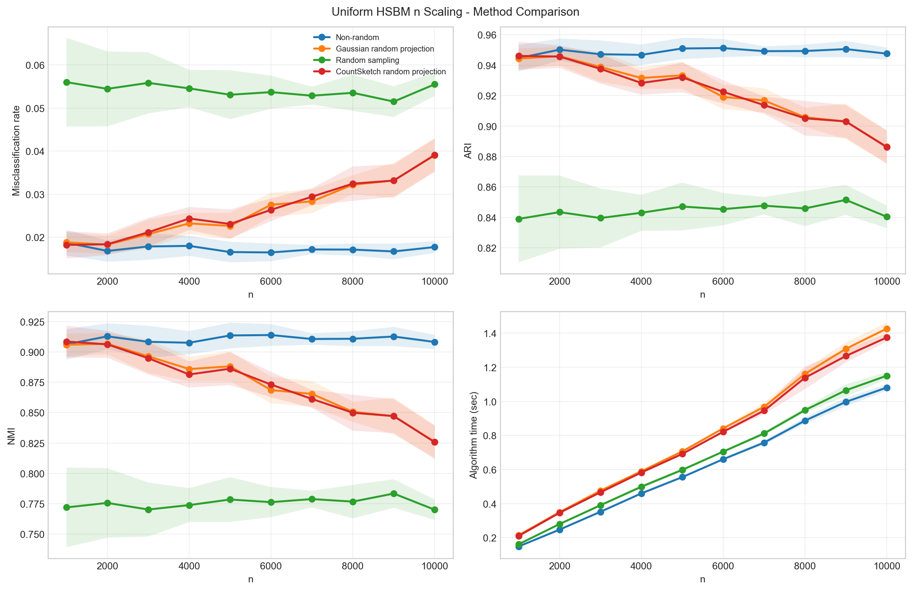
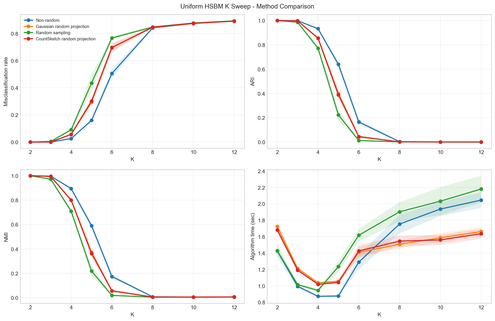
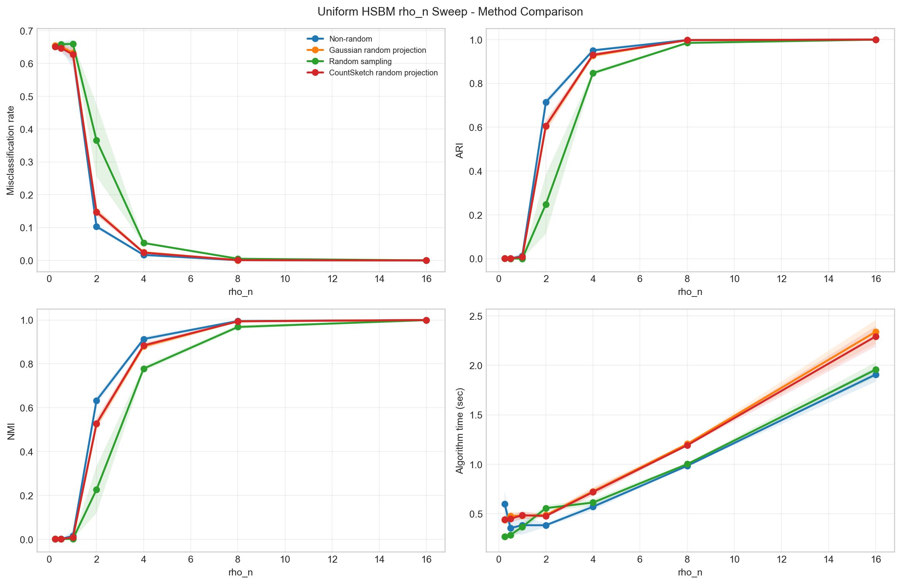

# 균일 HSBM 실험 결과보고서

이 보고서는 같은 로컬 실행 환경에서 `Non-random`, `Gaussian random projection`, `Random sampling`, `CountSketch random projection`을 모두 다시 실행해 비교한 결과입니다. 각 `(sweep 값, 반복 번호)`마다 하나의 균일 HSBM 인스턴스를 생성하고 네 방법을 같은 `Theta = I - Delta`에 적용했습니다.

## 실험 구성

- `n변화`: `K=3`, `rho_n=4.0`을 고정하고 `n`을 1000부터 10000까지 바꿉니다.
- `K변화`: `n=5000`, `rho_n=8.0`을 고정하고 `K`를 바꿉니다.
- `rho_n변화`: `n=5000`, `K=3`을 고정하고 `rho_n`을 `{0.25, 0.5, 1, 2, 4, 8, 16}`으로 바꿉니다.
- Gaussian RP와 CountSketch RP는 모두 `ell = K + 160`, power iteration `q=4`를 사용했습니다.
- Random sampling은 기존과 같이 `Theta`의 sparse nonzero entry를 확률 `p=0.7`로 샘플링하고 `1/p`로 rescale했습니다.
- 볼드 처리된 행은 같은 `x` 값 안에서 평균 오분류율이 가장 낮은 방법입니다.

## 전체 요약

| sweep | method | 평균_오분류율 | 평균_ARI | 평균_NMI | 평균_주요시간초 | 평균_spectral초 |
| --- | --- | --- | --- | --- | --- | --- |
| **K** | **Non-random** | **0.4126** | **0.4677** | **0.4594** | **1.3993** | **0.6673** |
| K | Gaussian random projection | 0.4577 | 0.4127 | 0.4052 | 1.3998 | 0.6678 |
| K | Random sampling | 0.4897 | 0.3748 | 0.3667 | 1.5448 | 0.8128 |
| K | CountSketch random projection | 0.4589 | 0.4112 | 0.4038 | 1.3881 | 0.6560 |
| **n** | **Non-random** | **0.0173** | **0.9488** | **0.9105** | **0.6142** | **0.1285** |
| n | Gaussian random projection | 0.0264 | 0.9225 | 0.8741 | 0.8037 | 0.3180 |
| n | Random sampling | 0.0541 | 0.8443 | 0.7756 | 0.6605 | 0.1748 |
| n | CountSketch random projection | 0.0265 | 0.9220 | 0.8734 | 0.7839 | 0.2982 |
| **rho_n** | **Non-random** | **0.2939** | **0.5253** | **0.5085** | **0.7417** | **0.2351** |
| rho_n | Gaussian random projection | 0.3018 | 0.5052 | 0.4867 | 0.8800 | 0.3734 |
| rho_n | Random sampling | 0.3419 | 0.4402 | 0.4252 | 0.7222 | 0.2156 |
| rho_n | CountSketch random projection | 0.2996 | 0.5064 | 0.4881 | 0.8658 | 0.3592 |

## n 변화 실험

### n = 1000.0

| 방법 | 오분류율 | ARI | NMI | 주요시간초 | spectral초 | 하이퍼엣지수 | 평균degree |
| --- | --- | --- | --- | --- | --- | --- | --- |
| Non-random | 0.0187 | 0.9447 | 0.9062 | 0.1479 | 0.0583 | 4983.5 | 14.9505 |
| Gaussian random projection | 0.0188 | 0.9443 | 0.9059 | 0.2137 | 0.1241 | 4983.5 | 14.9505 |
| Random sampling | 0.0560 | 0.8390 | 0.7720 | 0.1609 | 0.0713 | 4983.5 | 14.9505 |
| **CountSketch random projection** | **0.0182** | **0.9461** | **0.9085** | **0.2097** | **0.1201** | **4983.5** | **14.9505** |

### n = 2000.0

| 방법 | 오분류율 | ARI | NMI | 주요시간초 | spectral초 | 하이퍼엣지수 | 평균degree |
| --- | --- | --- | --- | --- | --- | --- | --- |
| **Non-random** | **0.0168** | **0.9502** | **0.9128** | **0.2468** | **0.0711** | **10066.5** | **15.0998** |
| Gaussian random projection | 0.0182 | 0.9460 | 0.9067 | 0.3493 | 0.1735 | 10066.5 | 15.0998 |
| Random sampling | 0.0544 | 0.8435 | 0.7757 | 0.2795 | 0.1037 | 10066.5 | 15.0998 |
| CountSketch random projection | 0.0183 | 0.9457 | 0.9062 | 0.3456 | 0.1698 | 10066.5 | 15.0998 |

### n = 3000.0

| 방법 | 오분류율 | ARI | NMI | 주요시간초 | spectral초 | 하이퍼엣지수 | 평균degree |
| --- | --- | --- | --- | --- | --- | --- | --- |
| **Non-random** | **0.0178** | **0.9472** | **0.9083** | **0.3516** | **0.0959** | **15010.0** | **15.0100** |
| Gaussian random projection | 0.0207 | 0.9389 | 0.8963 | 0.4753 | 0.2196 | 15010.0 | 15.0100 |
| Random sampling | 0.0558 | 0.8396 | 0.7703 | 0.3898 | 0.1341 | 15010.0 | 15.0100 |
| CountSketch random projection | 0.0211 | 0.9376 | 0.8948 | 0.4659 | 0.2102 | 15010.0 | 15.0100 |

### n = 4000.0

| 방법 | 오분류율 | ARI | NMI | 주요시간초 | spectral초 | 하이퍼엣지수 | 평균degree |
| --- | --- | --- | --- | --- | --- | --- | --- |
| **Non-random** | **0.0180** | **0.9468** | **0.9075** | **0.4595** | **0.1143** | **20151.9** | **15.1139** |
| Gaussian random projection | 0.0232 | 0.9316 | 0.8859 | 0.5893 | 0.2441 | 20151.9 | 15.1139 |
| Random sampling | 0.0546 | 0.8430 | 0.7739 | 0.4986 | 0.1535 | 20151.9 | 15.1139 |
| CountSketch random projection | 0.0243 | 0.9284 | 0.8814 | 0.5820 | 0.2369 | 20151.9 | 15.1139 |

### n = 5000.0

| 방법 | 오분류율 | ARI | NMI | 주요시간초 | spectral초 | 하이퍼엣지수 | 평균degree |
| --- | --- | --- | --- | --- | --- | --- | --- |
| **Non-random** | **0.0165** | **0.9510** | **0.9136** | **0.5549** | **0.1256** | **25129.9** | **15.0779** |
| Gaussian random projection | 0.0226 | 0.9333 | 0.8881 | 0.7057 | 0.2763 | 25129.9 | 15.0779 |
| Random sampling | 0.0531 | 0.8471 | 0.7785 | 0.5975 | 0.1681 | 25129.9 | 15.0779 |
| CountSketch random projection | 0.0231 | 0.9320 | 0.8862 | 0.6911 | 0.2617 | 25129.9 | 15.0779 |

### n = 6000.0

| 방법 | 오분류율 | ARI | NMI | 주요시간초 | spectral초 | 하이퍼엣지수 | 평균degree |
| --- | --- | --- | --- | --- | --- | --- | --- |
| **Non-random** | **0.0164** | **0.9513** | **0.9139** | **0.6599** | **0.1374** | **30270.3** | **15.1351** |
| Gaussian random projection | 0.0275 | 0.9192 | 0.8686 | 0.8408 | 0.3183 | 30270.3 | 15.1351 |
| Random sampling | 0.0537 | 0.8454 | 0.7763 | 0.7046 | 0.1821 | 30270.3 | 15.1351 |
| CountSketch random projection | 0.0263 | 0.9225 | 0.8731 | 0.8211 | 0.2986 | 30270.3 | 15.1351 |

### n = 7000.0

| 방법 | 오분류율 | ARI | NMI | 주요시간초 | spectral초 | 하이퍼엣지수 | 평균degree |
| --- | --- | --- | --- | --- | --- | --- | --- |
| **Non-random** | **0.0171** | **0.9492** | **0.9106** | **0.7575** | **0.1504** | **35239.0** | **15.1024** |
| Gaussian random projection | 0.0283 | 0.9169 | 0.8654 | 0.9679 | 0.3608 | 35239.0 | 15.1024 |
| Random sampling | 0.0529 | 0.8477 | 0.7789 | 0.8112 | 0.2041 | 35239.0 | 15.1024 |
| CountSketch random projection | 0.0294 | 0.9138 | 0.8613 | 0.9450 | 0.3379 | 35239.0 | 15.1024 |

### n = 8000.0

| 방법 | 오분류율 | ARI | NMI | 주요시간초 | spectral초 | 하이퍼엣지수 | 평균degree |
| --- | --- | --- | --- | --- | --- | --- | --- |
| **Non-random** | **0.0171** | **0.9493** | **0.9108** | **0.8864** | **0.1656** | **40199.8** | **15.0749** |
| Gaussian random projection | 0.0322 | 0.9058 | 0.8507 | 1.1607 | 0.4399 | 40199.8 | 15.0749 |
| Random sampling | 0.0535 | 0.8459 | 0.7768 | 0.9481 | 0.2273 | 40199.8 | 15.0749 |
| CountSketch random projection | 0.0324 | 0.9051 | 0.8499 | 1.1380 | 0.4172 | 40199.8 | 15.0749 |

### n = 9000.0

| 방법 | 오분류율 | ARI | NMI | 주요시간초 | spectral초 | 하이퍼엣지수 | 평균degree |
| --- | --- | --- | --- | --- | --- | --- | --- |
| **Non-random** | **0.0167** | **0.9506** | **0.9127** | **0.9967** | **0.1783** | **45278.7** | **15.0929** |
| Gaussian random projection | 0.0332 | 0.9030 | 0.8471 | 1.3080 | 0.4897 | 45278.7 | 15.0929 |
| Random sampling | 0.0515 | 0.8515 | 0.7834 | 1.0645 | 0.2461 | 45278.7 | 15.0929 |
| CountSketch random projection | 0.0331 | 0.9031 | 0.8472 | 1.2659 | 0.4476 | 45278.7 | 15.0929 |

### n = 10000.0

| 방법 | 오분류율 | ARI | NMI | 주요시간초 | spectral초 | 하이퍼엣지수 | 평균degree |
| --- | --- | --- | --- | --- | --- | --- | --- |
| **Non-random** | **0.0177** | **0.9476** | **0.9082** | **1.0806** | **0.1877** | **50395.0** | **15.1185** |
| Gaussian random projection | 0.0390 | 0.8864 | 0.8260 | 1.4267 | 0.5337 | 50395.0 | 15.1185 |
| Random sampling | 0.0555 | 0.8404 | 0.7701 | 1.1501 | 0.2572 | 50395.0 | 15.1185 |
| CountSketch random projection | 0.0391 | 0.8862 | 0.8257 | 1.3748 | 0.4819 | 50395.0 | 15.1185 |

### 그림

## K 변화 실험

### K = 2.0000

| 방법 | 오분류율 | ARI | NMI | 주요시간초 | spectral초 | 하이퍼엣지수 | 평균degree |
| --- | --- | --- | --- | --- | --- | --- | --- |
| **Non-random** | **0.0000** | **1.0000** | **1.0000** | **1.4257** | **0.0964** | **79976.7** | **47.9860** |
| **Gaussian random projection** | **0.0000** | **1.0000** | **1.0000** | **1.7256** | **0.3963** | **79976.7** | **47.9860** |
| **Random sampling** | **0.0000** | **1.0000** | **1.0000** | **1.4294** | **0.1001** | **79976.7** | **47.9860** |
| **CountSketch random projection** | **0.0000** | **1.0000** | **1.0000** | **1.6822** | **0.3529** | **79976.7** | **47.9860** |

### K = 3.0000

| 방법 | 오분류율 | ARI | NMI | 주요시간초 | spectral초 | 하이퍼엣지수 | 평균degree |
| --- | --- | --- | --- | --- | --- | --- | --- |
| **Non-random** | **0.0005** | **0.9984** | **0.9960** | **0.9939** | **0.1194** | **50242.5** | **30.1455** |
| Gaussian random projection | 0.0009 | 0.9973 | 0.9935 | 1.2137 | 0.3391 | 50242.5 | 30.1455 |
| Random sampling | 0.0047 | 0.9858 | 0.9703 | 1.0155 | 0.1409 | 50242.5 | 30.1455 |
| CountSketch random projection | 0.0009 | 0.9972 | 0.9932 | 1.1915 | 0.3170 | 50242.5 | 30.1455 |

### K = 4.0000

| 방법 | 오분류율 | ARI | NMI | 주요시간초 | spectral초 | 하이퍼엣지수 | 평균degree |
| --- | --- | --- | --- | --- | --- | --- | --- |
| **Non-random** | **0.0257** | **0.9326** | **0.8941** | **0.8729** | **0.1594** | **39860.5** | **23.9163** |
| Gaussian random projection | 0.0562 | 0.8558 | 0.8004 | 1.0376 | 0.3241 | 39860.5 | 23.9163 |
| Random sampling | 0.0909 | 0.7722 | 0.7096 | 0.9443 | 0.2309 | 39860.5 | 23.9163 |
| CountSketch random projection | 0.0566 | 0.8549 | 0.7994 | 1.0196 | 0.3061 | 39860.5 | 23.9163 |

### K = 5.0000

| 방법 | 오분류율 | ARI | NMI | 주요시간초 | spectral초 | 하이퍼엣지수 | 평균degree |
| --- | --- | --- | --- | --- | --- | --- | --- |
| **Non-random** | **0.1603** | **0.6395** | **0.5903** | **0.8767** | **0.2349** | **35139.5** | **21.0837** |
| Gaussian random projection | 0.2949 | 0.3997 | 0.3725 | 1.0566 | 0.4147 | 35139.5 | 21.0837 |
| Random sampling | 0.4353 | 0.2240 | 0.2186 | 1.2355 | 0.5937 | 35139.5 | 21.0837 |
| CountSketch random projection | 0.3021 | 0.3887 | 0.3626 | 1.0427 | 0.4008 | 35139.5 | 21.0837 |

### K = 6.0000

| 방법 | 오분류율 | ARI | NMI | 주요시간초 | spectral초 | 하이퍼엣지수 | 평균degree |
| --- | --- | --- | --- | --- | --- | --- | --- |
| **Non-random** | **0.5059** | **0.1657** | **0.1741** | **1.2898** | **0.6795** | **32616.6** | **19.5700** |
| Gaussian random projection | 0.6977 | 0.0442 | 0.0565 | 1.4098 | 0.7995 | 32616.6 | 19.5700 |
| Random sampling | 0.7673 | 0.0131 | 0.0192 | 1.6175 | 1.0072 | 32616.6 | 19.5700 |
| CountSketch random projection | 0.6968 | 0.0449 | 0.0567 | 1.4261 | 0.8158 | 32616.6 | 19.5700 |

### K = 8.0000

| 방법 | 오분류율 | ARI | NMI | 주요시간초 | spectral초 | 하이퍼엣지수 | 평균degree |
| --- | --- | --- | --- | --- | --- | --- | --- |
| **Non-random** | **0.8416** | **0.0034** | **0.0080** | **1.7537** | **1.1721** | **29977.7** | **17.9866** |
| Gaussian random projection | 0.8454 | 0.0023 | 0.0062 | 1.5072 | 0.9256 | 29977.7 | 17.9866 |
| Random sampling | 0.8480 | 0.0017 | 0.0052 | 1.9030 | 1.3214 | 29977.7 | 17.9866 |
| CountSketch random projection | 0.8476 | 0.0020 | 0.0058 | 1.5457 | 0.9641 | 29977.7 | 17.9866 |

### K = 10.0000

| 방법 | 오분류율 | ARI | NMI | 주요시간초 | spectral초 | 하이퍼엣지수 | 평균degree |
| --- | --- | --- | --- | --- | --- | --- | --- |
| **Non-random** | **0.8739** | **0.0013** | **0.0060** | **1.9363** | **1.3806** | **28718.2** | **17.2309** |
| Gaussian random projection | 0.8746 | 0.0014 | 0.0063 | 1.5865 | 1.0308 | 28718.2 | 17.2309 |
| Random sampling | 0.8775 | 0.0007 | 0.0049 | 2.0324 | 1.4768 | 28718.2 | 17.2309 |
| CountSketch random projection | 0.8760 | 0.0011 | 0.0056 | 1.5604 | 1.0048 | 28718.2 | 17.2309 |

### K = 12.0000

| 방법 | 오분류율 | ARI | NMI | 주요시간초 | spectral초 | 하이퍼엣지수 | 평균degree |
| --- | --- | --- | --- | --- | --- | --- | --- |
| Non-random | 0.8926 | 0.0008 | 0.0066 | 2.0456 | 1.4960 | 28148.7 | 16.8892 |
| Gaussian random projection | 0.8918 | 0.0008 | 0.0065 | 1.6616 | 1.1121 | 28148.7 | 16.8892 |
| Random sampling | 0.8936 | 0.0004 | 0.0059 | 2.1809 | 1.6313 | 28148.7 | 16.8892 |
| **CountSketch random projection** | **0.8910** | **0.0010** | **0.0069** | **1.6362** | **1.0867** | **28148.7** | **16.8892** |

### 그림

## rho_n 변화 실험

### rho_n = 0.2500

| 방법 | 오분류율 | ARI | NMI | 주요시간초 | spectral초 | 하이퍼엣지수 | 평균degree |
| --- | --- | --- | --- | --- | --- | --- | --- |
| Non-random | 0.6537 | 0.0004 | 0.0008 | 0.6015 | 0.5721 | 1556.7 | 0.9340 |
| Gaussian random projection | 0.6546 | 0.0004 | 0.0009 | 0.4403 | 0.4110 | 1556.7 | 0.9340 |
| **Random sampling** | **0.6515** | **0.0006** | **0.0012** | **0.2699** | **0.2406** | **1556.7** | **0.9340** |
| CountSketch random projection | 0.6515 | 0.0004 | 0.0009 | 0.4422 | 0.4128 | 1556.7 | 0.9340 |

### rho_n = 0.5000

| 방법 | 오분류율 | ARI | NMI | 주요시간초 | spectral초 | 하이퍼엣지수 | 평균degree |
| --- | --- | --- | --- | --- | --- | --- | --- |
| Non-random | 0.6529 | 0.0009 | 0.0015 | 0.3568 | 0.3006 | 3141.8 | 1.8851 |
| Gaussian random projection | 0.6516 | 0.0006 | 0.0009 | 0.4781 | 0.4220 | 3141.8 | 1.8851 |
| Random sampling | 0.6584 | 0.0003 | 0.0008 | 0.2874 | 0.2313 | 3141.8 | 1.8851 |
| **CountSketch random projection** | **0.6466** | **0.0012** | **0.0015** | **0.4500** | **0.3938** | **3141.8** | **1.8851** |

### rho_n = 1.0000

| 방법 | 오분류율 | ARI | NMI | 주요시간초 | spectral초 | 하이퍼엣지수 | 평균degree |
| --- | --- | --- | --- | --- | --- | --- | --- |
| Non-random | 0.6299 | 0.0124 | 0.0151 | 0.3850 | 0.2722 | 6319.8 | 3.7919 |
| Gaussian random projection | 0.6327 | 0.0054 | 0.0055 | 0.4808 | 0.3680 | 6319.8 | 3.7919 |
| Random sampling | 0.6597 | 0.0001 | 0.0018 | 0.3676 | 0.2548 | 6319.8 | 3.7919 |
| **CountSketch random projection** | **0.6274** | **0.0078** | **0.0084** | **0.4860** | **0.3732** | **6319.8** | **3.7919** |

### rho_n = 2.0000

| 방법 | 오분류율 | ARI | NMI | 주요시간초 | spectral초 | 하이퍼엣지수 | 평균degree |
| --- | --- | --- | --- | --- | --- | --- | --- |
| **Non-random** | **0.1033** | **0.7141** | **0.6331** | **0.3847** | **0.1616** | **12618.6** | **7.5712** |
| Gaussian random projection | 0.1484 | 0.6046 | 0.5253 | 0.4882 | 0.2650 | 12618.6 | 7.5712 |
| Random sampling | 0.3658 | 0.2485 | 0.2264 | 0.5575 | 0.3343 | 12618.6 | 7.5712 |
| CountSketch random projection | 0.1474 | 0.6068 | 0.5277 | 0.4776 | 0.2544 | 12618.6 | 7.5712 |

### rho_n = 4.0000

| 방법 | 오분류율 | ARI | NMI | 주요시간초 | spectral초 | 하이퍼엣지수 | 평균degree |
| --- | --- | --- | --- | --- | --- | --- | --- |
| **Non-random** | **0.0166** | **0.9508** | **0.9133** | **0.5714** | **0.1255** | **25177.2** | **15.1063** |
| Gaussian random projection | 0.0247 | 0.9274 | 0.8801 | 0.7270 | 0.2811 | 25177.2 | 15.1063 |
| Random sampling | 0.0531 | 0.8471 | 0.7783 | 0.6138 | 0.1679 | 25177.2 | 15.1063 |
| CountSketch random projection | 0.0235 | 0.9308 | 0.8845 | 0.7200 | 0.2740 | 25177.2 | 15.1063 |

### rho_n = 8.0000

| 방법 | 오분류율 | ARI | NMI | 주요시간초 | spectral초 | 하이퍼엣지수 | 평균degree |
| --- | --- | --- | --- | --- | --- | --- | --- |
| **Non-random** | **0.0006** | **0.9983** | **0.9958** | **0.9848** | **0.1174** | **50327.7** | **30.1966** |
| Gaussian random projection | 0.0008 | 0.9977 | 0.9944 | 1.2063 | 0.3390 | 50327.7 | 30.1966 |
| Random sampling | 0.0051 | 0.9848 | 0.9683 | 1.0021 | 0.1348 | 50327.7 | 30.1966 |
| CountSketch random projection | 0.0008 | 0.9975 | 0.9938 | 1.1923 | 0.3250 | 50327.7 | 30.1966 |

### rho_n = 16.0000

| 방법 | 오분류율 | ARI | NMI | 주요시간초 | spectral초 | 하이퍼엣지수 | 평균degree |
| --- | --- | --- | --- | --- | --- | --- | --- |
| **Non-random** | **0.0000** | **1.0000** | **1.0000** | **1.9078** | **0.0961** | **100519.7** | **60.3118** |
| **Gaussian random projection** | **0.0000** | **1.0000** | **1.0000** | **2.3393** | **0.5276** | **100519.7** | **60.3118** |
| Random sampling | 0.0001 | 0.9998 | 0.9995 | 1.9570 | 0.1454 | 100519.7 | 60.3118 |
| **CountSketch random projection** | **0.0000** | **1.0000** | **1.0000** | **2.2925** | **0.4808** | **100519.7** | **60.3118** |

### 그림

## CountSketch 해석

- Gaussian RP와 직접 비교한 25개 sweep 지점 중 CountSketch의 오분류율이 더 낮은 지점은 10개, 동률은 2개, 더 높은 지점은 13개입니다.
- CountSketch의 spectral 단계 시간은 Gaussian RP 대비 평균 `0.9587`배입니다. CountSketch test matrix는 sparse하지만, 현재 설정에서는 반복적인 `Theta @ Y`와 QR 비용이 여전히 큽니다.
- `rho_n`이 충분히 큰 구간에서는 CountSketch, Gaussian RP, Non-random이 모두 거의 완전 복원에 접근합니다. 반대로 매우 희소한 `rho_n<=1` 구간은 네 방법 모두 어렵습니다.
- `K` 변화 후반부는 `rho_n`을 고정한 상태에서 `K`가 커지며 effective signal이 약해지는 구간이라, CountSketch를 추가해도 큰 `K`의 난도는 그대로 남습니다.

## 해석 메모

- 오분류율은 Hungarian matching으로 예측 label을 true label에 맞춘 뒤 계산했습니다.
- ARI와 NMI는 label permutation에 불변이므로 원 label을 그대로 사용했습니다.
- `algorithm_sec`는 생성, hypergraph Laplacian/operator 구성, spectral embedding, row normalization, k-means 주요 단계의 합입니다.
- 이번 보고서는 기존 저장 CSV를 섞지 않고 현재 실행 환경에서 새로 계산한 `EXP-20260506-004`부터 `006`까지의 비교 결과만 사용했습니다.
