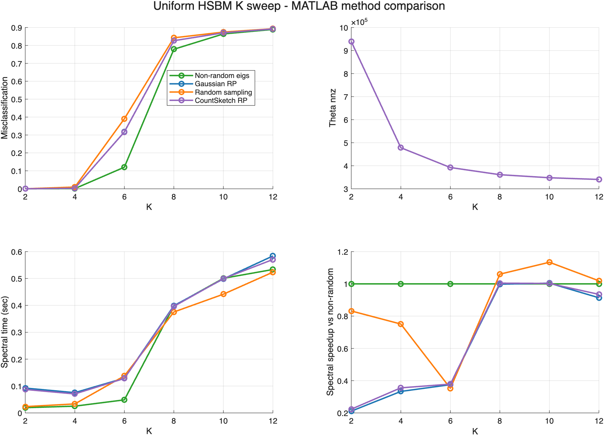
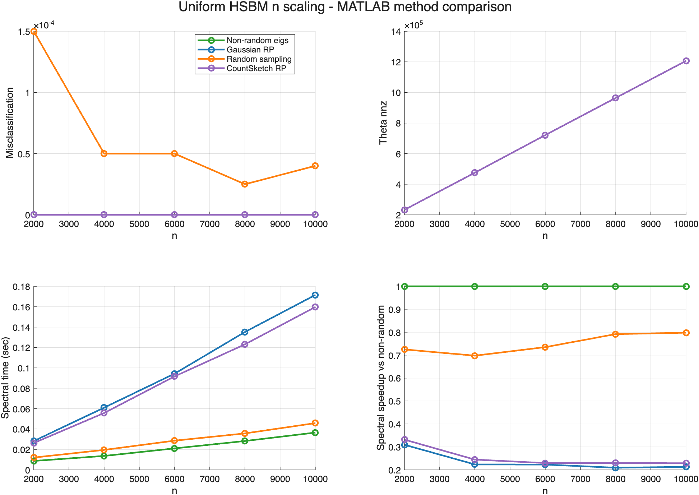
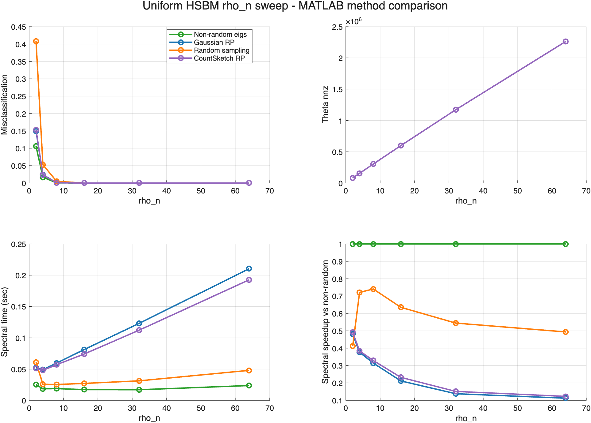

# 균일 HSBM MATLAB 실험 보고서

이 보고서는 `experiments/균일 HSBM 실험`의 method comparison을 MATLAB 코드로 다시 구현해 실행한 결과입니다. Python 공용 모듈은 호출하지 않았고, 하이퍼그래프 생성과 normalized operator 구성부터 metric 계산까지 MATLAB 안에서 수행했습니다.

## 실행 요약

| 항목 | 값 |
|---|---|
| 구현 위치 | `experiments/균일 HSBM 실험_matlab/` |
| MATLAB 버전 | `26.1.0.3234472 (R2026a) Update 1` |
| 반복 횟수 | `10` |
| seed | `20260506` |
| smoke 실행 | `false` |

비교 방법은 `Non-random eigs`, `Gaussian RP`, `Random sampling`, `CountSketch RP` 네 가지입니다.

## 전체 요약

| block | method | 평균 오분류율 | 평균 ARI | 평균 NMI | 평균 Theta nnz | 평균 spectral초 | 평균 speedup |
|---|---|---:|---:|---:|---:|---:|---:|
| EXP-20260506-008_uniform_hsbm_K_rho16_eigsh_methods_matlab | Non-random eigs | 0.4421 | 0.4597 | 0.4567 | 476409.5 | 0.2542 | 1.0000 |
| EXP-20260506-008_uniform_hsbm_K_rho16_eigsh_methods_matlab | Gaussian RP | 0.4846 | 0.3982 | 0.3978 | 476409.5 | 0.2963 | 0.6391 |
| EXP-20260506-008_uniform_hsbm_K_rho16_eigsh_methods_matlab | Random sampling | 0.5016 | 0.3783 | 0.3772 | 476409.5 | 0.2558 | 0.8581 |
| EXP-20260506-008_uniform_hsbm_K_rho16_eigsh_methods_matlab | CountSketch RP | 0.4847 | 0.3980 | 0.3975 | 476409.5 | 0.2920 | 0.6498 |
| EXP-20260506-007_uniform_hsbm_n_rho16_eigsh_methods_matlab | Non-random eigs | 0.0000 | 1.0000 | 1.0000 | 719989.6 | 0.0217 | 1.0000 |
| EXP-20260506-007_uniform_hsbm_n_rho16_eigsh_methods_matlab | Gaussian RP | 0.0000 | 1.0000 | 1.0000 | 719989.6 | 0.0981 | 0.2357 |
| EXP-20260506-007_uniform_hsbm_n_rho16_eigsh_methods_matlab | Random sampling | 0.0001 | 0.9998 | 0.9995 | 719989.6 | 0.0284 | 0.7494 |
| EXP-20260506-007_uniform_hsbm_n_rho16_eigsh_methods_matlab | CountSketch RP | 0.0000 | 1.0000 | 1.0000 | 719989.6 | 0.0913 | 0.2530 |
| EXP-20260506-009_uniform_hsbm_rho_eigsh_methods_matlab | Non-random eigs | 0.0206 | 0.9427 | 0.9225 | 762192.2 | 0.0200 | 1.0000 |
| EXP-20260506-009_uniform_hsbm_rho_eigsh_methods_matlab | Gaussian RP | 0.0291 | 0.9213 | 0.8998 | 762192.2 | 0.0959 | 0.2725 |
| EXP-20260506-009_uniform_hsbm_rho_eigsh_methods_matlab | Random sampling | 0.0777 | 0.8431 | 0.8250 | 762192.2 | 0.0363 | 0.5914 |
| EXP-20260506-009_uniform_hsbm_rho_eigsh_methods_matlab | CountSketch RP | 0.0295 | 0.9206 | 0.8993 | 762192.2 | 0.0891 | 0.2853 |

## Uniform HSBM K sweep - MATLAB method comparison

### K = 2

| 방법 | 오분류율 | ARI | NMI | spectral초 | speedup |
|---|---:|---:|---:|---:|---:|
| **Non-random eigs** | **0.0000** | **1.0000** | **1.0000** | **0.0195** | **1.0000** |
| Gaussian RP | 0.0000 | 1.0000 | 1.0000 | 0.0923 | 0.2108 |
| Random sampling | 0.0000 | 1.0000 | 1.0000 | 0.0234 | 0.8319 |
| CountSketch RP | 0.0000 | 1.0000 | 1.0000 | 0.0872 | 0.2232 |

### K = 4

| 방법 | 오분류율 | ARI | NMI | spectral초 | speedup |
|---|---:|---:|---:|---:|---:|
| **Non-random eigs** | **0.0010** | **0.9974** | **0.9945** | **0.0251** | **1.0000** |
| Gaussian RP | 0.0028 | 0.9927 | 0.9850 | 0.0753 | 0.3331 |
| Random sampling | 0.0095 | 0.9749 | 0.9548 | 0.0334 | 0.7509 |
| CountSketch RP | 0.0030 | 0.9920 | 0.9838 | 0.0706 | 0.3554 |

### K = 6

| 방법 | 오분류율 | ARI | NMI | spectral초 | speedup |
|---|---:|---:|---:|---:|---:|
| **Non-random eigs** | **0.1203** | **0.7321** | **0.6890** | **0.0485** | **1.0000** |
| Gaussian RP | 0.3171 | 0.3846 | 0.3702 | 0.1293 | 0.3750 |
| Random sampling | 0.3905 | 0.2901 | 0.2872 | 0.1375 | 0.3525 |
| CountSketch RP | 0.3168 | 0.3852 | 0.3711 | 0.1281 | 0.3784 |

### K = 8

| 방법 | 오분류율 | ARI | NMI | spectral초 | speedup |
|---|---:|---:|---:|---:|---:|
| **Non-random eigs** | **0.7785** | **0.0240** | **0.0385** | **0.3979** | **1.0000** |
| Gaussian RP | 0.8262 | 0.0081 | 0.0159 | 0.3988 | 0.9978 |
| Random sampling | 0.8424 | 0.0029 | 0.0078 | 0.3754 | 1.0601 |
| CountSketch RP | 0.8262 | 0.0079 | 0.0153 | 0.3962 | 1.0043 |

### K = 10

| 방법 | 오분류율 | ARI | NMI | spectral초 | speedup |
|---|---:|---:|---:|---:|---:|
| **Non-random eigs** | **0.8639** | **0.0035** | **0.0102** | **0.5007** | **1.0000** |
| Gaussian RP | 0.8702 | 0.0024 | 0.0083 | 0.4985 | 1.0044 |
| Random sampling | 0.8743 | 0.0013 | 0.0065 | 0.4416 | 1.1339 |
| CountSketch RP | 0.8701 | 0.0021 | 0.0076 | 0.4995 | 1.0025 |

### K = 12

| 방법 | 오분류율 | ARI | NMI | spectral초 | speedup |
|---|---:|---:|---:|---:|---:|
| **Non-random eigs** | **0.8890** | **0.0014** | **0.0079** | **0.5334** | **1.0000** |
| Gaussian RP | 0.8913 | 0.0011 | 0.0075 | 0.5838 | 0.9137 |
| Random sampling | 0.8930 | 0.0007 | 0.0069 | 0.5235 | 1.0189 |
| CountSketch RP | 0.8920 | 0.0009 | 0.0070 | 0.5706 | 0.9348 |

## Uniform HSBM n scaling - MATLAB method comparison

### n = 2000

| 방법 | 오분류율 | ARI | NMI | spectral초 | speedup |
|---|---:|---:|---:|---:|---:|
| **Non-random eigs** | **0.0000** | **1.0000** | **1.0000** | **0.0087** | **1.0000** |
| Gaussian RP | 0.0000 | 1.0000 | 1.0000 | 0.0282 | 0.3094 |
| Random sampling | 0.0001 | 0.9995 | 0.9990 | 0.0121 | 0.7248 |
| CountSketch RP | 0.0000 | 1.0000 | 1.0000 | 0.0263 | 0.3317 |

### n = 4000

| 방법 | 오분류율 | ARI | NMI | spectral초 | speedup |
|---|---:|---:|---:|---:|---:|
| **Non-random eigs** | **0.0000** | **1.0000** | **1.0000** | **0.0136** | **1.0000** |
| Gaussian RP | 0.0000 | 1.0000 | 1.0000 | 0.0610 | 0.2236 |
| Random sampling | 0.0000 | 0.9998 | 0.9996 | 0.0196 | 0.6976 |
| CountSketch RP | 0.0000 | 1.0000 | 1.0000 | 0.0558 | 0.2447 |

### n = 6000

| 방법 | 오분류율 | ARI | NMI | spectral초 | speedup |
|---|---:|---:|---:|---:|---:|
| **Non-random eigs** | **0.0000** | **1.0000** | **1.0000** | **0.0210** | **1.0000** |
| Gaussian RP | 0.0000 | 1.0000 | 1.0000 | 0.0943 | 0.2231 |
| Random sampling | 0.0000 | 0.9998 | 0.9996 | 0.0286 | 0.7349 |
| CountSketch RP | 0.0000 | 1.0000 | 1.0000 | 0.0916 | 0.2296 |

### n = 8000

| 방법 | 오분류율 | ARI | NMI | spectral초 | speedup |
|---|---:|---:|---:|---:|---:|
| **Non-random eigs** | **0.0000** | **1.0000** | **1.0000** | **0.0283** | **1.0000** |
| Gaussian RP | 0.0000 | 1.0000 | 1.0000 | 0.1352 | 0.2092 |
| Random sampling | 0.0000 | 0.9999 | 0.9998 | 0.0357 | 0.7916 |
| CountSketch RP | 0.0000 | 1.0000 | 1.0000 | 0.1231 | 0.2299 |

### n = 1e+04

| 방법 | 오분류율 | ARI | NMI | spectral초 | speedup |
|---|---:|---:|---:|---:|---:|
| **Non-random eigs** | **0.0000** | **1.0000** | **1.0000** | **0.0366** | **1.0000** |
| Gaussian RP | 0.0000 | 1.0000 | 1.0000 | 0.1715 | 0.2132 |
| Random sampling | 0.0000 | 0.9999 | 0.9997 | 0.0458 | 0.7978 |
| CountSketch RP | 0.0000 | 1.0000 | 1.0000 | 0.1597 | 0.2289 |

## Uniform HSBM rho_n sweep - MATLAB method comparison

### rho_n = 2

| 방법 | 오분류율 | ARI | NMI | spectral초 | speedup |
|---|---:|---:|---:|---:|---:|
| **Non-random eigs** | **0.1062** | **0.7068** | **0.6258** | **0.0251** | **1.0000** |
| Gaussian RP | 0.1496 | 0.6017 | 0.5229 | 0.0521 | 0.4816 |
| Random sampling | 0.4084 | 0.2252 | 0.2014 | 0.0608 | 0.4127 |
| CountSketch RP | 0.1527 | 0.5947 | 0.5160 | 0.0510 | 0.4922 |

### rho_n = 4

| 방법 | 오분류율 | ARI | NMI | spectral초 | speedup |
|---|---:|---:|---:|---:|---:|
| **Non-random eigs** | **0.0165** | **0.9511** | **0.9137** | **0.0185** | **1.0000** |
| Gaussian RP | 0.0242 | 0.9286 | 0.8813 | 0.0490 | 0.3768 |
| Random sampling | 0.0528 | 0.8478 | 0.7793 | 0.0256 | 0.7212 |
| CountSketch RP | 0.0232 | 0.9316 | 0.8857 | 0.0481 | 0.3841 |

### rho_n = 8

| 방법 | 오분류율 | ARI | NMI | spectral초 | speedup |
|---|---:|---:|---:|---:|---:|
| **Non-random eigs** | **0.0006** | **0.9983** | **0.9957** | **0.0188** | **1.0000** |
| Gaussian RP | 0.0007 | 0.9978 | 0.9946 | 0.0597 | 0.3143 |
| Random sampling | 0.0049 | 0.9854 | 0.9694 | 0.0253 | 0.7406 |
| CountSketch RP | 0.0008 | 0.9975 | 0.9939 | 0.0570 | 0.3290 |

### rho_n = 16

| 방법 | 오분류율 | ARI | NMI | spectral초 | speedup |
|---|---:|---:|---:|---:|---:|
| **Non-random eigs** | **0.0000** | **1.0000** | **1.0000** | **0.0172** | **1.0000** |
| Gaussian RP | 0.0000 | 1.0000 | 1.0000 | 0.0812 | 0.2118 |
| Random sampling | 0.0000 | 0.9999 | 0.9998 | 0.0271 | 0.6354 |
| CountSketch RP | 0.0000 | 1.0000 | 1.0000 | 0.0740 | 0.2324 |

### rho_n = 32

| 방법 | 오분류율 | ARI | NMI | spectral초 | speedup |
|---|---:|---:|---:|---:|---:|
| **Non-random eigs** | **0.0000** | **1.0000** | **1.0000** | **0.0170** | **1.0000** |
| Gaussian RP | 0.0000 | 1.0000 | 1.0000 | 0.1230 | 0.1380 |
| Random sampling | 0.0000 | 1.0000 | 1.0000 | 0.0312 | 0.5446 |
| CountSketch RP | 0.0000 | 1.0000 | 1.0000 | 0.1122 | 0.1514 |

### rho_n = 64

| 방법 | 오분류율 | ARI | NMI | spectral초 | speedup |
|---|---:|---:|---:|---:|---:|
| **Non-random eigs** | **0.0000** | **1.0000** | **1.0000** | **0.0237** | **1.0000** |
| Gaussian RP | 0.0000 | 1.0000 | 1.0000 | 0.2104 | 0.1124 |
| Random sampling | 0.0000 | 1.0000 | 1.0000 | 0.0479 | 0.4937 |
| CountSketch RP | 0.0000 | 1.0000 | 1.0000 | 0.1926 | 0.1228 |

## 해석 메모

- 오분류율은 label permutation을 DP assignment로 맞춘 뒤 계산했습니다.
- ARI와 NMI는 MATLAB 구현으로 직접 계산했습니다.
- MATLAB과 Python은 RNG, `eigs`, `kmeans` 초기화가 달라 수치가 완전히 같지는 않습니다.
- 이번 MATLAB 폴더의 결과는 기존 Python 결과를 덮어쓰지 않고 별도 `results/`에 저장했습니다.
